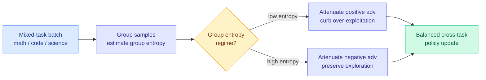

# GEPO: Group Entropy-Controlled Policy Optimization

**TL;DR.** Entropy control (nudging how much a model explores vs exploits) is a standard RL knob, but it is usually applied globally or per-token. When you train on a *mixture* of tasks (math, code, science, instruction-following), each task lives in a different entropy regime, so one global knob is wrong for all of them. Worse, GRPO's normalized advantages introduce an entropy-dependent bias that makes the advantage signals across prompt groups statistically non-comparable. GEPO is a lightweight GRPO extension that estimates entropy *per group* and shapes advantages asymmetrically: damp positive advantages in low-entropy groups (stop over-exploiting), damp negative advantages in high-entropy groups (protect exploration).

## What it is

An RL-for-LLMs method extending GRPO (Group Relative Policy Optimization, the reward-normalization scheme behind most reasoning RL). GEPO's insight is that heterogeneous-task training induces distinct entropy regimes under one policy, so a single global or token-level entropy target cannot serve them all. It uses **group entropy** — estimated from the samples already grouped by GRPO — to perform **entropy-conditioned asymmetric advantage shaping**, with adaptive thresholds derived from historical entropy statistics.

## Core novelty

Diagnosing and correcting an **entropy-dependent bias in GRPO's normalized advantages** that makes cross-group advantage signals non-comparable, then fixing it with a per-group, asymmetric shaping rule (attenuate positive advantages where entropy is low, negative where entropy is high) that needs no extra models — it reuses the grouped samples GRPO already produces.

## Key results

- On two base models across **13 benchmarks** (math, physics, science, code, instruction-following), GEPO consistently beats GRPO and recent entropy-control methods.
- Delivers **balanced cross-task improvement** while preserving each task's own exploration level, rather than trading one task off against another.

## How it relates to prior wiki knowledge

- **Continues the GRPO-refinement thread**: [Balanced Aggregation GRPO (2026-05-09)](2026-05-09-balanced-aggregation-grpo.md) and [ResRL negative-sample projection (2026-05-08)](2026-05-08-resrl-negative-sample-projection-rl.md). GEPO's negative-sample reset rhymes with ResRL's treatment of negatives. See [rl-for-llms.md](rl-for-llms.md).
- **The heterogeneity framing** connects to the routing intuition Amit tracks: different task regions need different treatment. GEPO does this inside the RL update rather than at inference-time routing.
- **Complements today's [Experiential Learning](2026-07-21-experiential-learning-llm-as-coach.md) and [Distilled RL](../inference-efficiency/2026-07-21-distilled-rl-post-training.md)**: three distinct July-21 attacks on the coarse-reward problem — GEPO reshapes the scalar advantage, Experiential Learning replaces the scalar with textual feedback, Distilled RL adds teacher guidance.

## Gaps

The entropy-shaping thresholds are adaptive but heuristic (derived from historical statistics); their sensitivity is not deeply ablated. Tested on verifiable-reward tasks; behavior on open-ended tasks (where entropy is inherently higher and messier) is untested. As a GRPO add-on it inherits GRPO's assumptions about group sampling.

**Raw source:** [HuggingFace Daily Papers 2026-07-21](../../../raw/huggingface/2026-07-21.md) · [arXiv 2607.16850](https://arxiv.org/abs/2607.16850)
