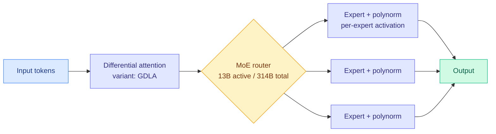

# Motif-3-Beta: A Korean Open-Weight MoE with Differential Attention and Polynorm

**TL;DR.** Motif Technologies (a Korean lab) released **Motif-3-Beta**, an open-weight mixture-of-experts model — 13B active parameters out of 314B total — that HuggingFace's Elie Bakouch reports performs on par with much larger models like MiniMax M3 and DeepSeek V4 Pro. What makes it notable beyond the leaderboard is that Motif ships its own **research bets baked into the architecture**: a per-expert activation function (polynorm), a variant of differential attention they call GDLA (Elie's guess: gated differential latent attention), and a modified mHC. This is a source-layer signal, surfaced via Twitter, not the HuggingFace daily papers.

## What it is

A sparse MoE (mixture-of-experts: each token is routed through a small subset of specialized sub-networks, so total parameters are large but per-token compute is small) open-weight release. Motif also released the smaller **Motif 2.6B**, whose tech report is the more detailed artifact: differential attention (an attention variant that subtracts two softmax maps to cancel attention noise) plus polynorm, trained at scale on 2.5T tokens with a "data mixture schedule" that continuously adjusts the training mix, using WSD (warmup-stable-decay) with a simple moving average over the last 6 checkpoints every 8B tokens. Motif reliably publishes tech reports *and* kernels.

## Core novelty

Not the size (314B total is modest against Kimi K3's 2.8T), but the **willingness to deploy non-standard architecture at scale**: differential attention and polynorm are research ideas that most labs have not committed to in a shipped, open-weight flagship. Motif is treating an open release as a vehicle for architectural bets, and publishing the kernels needed to run them.

## How it relates to prior wiki knowledge

- **Adds a third axis to the open-weight escalation.** The wiki's July open-weights thread has been China-centric: [Kimi K3 (2.8T MoE)](../ai-industry/2026-05-23-kimi-k2-5-cursor-composer-2-5-fireworks.md), Qwen 3.8 (2.4T), GLM-5.2, DeepSeek V4. Motif is **Korean**, and competes on architecture/efficiency rather than raw scale (13B active is very cheap to serve for its quality).
- **Differential attention as a live design choice** connects to [attention-mechanisms.md](attention-mechanisms.md) and the wiki's attention-variant tracking ([MDN momentum-deltanet linear attention, 2026-05-11](../inference-efficiency/2026-05-11-mdn-momentum-deltanet-linear-attention.md), [Chiaroscuro spectral routing, 2026-06-09](../ai-routing/2026-06-09-chiaroscuro-attention-spectral-routing.md)).
- **MoE efficiency** links to [emo-pretraining MoE emergent modularity (2026-05-09)](../inference-efficiency/2026-05-09-emo-pretraining-moe-emergent-modularity.md), [UniPool shared expert pool (2026-05-09)](../inference-efficiency/2026-05-09-unipool-shared-expert-pool-moe.md), and the MoE-µP scaling work in [ai-routing/2026-05-17](../ai-routing/2026-05-17-moe-mup-maximally-scale-stable-parameterization.md) (echoed by Kurate cs.LG #16 this week).

## Gaps

Claims are from the release materials and a HuggingFace researcher's read, not an independent benchmark. GDLA is an inferred name (the exact mechanism is not yet confirmed from a paper). "On par with MiniMax M3 / DeepSeek V4 Pro" needs third-party eval. Whether polynorm + differential attention actually cause the efficiency, versus data-mixture tuning, is not yet isolable.

**Raw source:** [Twitter morning 2026-07-21](../../../raw/twitter/2026-07-21-morning.md) (@eliebakouch) · [Motif-3-Beta on HuggingFace](https://huggingface.co/Motif-Technologies/Motif-3-Beta)
