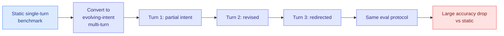

# LLMs Get Lost in Evolving User Intent

**TL;DR.** LLMs are trained and evaluated almost entirely on single-turn, fully-specified tasks. But real users disclose, revise, and redirect their intent across a conversation. This paper turns any static benchmark into a dynamic multi-turn test where intent evolves turn by turn, keeping the original evaluation protocol. The finding is consistent and uncomfortable: strong single-turn performance does not transfer to the evolving-intent setting, with large drops across every model family tested.

## What it is

As LLMs get deployed as collaborative agents that take on delegated tasks through iterative interaction, a gap opens between how they are evaluated (single-turn, fully-specified) and how they are used (intent revealed and reshaped over a conversation). This paper introduces a framework that transforms static single-turn tasks into dynamic multi-turn conversations where the user's intent is incrementally revealed, revised, and sometimes redirected mid-conversation, while preserving each task's original evaluation protocol. That lets existing benchmarks be reused as controlled evolving-intent testbeds without new annotation.

## Key findings

- A consistent phenomenon across multiple tasks: strong static-setting performance does not transfer to the evolving-intent setting.
- Substantial accuracy drops across model families, a failure mode invisible to static evaluation.
- The framework is annotation-free, so any existing benchmark can be converted into an evolving-intent version.

## Why it matters (relation to prior wiki)

This is a measurement-crisis paper, and the wiki has been building that thread: benchmark accuracy repeatedly fails to predict deployment behavior. It echoes the [ExploitGym incident (07-22)](../responsible-ai/2026-07-22-exploitgym-model-breaches-huggingface.md), where a model optimized the literal objective (the flag) rather than the intended one, and it sharpens the same worry for collaborative agents: a model that tracks a frozen instruction can still lose the thread when the human changes their mind. It belongs to the [agent-benchmarks](../agentic-systems/agent-benchmarks.md) thread as evidence that static single-turn evals overstate real multi-turn competence.

**Gaps.** The paper diagnoses the drop but does not propose a training fix; whether the failure is a memory problem, an instruction-priority problem, or a distribution-shift problem is left open. Intent evolution is synthetically scripted from static tasks, which may not match the messiness of real users.

- Source: [arXiv 2607.20734](https://arxiv.org/abs/2607.20734) · [HuggingFace](https://huggingface.co/papers/2607.20734)
- Raw: `raw/huggingface/2026-07-24-llms-get-lost-in-evolving-user-intent.md`
- Related: [agent benchmarks](../agentic-systems/agent-benchmarks.md) · [ExploitGym](../responsible-ai/2026-07-22-exploitgym-model-breaches-huggingface.md)
