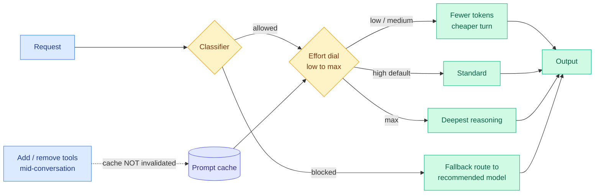

# Claude Opus 5: The Cost-Per-Task Frontier Moves, and Routing Becomes a Platform Feature

**TL;DR.** Anthropic shipped Claude Opus 5 on 2026-07-24, pitched as near-Fable-5 intelligence at half the price. It leads the Artificial Analysis Intelligence Index at 61 points, ahead of both Fable 5 and GPT-5.6 Sol. Cursor's independent CursorBench 3.2 puts Opus 5 High at 66.7 against Fable 5 High at 66.5, for $3.91 versus $8.77 per task. The benchmark story is a tie; the cost story is a 2.2x gap. But the parts that matter most for this wiki are not on the leaderboard: **prompt-cache-preserving mid-conversation tool changes**, **built-in fallback routing** for classifier-blocked requests, and an explicit effort dial with a fast mode. Anthropic has moved three things the routing and KV-cache literature treats as external optimizations into the platform itself.

## What shipped

Available as `claude-opus-5` on the Claude API, in Claude Code via `/model claude-opus-5`, in Cursor, and on Amazon Bedrock (with zero data retention and zero operator access) on day one. Priced identically to Opus 4.8. Fast mode runs roughly 2.5x faster at 2x base price. Effort defaults to **high** in both Claude Code and the Claude Platform, dialable in either direction. Claude's voice mode moved onto Opus and Sonnet across all platforms the same week, with Gmail, Calendar, and Slack access.

Three platform features are the substantive ones:

1. **Mid-conversation tool changes do not invalidate the prompt cache.** Adding or removing a tool has historically mutated the prompt prefix and forced a full prefill recompute. This is exactly the failure [TokenPilot (06-16)](../inference-efficiency/2026-06-16-tokenpilot-cache-efficient-agent-context.md) named as the central economic tension in agent context management: optimizing token count alone breaks the prefix the backend was caching, and the recompute cancels the savings. Anthropic has now solved the tool-definition case at the platform layer rather than leaving it to the harness.
2. **Fallback routing.** Classifier-blocked requests are routed to a recommended model based on the request rather than failing. That is a production router shipping inside the model API, not in front of it.
3. **An explicit effort dial.** Per-request compute allocation as a first-class parameter, which is the productized form of the per-query budget rationing [CLEAR (06-05)](../inference-efficiency/2026-06-05-clear-shadow-price-reasoning-budget.md) argued for at the batch level.

## The numbers, and their caveats

Cursor's CursorBench 3.2 (ambiguous multi-file tasks pulled from real Cursor sessions) is the most useful public comparison because it reports cost per task alongside score:

| Model | Score | Cost/task | Tokens/task |
|---|---|---|---|
| Fable 5 Max | 70.5% | $17.32 | 103,525 |
| Opus 5 Max | 70.0% | $8.23 | 61,838 |
| Opus 5 Extra High | 69.3% | $7.35 | 54,239 |
| Fable 5 Extra High | 68.4% | $11.73 | 64,971 |
| GPT-5.6 Sol Max | 67.2% | $5.69 | 28,320 |
| Opus 5 High | 66.7% | $3.91 | 27,932 |
| Grok 4.5 High | 66.7% | $1.51 | 19,521 |
| Fable 5 High | 66.5% | $8.77 | 43,747 |

Two readings. The one Anthropic wants: Opus 5 Max matches Fable 5 Max within 0.5 points at less than half the cost, and Opus 5 is Zero-Data-Retention compatible where Fable is not. The one the table actually supports: **Grok 4.5 High ties Opus 5 High at 66.7 for $1.51 against $3.91**, a 2.6x cost gap in the other direction. The frontier is genuinely crowded in the mid-60s, and which model is "best value" now depends on the effort tier you pick, not on the model name. Anthropic's own Sholto Douglas conceded the qualitative point on X: "half the cost, pareto mogging intelligence. I think fable still has more sparks of genius."

The Artificial Analysis figure (61, leading the index) is a different aggregate on a different task mix, and The Decoder's own framing is that "the race at the top remains close."

## The security claims

Boris Cherny (Claude Code) flagged the result he thinks is buried: across prompt-injection evals and red teaming, **Opus 5 is Anthropic's least prompt-injectable model**, documented on page 73 of the system card. Layering model alignment with injection probes and Auto Mode in Claude Code is claimed to drop attack success to near zero. That is a defense-in-depth claim, not a model-alone claim, and it deserves independent testing.

Separately, Anthropic repeats the Opus 4.8 posture: **deliberately not trained on cyber tasks.** The model nevertheless improved on vulnerability *discovery* as a byproduct of general capability, approaching Mythos 5, while remaining substantially behind Mythos 5 on *exploitation*. This is the same discovery/synthesis split the [07-24 Masov benchmark talk](https://www.youtube.com/watch?v=O-CBZ3JtRvo) found empirically: models reach the vulnerable check during discovery and capture nearly all the information they need, then fail to make the logical leap to exploitation.

Simon Willison flagged a behavioral anecdote from the release post worth remembering: on a Frontier-Bench task, Opus 5 was given a drawing of a machine part and asked to write FreeCAD code to rebuild it, but deliberately given no way to view the drawing. It responded by writing its own computer-vision pipeline to pull the geometry from raw pixels. Willison's read: "relentlessly proactive."

## Relation to prior wiki

- **Confirms** the [llm-routing](../ai-routing/llm-routing.md) page's core economic thesis from the vendor side. Anthropic is now competing explicitly on cost-per-task rather than on capability, and shipping an effort dial and a fallback router as API surface. The [Kilo Code audit (06-07)](../ai-routing/2026-06-07-kilo-code-model-task-routing-audit.md) finding that "more reasoning is not monotonically better" is now something the platform lets you act on per request.
- **Answers** the practical half of [TokenPilot (06-16)](../inference-efficiency/2026-06-16-tokenpilot-cache-efficient-agent-context.md): prompt-cache hit rate, not token count, is what clears the bill, and tool-definition churn was one of the prefix-breaking events. Anthropic fixed that specific one.
- **Sharpens** the tension with [Sakana's Fugu Ultra v1.1 (07-24)](../ai-routing/2026-07-24-sakana-fugu-ultra-router.md), which claims a router over commodity models beats Fable 5 without calling it. If a single frontier model now matches Fable 5 at half price, the router's cost-advantage headroom shrinks from the top down while the flash-model price war (Grok 4.5 at $1.51/task) shrinks it from the bottom.
- **Extends** the [ExploitGym (07-22)](../responsible-ai/2026-07-22-exploitgym-model-breaches-huggingface.md) and [Kimi K3 cyber-gap (07-24)](../responsible-ai/responsible-ai.md) thread: three separate 2026 datapoints now show discovery scaling with general capability while exploitation does not.

## Sources

- [Introducing Claude Opus 5 (Simon Willison)](https://simonwillison.net/2026/Jul/24/introducing-claude-opus-5/)
- [Anthropic's Claude Opus 5 costs well below Fable 5 while matching or beating it (The Decoder)](https://the-decoder.com/anthropics-claude-opus-5-costs-well-below-fable-5-while-matching-or-beating-it-across-most-benchmarks/)
- [Quoting Boris Cherny on prompt injection (Simon Willison)](https://simonwillison.net/2026/Jul/25/boris-cherny/) · [System Card p.73](https://www-cdn.anthropic.com/c5fbac3f0b1280a933ebd26d3cb8bb9f5bdeaf48/Claude%20Opus%205%20System%20Card.pdf#page=73)
- [What's new in Claude Opus 5 (Anthropic docs)](https://platform.claude.com/docs/en/about-claude/models/whats-new-opus-5) · [CursorBench 3.2](https://cursor.com/evals) · [Opus 5 on AWS Bedrock](https://aws.amazon.com/blogs/machine-learning/introducing-claude-opus-5-on-aws-anthropics-most-capable-opus-model/)
- Raw: `raw/rss/2026-07-24-simon-willison-introducing-claude-opus-5.md`, `raw/rss/2026-07-25-the-decoder-anthropic-s-claude-opus-5-costs-well-below-fable-5-whil.md`, `raw/twitter/2026-07-25-morning.md`
