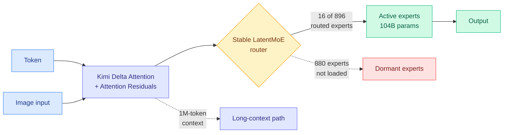

# Kimi K3: Open Frontier Intelligence

**Source:** [HuggingFace Daily Papers](https://huggingface.co/papers/2607.24653) · [arXiv 2607.24653](https://arxiv.org/abs/2607.24653) · [Tech blog](https://kimi.com/blog/kimi-k3) · [Weights](https://huggingface.co/moonshotai/Kimi-K3)
**Raw:** [`raw/huggingface/2026-07-28-kimi-k3-open-frontier-intelligence.md`](../../raw/huggingface/2026-07-28-kimi-k3-open-frontier-intelligence.md) · [`raw/twitter/2026-07-28-morning.md`](../../raw/twitter/2026-07-28-morning.md)
**Cross-source confirmed via social** (HuggingFace top + heavy curated Twitter amplification)

## TL;DR

Moonshot AI released Kimi K3 as open weights: a 2.8-trillion-parameter mixture-of-experts model (MoE, an architecture where each token is routed through a small subset of specialized sub-networks instead of the whole model) with 104B parameters active per token, native vision, and a 1-million-token context window. The headline number is not the parameter count but the efficiency claim: roughly **2.5x better scaling efficiency than Kimi K2**, meaning 2.5x the capability per unit of training compute rather than merely more parameters. It trails Claude Fable 5 and GPT-5.6 Sol on Moonshot's own evaluation suite but beats every other open and proprietary model they tested. Alongside the weights, Moonshot open-sourced the infrastructure: **MoonEP**, an expert-parallelism communication library that improves on DeepSeek's DeepEP (currently the default in vLLM and SGLang), plus attention kernels and agent-environment infrastructure.

## Key findings

- **2.8T total, 104B activated, 16 of 896 routed experts per token.** That is a ~3.7% activation ratio, sparser than most shipped MoE models. Sparsity this aggressive is normally where routing collapses; Moonshot's answer is **Stable LatentMoE**, which they credit with keeping expert activation balanced at this ratio.
- **Kimi Delta Attention (KDA) plus Attention Residuals.** Both are described as improving information flow, KDA across sequence length and Attention Residuals across model depth. The pairing matters: sparse-MoE depth normally degrades gradient signal, and a residual path around attention is the structural fix.
- **~2.5x scaling efficiency over K2.** Elie Bakouch (HuggingFace) called the scaling law in the report "a piece of art" and the report itself "the blueprint of what a stable recipe at 3T scale MoE looks like."
- **Numerical stability is the stated hard problem.** Susan Zhang's read of the report frames the theme as signal propagation and precision at scale, not architecture novelty. This is the honest version of a 3T-scale training story.
- **Infrastructure co-design is treated as first-class**: algorithm-system co-design for KDA, perfectly balanced expert-parallel training with efficient memory management, million-token agentic RL with persistent rollout and sandbox state, plus deployment work.
- **Ships MXFP4 weights at ~1.4 TB.** Running it locally is a datacenter exercise, not a workstation one, but tinygrad reported it working out of the box on AMD MI350X with SGLang on release day.

## Relation to prior wiki pages

**Confirms and extends the sparsity-plus-stability thread.** [Motif 3-beta (07-21)](2026-07-21-motif-3-beta-open-weight-moe.md), an open-weight MoE release, made the same bet that the interesting lever is activation ratio rather than total parameters. K3 pushes that ratio to ~3.7% at ten times the scale and, unlike Motif, ships the communication library that makes it servable. Three open-weight MoE releases in six weeks now treat *expert-parallel communication* as the shipped artifact rather than an implementation detail.

**Directly extends the expert-parallelism-as-KV-capacity-lever finding.** The [kv-cache](../inference-efficiency/kv-cache.md) page recorded from [SemiAnalysis's AMD piece (07-25)](../hardware/2026-07-25-semianalysis-amd-cuda-moat.md), which measured real agentic serving at 140k-in / 396-out with a 99.2% cache hit rate, that moving DeepSeek-R1 from EP8 to EP64 cuts experts per GPU from 32 to 4 and **frees HBM for KV cache**, with NVIDIA reporting up to 2.28x higher per-GPU output throughput from Wide-EP. MoonEP is a direct attack on that lever: better expert-parallel balance means fewer redundant expert replicas, which means more HBM for cache. At 896 experts and a 1M-token context, K3 is the workload where that tradeoff binds hardest.

**Sits opposite [Claude Opus 5 (07-25)](2026-07-25-claude-opus-5.md)** in the week's pricing story. Opus 5 shipped near-frontier capability at $5/$25 per million tokens with a 1M-token window; K3 ships a 1M-token window at zero marginal license cost if you own the machines. Both landed within 72 hours. The [ai-industry](../ai-industry/2026-07-25-nvidia-open-weights-letter.md) thread on Jensen Huang's open-weights letter now has its concrete artifact.

**Contradicts nothing, but stresses one prior claim.** The wiki has repeatedly recorded that open-weight releases trail frontier proprietary models by roughly two quarters. K3's own abstract concedes it still trails Claude Fable 5 and GPT-5.6 Sol. What has changed is not the gap but the *cost of closing most of it*: Cursor added K3 the same day and reported it scoring close to frontier on CursorBench.

## Gaps

Moonshot reports the evaluation suite itself, so "outperforms other open and proprietary models evaluated in our suite" is a vendor-selected comparison set. No independent third-party numbers existed on release day. The 2.5x scaling-efficiency figure is measured against their own K2 baseline, which makes it a recipe-improvement claim rather than a field-wide one. And the license is unusual: free to self-host, but commercial cloud resellers must share profits, which tinygrad flagged approvingly as a sustainable open-weights model but which is not OSI-open.

## Links

- [MoE and attention concept page](attention-mechanisms.md)
- [KV cache](../inference-efficiency/kv-cache.md)
- [Memory hierarchy](../hardware/memory-hierarchy.md)
- [Anthropic's open-weights position (07-28)](../ai-industry/2026-07-28-anthropic-open-weights-position.md)
- [Daily digest 2026-07-28](../daily-digest/2026-07/2026-07-28.md)
