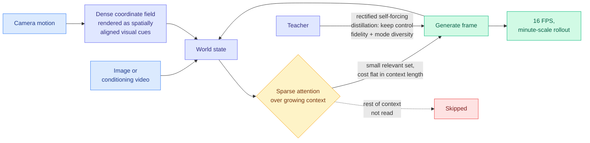

# Wonder: Video World Model Done Better

**arxiv:** [2607.26037](https://arxiv.org/abs/2607.26037) · **Source:** [HuggingFace Daily Papers 2026-07-29](../../raw/huggingface/2026-07-29-wonder-video-world-model-done-better.md)

## TL;DR

Wonder is a general-purpose video world model: give it an image or a conditioning video and it builds a playable world you navigate in real time by moving a camera, discovering unseen regions and revisiting previously seen ones over a long horizon. Three co-designed pieces make that work. **Camera conditioning via a dense coordinate field**, whose renderings give spatially aligned motion and orientation cues so the model reads camera motion as visual evidence rather than as an abstract control signal. **A sparse-attention memory mechanism** that selectively attends to a small set of relevant context tokens at inference time regardless of how long the actual context has grown, which is what makes revisiting a place you saw two minutes ago affordable. And a set of fixes to self-forcing-style distillation so the student respects control signals and keeps the teacher's generation diversity and long-term memory instead of collapsing to a single mode. Result: diverse **minute-scale video at 16 FPS** with coherent geometry, appearance, and dynamics across long rollouts, plus video-conditioned generation that re-shoots existing dynamic scenes in real time.

## The efficiency mechanism is the familiar one

The camera-conditioning idea is the elegant part (turn a control signal into visual evidence the model already knows how to read), but the piece that matters for this wiki is the memory mechanism, because it is the same primitive the KV cache literature keeps rediscovering. Wonder's problem is that a world you can revisit requires a context that grows without bound, and attention over it does not fit. Its answer is select-a-small-relevant-set-and-attend-exactly, with cost independent of true context length. That is structurally [MSA (06-12)](../inference-efficiency/2026-06-12-minimax-sparse-attention-msa.md)'s blockwise select-then-attend-exactly, and it is [LOCKS (07-29)](../inference-efficiency/2026-07-29-locks-page-local-key-summaries.md)'s claim that selection can be made cheap enough to be free. Three different subfields (long-context serving, agentic memory, interactive world models) converging on the same mechanism in the same quarter is the pattern worth naming: **sparse retrieval over a growing cache is becoming the default answer to persistence, whatever the modality.**

The distillation half is also on familiar ground. Self-forcing-style distillation collapsing student diversity and control fidelity is the video-generation instance of the mode-collapse failure the [knowledge-distillation](../inference-efficiency/knowledge-distillation.md) page tracks in language models, and Wonder's fix (rectify the pipeline so the student keeps the teacher's diverse modes) is the same concern as the reverse-KL mode-seeking problem that motivated [TrOPD (06-03)](../inference-efficiency/2026-06-03-tropd-trust-region-on-policy-distillation.md)'s trust region.

## Why it matters beyond the paper

**Wonder is the strongest current research datapoint for the thesis that Google withdrew from the coding-agent race to bet on world models.** [Alberto Romero's essay (07-28)](../ai-industry/2026-07-29-google-withdrew-world-models.md) argues Hassabis does not believe recursive self-improvement through coding agents reaches general intelligence, and is steering DeepMind toward systems that simulate the physical world. That is a claim about strategy; Wonder plus two highly-rated Kurate papers the same week (**Persistent Computational State: A Session-Centric Runtime for Generative World Models**, cs.AI #6, and **On the Identifiability of Controlled World Models**, cs.LG #10) is what the underlying research activity looks like. The presence of a *runtime* paper is the informative part: you write serving infrastructure for a thing you expect to deploy, not for a thing you are still exploring.

## Gaps

No quantitative comparison to prior world models is visible in the abstract, which for a paper whose title claims "done better" is the first thing to want. Minute-scale is a real advance and still short of the horizons the interactive-world use case implies. The sparse memory mechanism's failure mode is unreported: what happens when you revisit a region whose tokens the selector does not retrieve is exactly the question, and it is the one place a world model's incoherence would be most visible. And nothing here addresses whether world-model training compute is competitive with the alternative, which is the crux of the strategic argument the paper is being enlisted into.

## Related

- [The actual reason why Google "fell out" of the AI race (07-29)](../ai-industry/2026-07-29-google-withdrew-world-models.md)
- [LOCKS (07-29)](../inference-efficiency/2026-07-29-locks-page-local-key-summaries.md)
- [MSA (06-12)](../inference-efficiency/2026-06-12-minimax-sparse-attention-msa.md)
- [Daily digest 2026-07-29](../daily-digest/2026-07/2026-07-29.md)
