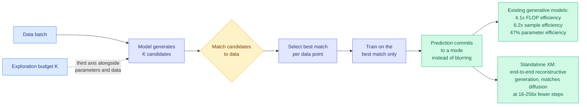

# Explorative Modeling: Unlocking a Third Pretraining Axis and End-to-End Generation

**Source:** HuggingFace Daily Papers, 2026-07-31 · [arXiv 2607.27372](https://arxiv.org/abs/2607.27372) · [raw](../../raw/huggingface/2026-07-31-explorative-modeling-unlocking-a-third-pretraining-axis-and.md)

## TL;DR

Scaling laws give you two knobs: parameters and data. This paper claims a third. The observation behind it is that generative modelling is the one part of deep learning that never went end-to-end. Every scalable generative approach handles multi-modal target distributions the same way, by **factoring the generation procedure** into stages (diffusion steps, autoregressive token steps), because predicting a multi-modal target directly makes the model average the modes and produce blur. Explorative Modeling factors the **training loop** instead of the generation procedure: at each step it explores **K candidate matches** between the model's generations and the data, and trains only on the best one. Predictions then commit to a mode rather than averaging across modes. Exploration becomes a scaling axis, and the reported gains **grow with scale rather than saturating**.

## What it actually does

The framing is the contribution and it is a good one. Generative models are capable but not trained end-to-end, and the reason is mode collapse in the loss, not a limitation of the architecture. If you ask a model to predict a target that could plausibly be many things, and you train with a loss that penalises distance to the one sample you happened to draw, the optimal prediction is the average of the plausible things. Diffusion and autoregression both dodge this by decomposing generation into many small steps where each step's target is nearly unimodal.

Explorative Modeling keeps generation in one shot and changes what the loss compares against. Generate K candidates, match them to the data, keep the best match, train on that. The model is never punished for producing a valid mode that was not the sampled one. K is the exploration budget, and it is the new axis.

## Key findings

- **Exploration scales monotonically** across continuous and discrete domains: images, video, and language.
- **Gains increase with scale**, which is the claim that matters. Improvement climbs from **7% to 36% as data scales** and from **13% to 23% as models grow**, with efficiency gains **more than doubling at 3x the compute**. An axis whose returns grow with the other two axes is a different proposition from one that saturates.
- Concrete efficiency numbers on existing recipes: **4.1x FLOP efficiency, 6.2x sample efficiency, 47% parameter efficiency**.
- **1.43 FID on ImageNet without guidance**, described as near state of the art, from lifting the strongest existing image-generation recipe.
- As a standalone paradigm, **XMs match diffusion on control tasks at 16 to 256x fewer inference steps**.

## How this relates to prior wiki pages

**The inference-step reduction is the number that puts this on [inference-efficiency](../inference-efficiency/)'s radar rather than only on this page.** Sixteen to 256x fewer steps at matched control-task quality is a larger factor than anything in the wiki's diffusion-acceleration coverage, and it comes from removing the reason the steps existed rather than from making each step cheaper. That is a structurally different kind of win from distillation-based few-step samplers, which compress a many-step teacher into a few-step student and inherit its ceiling.

**The "train on the best of K" mechanism is the same shape as a pattern the wiki has been tracking on the training side all quarter, arriving in a new place.** The [knowledge-distillation](../inference-efficiency/knowledge-distillation.md) thread has accumulated papers arguing that uniform training signal is wasteful and that concentrating updates where they carry information is the win: TIP (04-16) found most teacher-generated tokens carry no learning signal and you only need about 10%, LongAct (04-18) found long-context gradient signal concentrated in the first 5% of tokens, and CoRT (07-30) replaced GRPO's single advantage broadcast uniformly across tokens with per-token rubric-dependence contrast. All of those select **which parts of a fixed target to train on**. Explorative Modeling selects **which target to train against**, from candidates the model itself produced. It is the same selectivity principle applied one level up, to the target rather than the token weighting, and it is the first version of the idea that produces a scaling axis rather than an efficiency multiplier.

**Read against [Flux-OPD](../inference-efficiency/2026-07-31-flux-opd-evolving-contexts.md) and [β-OPSD](../inference-efficiency/2026-07-31-beta-opsd-policy-optimization-self-distillation.md), also today, there is a shared move.** Both of those take a distillation objective and reveal it as a member of a parameterised family, then tune the parameter (β-OPSD shows vanilla on-policy self-distillation is exactly the β=1 case of a broader policy-optimization family). Explorative Modeling does the analogous thing to generative pretraining: K=1 recovers the standard objective, and the standard objective turns out to be the degenerate member of a family nobody had written down. Three papers in one day converting a fixed training recipe into a one-parameter family is worth naming as a pattern.

## Gaps

The K-candidate generation cost is the obvious missing accounting. Reported efficiency is in FLOPs, samples and parameters, and if generating K candidates per training step multiplies the forward cost by K, then a 4.1x FLOP efficiency claim needs to be net of that, which the abstract does not confirm. The matching step is also unspecified in the front matter, and how you match candidates to data is the entire mechanism: a bad matcher reintroduces the averaging it was built to avoid. "Near state-of-the-art 1.43 FID on ImageNet without guidance" is a strong number but ImageNet FID is the most gamed metric in generative modelling. And the language-domain result is asserted alongside images and video without a separate number, which for a wiki focused on LLMs is the one that would matter most.

## Related

- [knowledge-distillation.md](../inference-efficiency/knowledge-distillation.md)
- [Flux-OPD: on-policy distillation with evolving contexts](../inference-efficiency/2026-07-31-flux-opd-evolving-contexts.md)
- [β-OPSD](../inference-efficiency/2026-07-31-beta-opsd-policy-optimization-self-distillation.md)
