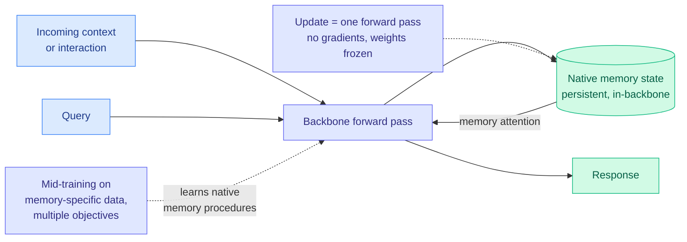

# Metis: Memory Foundation Model

**Source:** [arXiv 2607.26760](https://arxiv.org/abs/2607.26760) · [raw](../../raw/huggingface/2026-07-31-metis-memory-foundation-model.md)
**Date ingested:** 2026-07-31

## TL;DR

Agent memory is almost always an external module bolted onto a frozen model: a vector store, a graph, a directory of markdown files. Metis argues that is a design accident and builds memory into the backbone instead. The model carries a **persistent memory state** inside itself, compresses history into that state, and reads it back through a dedicated memory attention path. The claim that makes it interesting operationally: **online memory maintenance is gradient-free**. Updating memory costs one forward pass, and at inference all learned weights stay frozen while the memory states transform themselves through ordinary forward computation.

## What it proposes

Metis formalizes "native memory" as two properties a model must have rather than a system must provide:

1. **A persistent, dynamically evolving memory state within the backbone.** Not a retrieval index sitting beside the model.
2. **Native memory procedures.** The model itself decides what to store and how to use it, through model computation, rather than through an external controller calling a store/retrieve API.

The training path is mid-training on large-scale memory-specific data with multiple objectives designed to install those procedures. The authors release the project and checkpoints.

## Key claims

- Memory state is compressed into the model and accessed through **memory attention**, so the read path is architectural rather than retrieval-based.
- **Online maintenance is gradient-free**: memory update requires only a forward pass, which removes the test-time-training cost that competing internal-memory approaches (Titans and relatives) pay.
- At inference **all model weights remain frozen** and only memory states change, which is the property that makes this deployable rather than a per-user fine-tune.
- Framed explicitly as a **first prototype**, with the paper providing an analysis of strengths, limitations and behaviours rather than a claim of state of the art.

## Gaps

The abstract is unusually light on numbers for a paper making an architectural claim, and "detailed analysis of its strengths, limitations, and behaviors" is doing a lot of work. No head-to-head against the external-memory systems it is arguing against, no context-length or capacity characterization of the memory state, and no cost accounting for the mid-training stage, which is the price of entry for anyone wanting to reproduce it. A fixed-size internal state also has a capacity ceiling that an external store does not, and where that ceiling sits is the first question a deployment would ask.

## Relation to prior wiki state

**A structural counter-proposal to everything on [agent-memory.md](../agentic-systems/agent-memory.md).** That page's entire recent history is a catalogue of failures in the external-store paradigm: [InMind (07-29)](../agentic-systems/2026-07-29-inmind-implicit-association-blind-spot.md) found six vector, graph and agentic memory systems reach at most 14.4% on queries whose answer requires a stored fact that does not resemble the query, while the same systems recall those facts on demand at up to 100%; [TRACE (06-13)](../agentic-systems/2026-06-13-trace-compiling-user-corrections.md) found 57.5% of applicable user-preference checks violated even with memory in place. Every one of those failures is an **interface** failure between an external store and a model. Metis's bet is that the interface is the problem and the fix is to delete it. Whether an in-backbone state actually surfaces implicit associations that retrieval misses is exactly the experiment InMind's benchmark exists to run, and Metis does not run it.

**Same-day contrast with [Memory Decoder at Scale](../inference-efficiency/2026-07-31-memory-decoder-at-scale.md).** Both papers open with the identical diagnosis, that decoder-only models entangle long-term memory with reasoning in one parameter set. Memory Decoder's answer is a separate pretrained module you can swap and share across base models. Metis's answer is a memory state living inside the backbone. Modularity versus integration, decided on the same day by two different groups.

**Complements [Filesystem-Based Memory (same day)](../agentic-systems/2026-07-31-filesystem-based-memory-agents.md)**, which measured the most widely deployed external memory design, a directory tree of markdown files an agent maintains itself, and found that organization buys search economy and does not buy better answers.

## Links

- [agent-memory.md](../agentic-systems/agent-memory.md)
- [Memory Decoder at Scale](../inference-efficiency/2026-07-31-memory-decoder-at-scale.md)
- [Filesystem-Based Memory for LLM Agents](../agentic-systems/2026-07-31-filesystem-based-memory-agents.md)
- [Daily digest 2026-07-31](../daily-digest/2026-07/2026-07-31.md)
