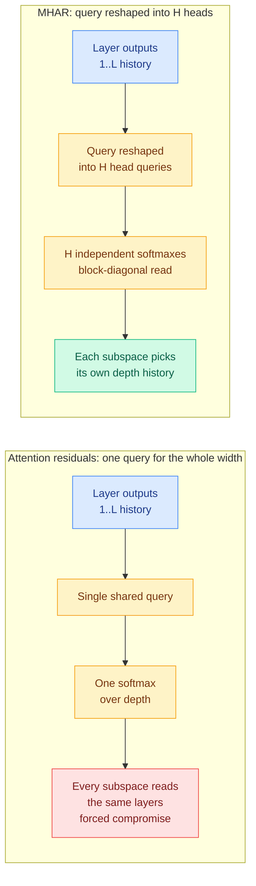

# Multi-Head Attention Residuals (MHAR)

**Source:** HuggingFace Daily Papers, 2026-07-31 · [arXiv 2607.27230](https://arxiv.org/abs/2607.27230) · [raw](../../raw/huggingface/2026-07-31-multi-head-attention-residuals.md)
**Authors:** Cheng Luo (independent), Zefan Cai, Junjie Hu (University of Wisconsin–Madison)

## TL;DR

A Transformer moves information down its depth through one additive residual stream, so every sublayer reads only the most recent state and anything computed early gets buried under later additions. Kimi's *attention residuals* (2025) relaxed this by letting each sublayer attend, through a learned softmax, over the whole history of previous layer outputs. MHAR finds the bottleneck in that fix: the depth-attention read uses **one query shared across the entire model width**, so every feature subspace has to read the depth history through the same distribution. MHAR reshapes that query into **H per-subspace heads**, each with its own softmax over depth. The reshape adds **zero parameters** and negligible compute, and `H = 1` recovers attention residuals exactly.

## The mechanism

The paper's causal story is the interesting part, not the delta. The cost of a single shared depth query grows with **how much the feature subspaces disagree** about which layers they want to read, and that disagreement grows with model width. So the single-query design should hurt more as models get wider, which is a falsifiable prediction the paper then tests by probing the trained queries directly and confirming that learned subspace disagreement is the driver.

This is the depth-axis version of the argument that produced multi-head attention on the token axis in the first place: one head forces all subspaces to attend to the same tokens, so give them their own heads. MHAR observes that nobody ever applied that argument to attention *over depth*.

## Key results

- Validation loss over a standard Transformer improves by **-0.061 at 100M, -0.149 at 350M, -0.140 at 1B**, trained from scratch on a deduplicated Nemotron-based anneal corpus that is quality-filtered and STEM/code-heavy. Best of four compared methods in every setting, with the gain growing from 100M to the larger scales.
- **The head count is a real design axis, not a free knob.** Validation loss is **U-shaped in H**, with a flat optimum at **H = 4 or H = 8** across scales. Over-splitting to H = 16 consistently gives back part of the gain.
- **Fused Triton routing kernels** raise attention-residual training throughput from **0.2–0.5x to 0.55–0.88x** of a standard Transformer baseline, at near-baseline peak memory. This is the number that decides whether anyone adopts it.
- An **identity-preserving conversion** using delta attention residuals supports 8B mid-training, giving **+3.2 on GSM8K and +3.1 on GPQA**. Existing checkpoints can be converted rather than retrained.

## Gaps

Even after kernel work, training throughput is **0.55–0.88x** of the baseline, so a validation-loss gain of 0.14 nats has to beat a 12–45% training slowdown, and the paper does not present that as a compute-matched comparison. The U-shape in H is reported at three scales but the optimum is claimed to be flat and scale-stable on that evidence alone, which is thin for a hyperparameter someone will have to pick at 100B. The 8B result is mid-training conversion, not a from-scratch 8B run, so the scaling trend is extrapolated across a methodology change. And there is no inference-time cost accounting: reading a softmax-weighted combination of all previous layer outputs means keeping them resident.

## Relation to prior wiki state

**Adds a third line to [attention-mechanisms.md](attention-mechanisms.md).** That page has tracked two lines, the *recurrent rule* inside linear-attention layers ([Gated DeltaNet-2 (05-24)](../inference-efficiency/2026-05-24-gated-deltanet-2-decoupled-erase-write.md), [MDN (05-11)](../inference-efficiency/2026-05-11-mdn-momentum-deltanet-linear-attention.md)) and the *estimator order* of the attention read ([Parallax (05-29)](../inference-efficiency/2026-05-29-parallax-local-linear-attention.md)), plus a distributed-execution sibling from [FVAttn (07-23)](../inference-efficiency/2026-07-23-fvattn-adaptive-sparse-attention.md). MHAR works on a fourth axis: **the routing of information across depth**, which none of them touch. It also explicitly positions itself against hyper-connections and DenseFormer by enriching routing inside one residual stream rather than changing stream topology.

**Third paper this quarter to reject uniform allocation across depth.** [LoopCoder-v2 (06-17)](../inference-efficiency/2026-06-17-loopcoder-v2-parallel-loop-transformer.md) and [Variable-Width Transformers (06-17)](../inference-efficiency/2026-06-17-variable-width-transformers.md) both argued capacity should follow layer function, and the [06-17 hybrid-attention mechanism study](../inference-efficiency/2026-06-17-rethinking-efficient-attention-hybrid.md) found long-range retrieval is carried by full-attention layers while efficient layers merely shape their optimization trajectory. MHAR is the same prior applied to reads rather than to capacity: **different parts of the model want different layers, so stop making them share**. That crosses this wiki's three-paper bar for a named pattern.

## Links

- [attention-mechanisms.md](attention-mechanisms.md)
- [Daily digest 2026-07-31](../daily-digest/2026-07/2026-07-31.md)
