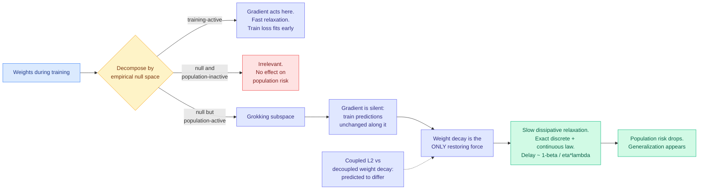

# Grokking on the Weight-Decay Clock: A Rate Hierarchy from Softly Broken Symmetries

**Author:** Taeyoung Kim
**Source:** Kurate weekly cs.AI leaderboard **#1** (score 1518, win rate 79.3%, ai_rating 6.5/10), published 2026-07-27
**Links:** [arXiv 2607.23967](https://arxiv.org/abs/2607.23967) · [raw](../../raw/kurate/2026-08-02-cs-ai.md)

## TL;DR

Grokking is the phenomenon where a network fits its training set early, sits at chance on held-out data for a long time, then suddenly generalizes. Four years of empirical study has produced stories about it (circuit formation, representation cleanup, a race between memorization and generalization) and no closed-form account of *when* it happens. This paper gives one. In linear models trained with full-batch heavy-ball momentum and weight decay, there is an exactly solvable late-time relaxation mechanism, and the paper extends it to nonlinear networks through a locally quadratic approximation.

The mechanism is a specific subspace. Inside the empirical null space of the training data there is a **population-active** component: directions along which the training predictions do not change at all, but the population risk does. The paper calls this the **grokking subspace**. Because moving along it leaves the training loss untouched, the gradient term is silent there and **weight decay is the only restoring force acting on it**. What follows is a slow dissipative relaxation with an exact discrete-time and continuous-time law, and the paper shows that only this subspace contributes to the slow asymptotic decay of the population risk. Everything else has already relaxed.

The payoff is a clock rather than a narrative. In the weak-regularization regime the delay scales as **(1 − β)/(ηλ)**, recovering the empirically familiar relationship between momentum β, learning rate η and weight decay λ. The theory also predicts that **coupled L2 regularization and decoupled weight decay behave differently**, which is a statement about optimizer choice rather than about architecture, and it yields causal predictions for interventions that modify the grokking component directly. All identities are verified **without fitted parameters** in a synthetic model where every subspace and relaxation rate is computable in closed form, and genuine delayed generalization is then observed in modular addition with the measured delay following the predicted scaling.

## Diagram

## Key findings

- **The grokking subspace is identified, not postulated.** It is the population-active part of the empirical null space, and the paper proves only that subspace contributes to the slow asymptotic decay of population risk. That converts "why the delay" from a question about learning dynamics broadly into a question about one linear-algebraic object.
- **Weight decay is not an accelerant, it is the clock.** Along the grokking subspace the data term contributes nothing, so the relaxation rate is set entirely by the regularizer. This is why grokking disappears when weight decay is removed, and the paper gives the reason rather than the observation.
- **The (1 − β)/(ηλ) scaling falls out of the derivation** in the weak-regularization regime rather than being fit to curves. Momentum enters through the (1 − β) factor because heavy-ball dynamics rescale the effective step along a slow mode.
- **Coupled L2 and decoupled weight decay are predicted to give distinct grokking behaviour.** AdamW versus Adam-with-L2 is not a cosmetic difference in this account, it changes the restoring force acting on the subspace that controls the delay.
- **All theoretical identities are verified with no fitted parameters** in a synthetic model where subspaces and rates are computable in closed form, and modular addition, the canonical grokking testbed, shows delay following the predicted scaling with late-time relaxation matching the theoretical clock.

## Gaps

The exact result lives in linear models with full-batch heavy-ball optimization, and the extension to nonlinear networks is a **locally quadratic** approximation, which is the standard place this genre of theory breaks. Local quadratic expansions describe late-time relaxation near a solution well and say nothing about the earlier phase where features are actually formed, so the theory explains the *waiting* rather than the *learning*. Full-batch is also load-bearing: stochastic gradient noise injects a term into exactly the directions the analysis needs to be silent, and nothing here says how much noise the mechanism tolerates. The empirical validation is a synthetic model plus modular addition, which is the smallest possible grokking demonstration and shares no structure with a language model. And the causal-intervention predictions are stated as predictions; the paper verifies scaling laws rather than running the interventions at scale.

## Relation to prior wiki state

**This is the third result on this wiki arguing that the optimizer is a first-class determinant of what a network learns rather than a training detail, and it is the first to give a closed-form mechanism.** [Optimizer-Induced Spectral Scaling (05-23)](2026-05-23-same-architecture-optimizer-induced-spectral-scaling.md) held architecture and width fixed and found the same Transformer realizes markedly different spectral scaling laws under different optimizers, with Muon reaching hard-rank scaling exponent β = 1.02 on rare-token representations against AdamW's β = 0.44, and made the sharper point that **matched validation loss does not imply matched representation structure**. That paper measured the divergence. This one supplies a mechanism of the right shape for it: if a slow mode's relaxation rate is set by the regularizer and the optimizer's coupling to that regularizer differs, then two optimizers reaching the same loss have not reached the same place, and the difference is concentrated in directions the training loss cannot see. The two papers are not about the same quantity, spectral rank versus null-space relaxation, but they make the same structural claim from opposite ends: **the training loss is a lossy summary of the state the optimizer put the network in.**

It also lands next to the wiki's selective-training thread from a strange angle. [LongAct (04-18)](../inference-efficiency/2026-04-18-longact-saliency-sparse-rl.md) restricted RL gradient updates to high-magnitude Q/K activations on the argument that those positions are where attention does real work, and [TIP (04-16)](../inference-efficiency/knowledge-distillation.md) argued most teacher-generated tokens carry no learning signal and should be skipped. Both are claims that the gradient is concentrated and the rest is waste. The grokking result is the complement and it is uncomfortable: **there is a subspace on which the gradient is exactly zero and which nonetheless determines generalization.** A method that allocates training effort by gradient magnitude is, by construction, blind to it. Whether the grokking subspace matters at all at language-model scale is unknown, but "the directions that decide generalization are invisible to the gradient" is the kind of claim that, if it survives contact with real models, would put a boundary on the whole selective-training line.

Finally, the practical reading. This wiki has repeatedly found that the largest measured lever in a stack is a configuration choice nobody was measuring, most recently in the [08-01 digest](../daily-digest/2026-08/2026-08-01.md) where two Responses API settings tripled an ARC-AGI-3 score at one-sixth the tokens. The (1 − β)/(ηλ) clock is the training-side version of the same lesson: three hyperparameters that are usually inherited from a template jointly set a delay that people have been interpreting as a property of the task.

## Related pages

- [Optimizer-Induced Spectral Scaling](2026-05-23-same-architecture-optimizer-induced-spectral-scaling.md)
- [RL for LLMs](rl-for-llms.md)
- [Prescriptive Scaling Laws under Data Constraints](2026-05-09-prescriptive-scaling-laws-data-constrained.md)
