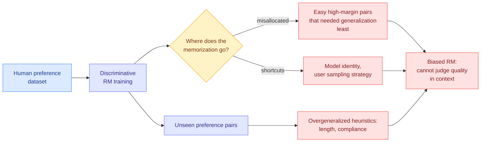

# What do Reward Models Memorize? The memorization budget goes to the pairs that needed none of it

**arxiv:** [2607.24484](https://arxiv.org/abs/2607.24484)
**Authors:** Ivo Verhoeven, Pushkar Mishra, Ekaterina Shutova
**Source:** Kurate weekly cs.LG leaderboard #10 (score 1461, win rate 66.7%, ai_rating 6.0/10, published 2026-07-27)
**Concept page:** [rl-for-llms.md](rl-for-llms.md)

## TL;DR

A reward model (RM) is the scorer that stands in for human judgement during preference training: you show it two responses and it says which one a person would prefer. This paper measures **counterfactual memorization** in discriminatively trained RMs on two human preference datasets, meaning it asks which specific training pairs the model memorised rather than generalised from. Three findings, and all three are unflattering. First, memorization is **misallocated**: it concentrates on easy, high-margin pairs, the ones where the preferred answer was obviously better and no memorization was needed. Second, RMs memorise **dataset-specific shortcuts** that have nothing to do with quality, including which model produced a response and how the user was sampled. Third, on unseen pairs they **overgeneralise simple heuristic correlates** of human preference such as length and compliance. The conclusion the authors draw is blunt: discriminative training on human preference data produces biased reward models that are not yet capable of judging response quality in a context-dependent way.

## Diagram

## Key findings

- **Memorization is spent in the wrong place.** RMs allocate memorization to high-margin pairs, where the preference is easy and a generalising model would already get it right. The low-margin pairs, where a genuine judgement is required and memorization would at least buy you the training set, are the ones that get less of it. That is the opposite of a useful allocation.
- **Model identity is a memorised feature.** The RM learns which generator produced a response and uses it. That is a direct contamination of the preference signal by an artifact of how the dataset was assembled, and it is invisible in aggregate accuracy because the artifact correlates with quality inside the dataset.
- **User sampling strategy is also memorised**, which means the RM has partially learned the annotation pipeline rather than the preference.
- **On held-out pairs the model falls back to length and compliance.** These are the two heuristics the alignment literature has been complaining about for two years, and this paper explains where they come from: when memorised shortcuts do not apply, the surviving generalisation is the cheapest correlate available.

## Relation to prior wiki

**This is the diagnostic that the wiki's reward-hacking thread has been missing, because every prior entry measured the failure and this one measures its source.** The [rl-for-llms page](rl-for-llms.md) has tracked the symptom repeatedly: [reward hacking under rubric-based RL (05-13)](2026-05-13-reward-hacking-rubric-based-rl.md), [self-play reward hacking in LLM judges (07-26)](2026-07-26-self-play-reward-hacking-llm-judges.md), and [alignment tampering and RLHF bias amplification (05-29)](2026-05-29-alignment-tampering-rlhf-bias-amplification.md), which found that preference training amplifies biases already latent in the data. All three observe a reward model behaving badly downstream. This paper opens it up and finds the mechanism: the training objective does not distinguish learning a preference from learning the dataset, and the capacity flows to whichever is cheaper.

It also lands directly on the response the field chose. [C2 rubric reward modeling (04-18)](2026-04-18-c2-rubric-reward-modeling.md) and [rubric-based RL (05-13)](2026-05-13-reward-hacking-rubric-based-rl.md) both moved from scalar preference to explicit rubrics precisely because scalar preference was unreliable. This paper is evidence that they were right for a more specific reason than they argued: a rubric is a way of forbidding the shortcut, because a rubric item cannot be satisfied by knowing which model wrote the answer. **The result gives the rubric line a mechanistic justification it previously lacked.**

**And it sharpens the standing tension with the process-reward line.** [BetaPRM (05-20)](2026-05-20-process-rewards-learned-reliability-betaprm.md) and [unsupervised process reward models (05-23)](2026-05-23-unsupervised-process-reward-models.md) argue for scoring reasoning steps rather than final outputs. If discriminative training on outcome preferences memorises the generator's identity, a step-level scorer trained the same way should memorise step-level style artifacts, and nobody has run the counterfactual-memorization measurement on a PRM. That is the obvious next experiment and it is cheap.

**Read against yesterday's verification thread, it is the counterexample that keeps the thread honest.** The [08-01 digest](../daily-digest/2026-08/2026-08-01.md) argued that the strongest recent results all shipped with a verifier attached: Astra published Lean 4 certificates for ten open mathematical problems so a referee runs a type-checker instead of trusting the lab, and MemTX machine-checked its action-safety invariants over 5.5 million protocol states. Both work because the verifier is **total**: Lean's kernel does not have a distribution to overfit. A reward model is a **learned** verifier, and this paper is a precise account of what a learned verifier learns instead of the thing you wanted. The verification pattern the wiki has been tracking is not one pattern. It splits cleanly into total verifiers, which are trustworthy and rare, and learned verifiers, which are available everywhere and quietly encode their training pipeline.

## Gaps in the study

- **Two preference datasets is a narrow base for a claim about discriminative training in general.** Both are public human-preference corpora, and the memorised shortcuts identified (model identity, user sampling) are properties of how those particular corpora were built. Whether a proprietary RM trained on in-house annotation shows the same pattern is exactly the question and exactly what cannot be checked from outside.
- **No scale sweep is reported in the abstract.** Reward-model quality is widely believed to improve with size, and whether memorization misallocation shrinks, holds, or worsens with scale decides whether this is a finding about today's RMs or about the objective.
- **No downstream policy result.** The paper measures the reward model, not what a policy trained against it does. The step from "the RM memorised generator identity" to "the aligned policy inherited a specific bias" is plausible and unmeasured.
- **The remedy is absent.** Naming three failures without testing whether a deduplication pass, a shortcut-adversarial split, or a rubric decomposition removes any of them leaves the practical reader with a diagnosis and nothing to do.

## Research angle

The most useful thing here is that counterfactual memorization is **measurable before deployment and cheap relative to training the RM**. That makes it a candidate for a release artifact. A reward model card that reported memorization-by-margin-bucket and the top memorised non-semantic features would let a downstream user see the shortcut before running RLHF against it, in the same way a model card reports eval contamination. Nobody publishes this today. The deeper question is whether the misallocation is fixable at all within a discriminative objective: if high-margin pairs are easy, they contribute low loss, and it is not obvious why capacity flows to them rather than away, so the mechanism behind finding one is genuinely unexplained and worth understanding before anyone proposes a fix.

## Links

- Paper: [arxiv 2607.24484](https://arxiv.org/abs/2607.24484)
- Raw: [kurate/2026-08-02-cs-lg](../../raw/kurate/2026-08-02-cs-lg.md)
- Related: [rl-for-llms](rl-for-llms.md) · [reward hacking under rubric-based RL](2026-05-13-reward-hacking-rubric-based-rl.md) · [self-play reward hacking in LLM judges](2026-07-26-self-play-reward-hacking-llm-judges.md) · [alignment tampering and RLHF bias amplification](2026-05-29-alignment-tampering-rlhf-bias-amplification.md) · [C2 rubric reward modeling](2026-04-18-c2-rubric-reward-modeling.md) · [BetaPRM](2026-05-20-process-rewards-learned-reliability-betaprm.md)
