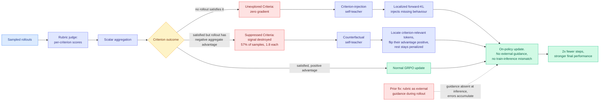

# CriPO: Enhancing Rubric-based RL via Self-Distillation

**arxiv:** [2607.18082](https://arxiv.org/abs/2607.18082) · **Source:** [HuggingFace Daily Papers, 2026-08-03](../../raw/huggingface/2026-08-03-enhancing-rubric-based-rl-via-self-distillation.md) · **Authors:** Mingxuan Xia, Yuhang Yang, Chao Ye, Shuai Zhu, Shenzhi Yang, Guangcheng Zhu, Yuhang Zhang, Cheng Peng, Haobo Wang, Siqing Wang (Zhejiang University, ByteDance)

## TL;DR

Rubric-based RL is how the field trains models on tasks with no single right answer. Instead of one scalar preference score, an LLM judge grades the response against a list of written criteria and the criterion scores are aggregated into a reward. The known complaint is **limited exploration**: a criterion that no sampled rollout ever satisfies produces no gradient, so the model never learns it. Existing fixes hand the rubric to the model during rollout generation as external guidance, which works and then breaks, because the policy is optimized on guided rollouts and deployed without guidance, so errors accumulate through autoregressive decoding.

CriPO's contribution is that it names a **second** failure mode that the exploration-focused line missed entirely, and it is more common than the first. **Suppressed Criteria**: a criterion that some rollout *did* satisfy, whose learning signal is destroyed anyway because scalar aggregation gave that rollout a non-positive aggregate advantage. The rollout got the criterion right and everything else wrong, so the good behaviour is punished along with the bad. The measurement is the striking part: **over 57% of samples exhibit this throughout training, at an average of 1.8 suppressed criteria per sample.** The field has been optimizing against exploration while more than half its samples were leaking signal it had already found.

The fix is on-policy self-distillation, so nothing breaks the train-inference match. For unexplored criteria, CriPO builds a **criterion-injection self-teacher** (the same policy, told about the missing criterion) and applies a localized forward-KL loss to inject the behaviour. For suppressed criteria, it builds a **counterfactual self-teacher** that locates which tokens in a negative-advantage rollout were the criterion-relevant ones, and **flips those tokens' advantages to positive** while the rest of the rollout stays penalized. On medicine and science benchmarks it beats rubric-based RL with roughly **2x fewer optimization steps**.

## The mechanism worth keeping

The counterfactual self-teacher is the load-bearing idea and it is more general than rubrics. GRPO, the group-relative policy optimization algorithm that most of this literature uses, assigns one advantage to a whole rollout by comparing its reward to the group mean. That is a **credit-assignment approximation**: every token in a below-average rollout is treated as having contributed to being below average. CriPO says that when you have a decomposed reward, you can partially undo the approximation, because the rubric tells you *which* criterion was met and a counterfactual pass tells you *which tokens* met it. Flipping only those tokens' advantages is a token-level credit assignment derived from a criterion-level reward.

That framing makes CriPO less a rubric paper than a **reward-decomposition paper**: any factorized reward with a locatable span is enough. The rubric is just the most available source of factorization today.

## Relation to prior wiki state

**Directly extends the rubric line the wiki has tracked since April, and answers the specific complaint that line ended on.** [C2 (04-18)](2026-04-18-c2-rubric-reward-modeling.md) established the shape, training a rubric generator from binary preferences plus a critical verifier that accepts or rejects each rubric before acting on it, so an 8B model matched one trained with rubrics from a 4x larger model. [Reward Hacking in Rubric-Based RL (05-13)](2026-05-13-reward-hacking-rubric-based-rl.md) then stress-tested the whole direction and found rubrics introduce their own hacking surface, separating verifier failure from rubric-design limitation, with exploitation growing over training and concentrating in partial satisfaction of compound criteria, treating implicit content as explicit, and imprecise topical matching. That paper's verdict was that rubrics beat scalars but by less than the four preceding papers implied. **CriPO adds a fifth failure mode to that taxonomy, and it is not a hacking mode, it is an optimizer mode**: the rubric was right, the judge was right, and the aggregation threw the signal away anyway.

**It gives yesterday's reward-model result its constructive counterpart.** [What do reward models memorize? (08-02)](2026-08-02-what-reward-models-memorize.md) found that memorization in discriminatively trained reward models concentrates on easy high-margin pairs that needed it least, that the model memorizes *which generator wrote the answer* and uses it, and that on held-out pairs it falls back to length and compliance. The wiki's read was that this gives the rubric line a mechanistic justification it had not had: **a rubric item cannot be satisfied by knowing which model wrote the answer.** CriPO is the other half of that argument. Yesterday's paper says the scalar reward model learns the wrong things; today's says that even with a decomposed reward, scalar *aggregation* at the advantage step reintroduces the same information loss. Decomposing the reward is necessary and, on its own, not sufficient. **You have to keep the decomposition all the way to the gradient.**

**It resolves the train-inference mismatch complaint that [NudgeRL (05-18)](2026-05-18-nudgerl-strategy-guided-rlvr.md) and the guidance-based exploration family opened.** Those methods bought exploration by conditioning rollouts on information the deployed model will not have. CriPO gets exploration from a self-teacher that is the same policy with a different prompt, so the distillation target is on-policy by construction. That is the same structural move [MAPD (08-02)](../inference-efficiency/2026-08-02-mapd-multi-agent-protocol-distillation.md) made with its privileged student branch, where a branch that sees a JSON reasoning protocol supplies a dense distillation signal to a deployed branch that never sees it. **Two papers in two days using a privileged-information branch to get dense supervision without contaminating the deployed policy** is worth watching as an emerging pattern; a third would make it one.

**It is also a data point for the self-play line.** [SCOPE (06-01)](2026-06-01-scope-self-play-co-evolving.md) used a frozen copy of the initial model as a self-judge writing task-specific rubrics from source documents, reaching up to +10.4 points on open-ended benchmarks with no curated prompts. SCOPE's self-judge generates the rubric; CriPO's self-teacher repairs the gradient the rubric produces. They compose and nobody has composed them.

## Gaps

Medicine and science only, which are the two domains where rubric-based RL is easiest to write good criteria for, so whether the 57% suppression rate holds in creative or conversational domains with fuzzier criteria is unmeasured. The counterfactual self-teacher has to *locate* criterion-relevant tokens, and the abstract does not say how reliable that localization is or what a wrong localization costs; flipping the advantage on the wrong span is a targeted reinforcement of a bad behaviour, which is a worse failure than leaving it suppressed. The 2x step reduction is a training-efficiency claim with no wall-clock number, and running two self-teachers per update is not free. No scale sweep is reported. And there is no ablation separating the unexplored-criteria half from the suppressed-criteria half, so which of the two mechanisms carries the gain is unknown, which matters because the paper's own novelty claim rests on the second one.

## Industrial read

The measurable takeaway is a diagnostic anyone running rubric-based RL can compute today with no new machinery: **count how many of your samples contain a criterion that some rollout satisfied while that rollout got a non-positive advantage.** If that number is anywhere near 57%, more than half your judged signal is being discarded by the aggregation step, and that is a cheaper thing to fix than buying a better judge. The broader implication for post-training stacks is that **the reward and the advantage should not be allowed to have different resolutions.** Teams have spent two years making rewards more granular and left the advantage computation scalar, and this paper is the first to price what that mismatch costs.

## Related pages

- [RL for LLMs](rl-for-llms.md)
- [C2 rubric reward modeling (04-18)](2026-04-18-c2-rubric-reward-modeling.md)
- [Reward Hacking in Rubric-Based RL (05-13)](2026-05-13-reward-hacking-rubric-based-rl.md)
- [SCOPE self-play (06-01)](2026-06-01-scope-self-play-co-evolving.md)
- [What do reward models memorize? (08-02)](2026-08-02-what-reward-models-memorize.md)
- [Knowledge Distillation](../inference-efficiency/knowledge-distillation.md)
