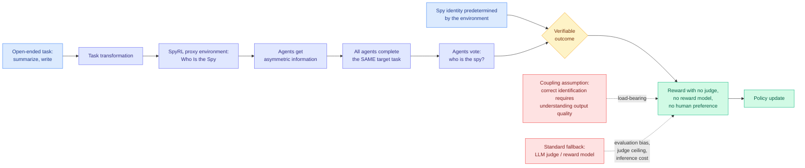

# From RLVR to RLSVR: Task Transformation Induces Self-Verifiable Rewards

**arxiv:** [2607.23802](https://arxiv.org/abs/2607.23802) · **Source:** [HuggingFace Daily Papers, 2026-08-03](../../raw/huggingface/2026-08-03-from-rlvr-to-rlsvr-task-transformation-induces-self-verifiab.md) · **Code:** [github.com/wangqinsi1/SpyRL](https://github.com/wangqinsi1/SpyRL)

## TL;DR

RLVR, reinforcement learning with verifiable rewards, is the recipe behind most of the reasoning gains of the last two years: generate an answer, check it against a deterministic verifier, reward accordingly. It works wherever correctness is decidable, which means mathematics and code, and stops at the edge of everything else. Open-ended tasks fall back on human preferences, reward models, or an LLM judge, each of which brings evaluation bias, a judge-capability ceiling, and per-rollout inference cost.

RLSVR's move is borrowed from self-supervised learning, where you invent a pretext task whose supervision comes free from the data. Here you **transform the open-ended task into a verifiable proxy environment** whose own rules emit the reward. The instantiation, SpyRL, is a multi-agent game modeled on *Who Is the Spy?*: several agents get asymmetric information, all complete the same target task (write the summary, write the story), then vote on which of them is the spy. Because the spy's identity was **predetermined by the environment**, the voting outcome is fully verifiable with no judge at all. And because identifying the odd one out requires actually reading and understanding the outputs, the verifiable signal stays coupled to output quality.

Reported on text summarization, creative writing and mathematical reasoning: SpyRL beats existing self-improvement methods on the non-verifiable tasks and still gains on the verifiable ones.

## The load-bearing assumption

Everything rests on one sentence in the abstract: "successful identification remains closely related to output quality." That is the coupling assumption, and it is where a proxy-environment method lives or dies, because the reward is now measuring something adjacent to what you want rather than what you want.

The failure mode is easy to state and the paper's reported gains suggest it did not dominate, but it is not obviously absent: a policy can improve at *being identifiable or unidentifiable* without improving at summarization. Making your summary stylistically distinctive is a good way to lose the spy game and has nothing to do with quality. Making it blandly generic is a good way to hide and is actively bad writing. The environment rewards a specific kind of discriminability, and the bet is that discriminability under asymmetric information correlates with substance. That is a bet, not a theorem, and the paper reports the correlation empirically rather than establishing it.

## Relation to prior wiki state

**This is the second architecture the wiki has seen for getting reward out of open-ended tasks without a judge, and the two differ in an instructive way.** [SCOPE (06-01)](2026-06-01-scope-self-play-co-evolving.md) co-evolved a Challenger that generates document-grounded tasks and a Solver that answers them via multi-turn retrieval, with a **frozen copy of the initial model as the self-judge**, writing task-specific rubrics from the source document and grading against them. Up to +10.4 points on eight open-ended benchmarks, matching or beating GRPO trained on about 9K curated prompts. SCOPE removes the *external* judge and keeps judging. RLSVR removes judging entirely and replaces it with a game rule. **SCOPE's reward is only as good as the frozen model's rubric-writing; RLSVR's is exactly correct and only approximately about the right thing.** Those are opposite error profiles: SCOPE has a noisy measurement of the right quantity, RLSVR an exact measurement of a proxy.

**It also sharpens today's other RL result.** [CriPO (08-03)](2026-08-03-cripo-rubric-rl-self-distillation.md) found that in rubric-based RL, over 57% of samples contain a criterion that some rollout satisfied whose signal was destroyed by scalar advantage aggregation. That is a paper about a decomposed reward losing resolution at the gradient. RLSVR goes the other way and produces a **maximally scalar** reward, one bit per episode from a vote. Read together they mark the two ends of the same axis: rich decomposed rewards that leak at aggregation, versus atomic verifiable rewards that never leak and never say why. The wiki has no paper that gets both, and that is the gap worth naming.

**Adds a fourth entry to the self-play thread on [RL for LLMs](rl-for-llms.md)**, and the first where the verification comes from *multi-agent* structure rather than from self-consistency or a frozen judge. Making the environment's hidden state the source of ground truth is a genuinely different generator of verifiable signal, and it is reusable: any hidden-role game, any prediction with a delayed reveal, any setting with a fact the environment knows and the agents must infer.

## Gaps

Three task families and no scale sweep, so how the coupling assumption behaves as the policy gets stronger is unknown, and it should get *worse*, because a stronger policy is better at optimizing whatever the environment actually measures. There is no ablation testing the coupling directly, which would be straightforward: correlate spy-game win rate against a held-out human or judge score for output quality across training, and show the correlation does not decay. Absent that, "closely related to output quality" is asserted. The multi-agent rollout is also more expensive per reward than a single judge call, and the abstract makes no cost comparison, which undercuts the "additional inference costs" complaint it opens with. And the gains on mathematical reasoning, a domain that already has a real verifier, are unexplained: if RLSVR helps where RLVR already works, something other than verifiability is doing the work.

## Industrial read

The generalizable idea is not the spy game. It is **task transformation as a design discipline**: before reaching for an LLM judge, ask whether the task can be embedded in a structure where the environment already knows the answer. Hidden-role games are one family. Others exist and are unexplored: hold out a fact and reward recovering it, generate then re-derive the input, pair an agent against a delayed real-world outcome. Every one of those turns a subjective evaluation into a verifiable one at the cost of measuring something slightly to the side of what you wanted.

For anyone running post-training on open-ended tasks today, the near-term value is as a **cheap auxiliary signal** rather than a replacement. The judge-based reward measures the right thing badly. The game-based reward measures a proxy exactly. Combining them is the obvious experiment and nobody has run it.

## Related pages

- [RL for LLMs](rl-for-llms.md)
- [SCOPE self-play (06-01)](2026-06-01-scope-self-play-co-evolving.md)
- [CriPO (08-03)](2026-08-03-cripo-rubric-rl-self-distillation.md)
- [Multi-Agent Systems](../agentic-systems/multi-agent-systems.md)
