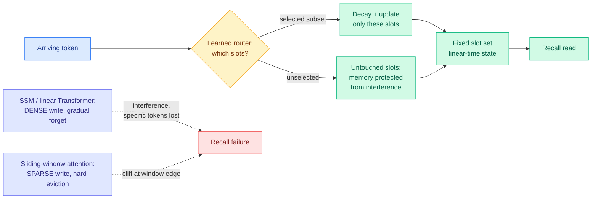

# Raven: High-Recall Sequence Modeling with Sparse Memory Routing

**Source:** Kurate weekly cs.LG leaderboard #16, ai_rating **7.0/10** (highest on either board this week) · [arXiv 2607.25357](https://arxiv.org/abs/2607.25357) · published 2026-07-28 · raw: [`raw/kurate/2026-08-04-cs-lg.md`](../../raw/kurate/2026-08-04-cs-lg.md)

**Authors:** Arshia Afzal (EPFL), Aviv Bick (CMU), Eric P. Xing (CMU, MBZUAI), Volkan Cevher (EPFL), **Albert Gu** (CMU, Cartesia AI)

**Not on HuggingFace Daily Papers.** LLM-rated underrated: top ai_rating on the week's cs.LG board, absent from the popularity signal entirely.

## TL;DR

Raven is a linear-time sequence model that interpolates between the two ways existing efficient architectures write to memory, and the framing is the contribution as much as the method. State-space models and linear Transformers **write densely**: every arriving token updates the entire state, so information persists indefinitely in principle but interferes, and recovering one specific past token gets hard. Sliding-window attention **writes sparsely**: it stores explicit token representations, so in-window recall is reliable, but eviction at the window edge is a hard cliff. Raven keeps a fixed set of memory slots and, at each step, **decays and updates only a selected subset via learned input-dependent routing**. That buys it protection from both failure modes at once: no position-based overwriting or hard eviction as in sliding-window attention, and much less interference than a dense state update. It is competitive with or better than prior linear-time baselines on recall-intensive benchmarks, stays effective **extrapolating to 16x its training context length**, and the gains carry into hybrid architectures.

---

---

## Key claims

- **The memory-write axis is the right way to organize the linear-attention zoo.** Two extremes, dense-write-with-gradual-forgetting (Mamba, GLA, DeltaNet) and sparse-write-with-hard-eviction (sliding-window attention), and the middle of that axis was empty.
- **The gap was specifically sparse routing *plus* selective decay.** Gated Slot Attention and Attention with Bounded Memory Control already introduced input-dependent routing, but both still wrote densely to all slots, so they could not isolate and protect a specific memory. Raven's decay applies **only to the slots it updated**, which is what makes protection possible.
- **Recall-intensive benchmarks are where both baseline families sharply degrade**, and that is where Raven's margin sits. Not perplexity, not aggregate downstream averages.
- **16x length extrapolation beyond training context**, which is unusual for any fixed-state model and is the specific property that has historically broken linear-attention substitutes.
- **The gains hold in hybrid architectures**, meaning Raven is a candidate replacement for the linear half of a KDA-plus-full-attention or Mamba-plus-attention backbone rather than a standalone alternative to Transformers.

## Gaps

The abstract reports "competitive with or outperforms prior linear-time baselines" without naming scales, and the wiki's repeated experience with this family (Parallax topped out at 1.7B, MDN at 1.3B) is that the recall claim is the one that fails to survive scale. No frontier-scale validation, and no RULER or needle-in-haystack numbers stated in the abstract. Routing adds a per-step decision that has to be cheap: no kernel or wall-clock throughput number appears in the abstract, and a slot router that costs more than the dense update it replaced would nullify the point.

## How this relates to prior wiki pages

**It directly addresses the open problem [attention-mechanisms](attention-mechanisms.md) has carried since 05-29.** That page lists as its first open problem: "Does the local-linear advantage survive scale and long-context retrieval? In-context retrieval is exactly where linear-attention substitutes historically collapse." Raven is the first paper in the wiki to attack that collapse *as the primary target* rather than reporting it as a limitation, and its answer is that the collapse was a write-policy artifact rather than a fixed-state capacity limit. Whether that survives at frontier scale is unresolved, but the diagnosis is new.

**It is a third line of work on that page, and the page should say so.** The page currently tracks Line 1 (the recurrent *rule* inside linear layers: Mamba2, GDN, KDA, plus MDN's momentum) and Line 2 (the estimator *order* of the attention read: softmax as local-constant fit, Parallax as local-linear fit). Raven changes neither. It changes **which part of the state gets written at all**, which is a write-sparsity axis orthogonal to both. Concretely: MDN improves how a dense update moves, Parallax improves what the read computes, Raven decides that most of the state should not be touched.

**It is the same structural insight as the KV-cache selection line, arrived at from the architecture side.** [LOCKS (07-29)](../inference-efficiency/2026-07-29-locks-page-local-key-summaries.md) established that attention keys are locally low-rank but globally high-rank, so a shared basis across the whole cache destroys the page-specific directions that distinguish neighbours, and gave every page its own summary. Raven's argument is the training-time twin: a shared dense state across all content destroys the slot-specific content that distinguishes one memory from another, so give each memory its own slot and only write the ones you mean to. [kv-cache](../inference-efficiency/kv-cache.md) named the pattern on 07-29 as "sparse retrieval over a growing cache is becoming the default answer to persistence, whatever the modality," after long-context serving, agentic memory and interactive world models converged on it in one quarter. **Raven makes it four, and it is the first one inside the model's own parameters rather than in the serving layer.**

**It gives the Kimi K3 prefix-cache problem an architectural exit.** The [SemiAnalysis K3 primer (08-04)](2026-08-04-semianalysis-kimi-k3-architecture-primer.md) shows that KDA's fixed-size recurrent state stops being a memory win under prefix caching, because the engine has to checkpoint state every 32K tokens without knowing where a prefix boundary falls. A slot-structured state with input-dependent routing is a different object to checkpoint: slots are addressable and most are untouched at any step, which at least makes incremental or differential checkpointing conceivable in a way a monolithic dense state does not. Nobody has connected these two papers.

**It is also the first entry on the routing page where the thing being routed is a memory slot, and that makes it the constructive answer to an axis opened in July.** [llm-routing](../ai-routing/llm-routing.md) has tracked routing across models ([TRACER 04-17](../ai-routing/2026-04-17-tracer-llm-routing.md), a model picked per query), across task-axis experts ([CaRE 05-11](../ai-routing/2026-05-11-care-bi-level-routing-moe-continual-learning.md)), across attention heads ([MISA 05-11](../inference-efficiency/2026-05-11-misa-mixture-of-indexer-sparse-attention.md), per-head KV selection), and across workflow phases ([Kilo's plan/implement split 06-16](../ai-routing/2026-06-16-kilo-plan-implement-model-split.md)). Every one of those is **query-conditioned**. Raven's router fires per incoming token, before any query exists, which makes it structurally **admission control against a fixed budget** rather than dispatch. That is exactly the shape [InMind (07-29)](../agentic-systems/2026-07-29-inmind-implicit-association-blind-spot.md) argued was missing: InMind measured the implicit-association blind spot, where retrieval-based memory only surfaces a fact when the fact resembles the query, so a stored tree-nut allergy never fires on a macaron request, and six vector, graph and agentic memory systems reached at most 14.4% on indirect queries against 84.0% when the decisive memory was simply placed in context. Its stated open problem was **deciding which facts must stay visible, decided before the query is known**, which cannot be query-conditioned by construction. Raven does not solve InMind's benchmark, which concerns an agent's external store rather than a layer's internal state, but it is the first architecture in this wiki whose routing decision has the right causal structure, and that makes the two papers worth reading together.

**The contrast that isolates Raven's actual contribution is against GSA and ABC, not against Mamba.** Gated Slot Attention and Attention with Bounded Memory Control already had input-dependent routing over a fixed slot set. Both still **wrote densely to all slots**, so routing changed the weighting of a write without ever isolating or protecting a memory. Raven's claim is that the protection is the load-bearing half: a slot you did not route to is a slot whose contents remain exactly retrievable. Stated that way it is also the stronger version of what [Gated DeltaNet-2 (05-24)](../inference-efficiency/2026-05-24-gated-deltanet-2-decoupled-erase-write.md) was reaching for by decoupling erase from write, since an unrouted slot needs no erase gate at all.

**And it sits against the 06-17 hybrid mechanism finding rather than with it.** [Rethinking Efficient Attention in Hybrid Architectures (06-17)](../inference-efficiency/2026-06-17-rethinking-efficient-attention-hybrid.md) found that long-range retrieval is carried by the **full-attention** layers and the efficient layers merely shape their optimization trajectory, and even that a *bigger* sliding window delays retrieval-head formation because the cheap layers cover for them (Large-Window Laziness). Raven's claim is that an efficient layer can itself carry high recall. If both are right, the interesting question is whether a Raven-based hybrid shifts retrieval work *back* into the efficient layers, and whether that helps or reintroduces laziness. That is a clean experiment nobody has run.

## Open problems

- **Scale.** No frontier-scale numbers. The family's track record says this is the load-bearing unknown.
- **Router cost.** A per-step slot-selection decision needs a kernel story to be deployable, and none is stated.
- **Composition with the recurrent-rule line.** Raven decides *which* slots to write; MDN decides *how* a write moves (with momentum). Nobody has combined a momentum delta-rule with sparse slot routing, which is now the second uncombined pair on the attention-mechanisms page.
- **Does sparse write help or hurt Large-Window Laziness in hybrids?** See above.

## Related pages

- [Attention Mechanisms](attention-mechanisms.md)
- [KV Cache](../inference-efficiency/kv-cache.md)
- [LLM Routing](../ai-routing/llm-routing.md)
- [SemiAnalysis Kimi K3 architecture primer](2026-08-04-semianalysis-kimi-k3-architecture-primer.md)
