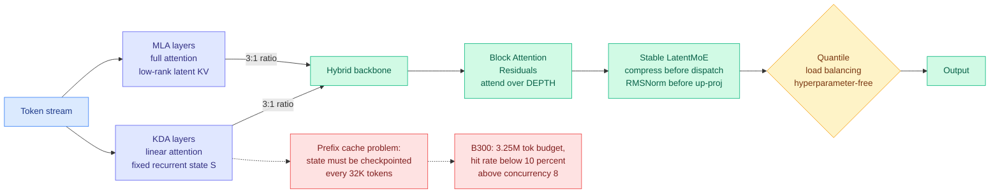

# SemiAnalysis: Kimi K3, The Manos, The Mythos, The Legendos

**Source:** [SemiAnalysis newsletter, 2026-08-03](https://newsletter.semianalysis.com/p/kimi-k3-the-manos-the-mythos-the) (Kimbo Chen) · raw: [`raw/rss/2026-08-03-semianalysis-kimi-k3-the-manos-the-mythos-the-legendos.md`](../../raw/rss/2026-08-03-semianalysis-kimi-k3-the-manos-the-mythos-the-legendos.md), also starred in [`raw/gmail/2026-08-04-starred.md`](../../raw/gmail/2026-08-04-starred.md)

## TL;DR

SemiAnalysis published the architecture primer for Kimi K3 that the release blog did not, and it is the most useful single document on hybrid linear attention this wiki has ingested. Four things are new. First, a full derivation of Kimi Delta Attention (KDA) from linear attention through DeltaNet and Gated DeltaNet, plus a FLOP-and-bytes complexity analysis of Moonshot's open-sourced FlashKDA kernels. Second, a **new proposed metric, KV throughput** (KV cache size divided by prefill time at a given sequence length), on the argument that KV cache *size* alone is a meaningless efficiency number because it is a property of the whole model design rather than a standalone knob. Third, and most consequential for anyone deploying linear-attention models, **linear attention does not actually give you a constant-size KV cache in production**: prefix caching requires saving the recurrent state, and since the engine cannot know where a future prefix boundary will fall, vLLM checkpoints KDA state every 32K tokens and at prompt boundaries, so cache memory grows with sequence length again, just with a much smaller constant. Fourth, measured serving numbers on real agentic traces showing that on a B300 node holding 3.25M tokens of KV budget, **cache hit rate collapses below 10% above concurrency 8 when the theoretical hit rate is 95%**.

---

---

## What the primer actually establishes

### 1. KDA is DeltaNet plus per-channel decay, and the lineage is a chain of loss-function edits

The derivation is clean and worth carrying. **Linear attention** removes the softmax, which lets you reorder the matrix products and compress all past keys and values into a single hidden state `S` rather than reading every past key. Reinterpreted as online learning, `S` is an associative memory and the update term is the gradient of a retrieval loss. **DeltaNet** changes that loss to minimize the L2 norm of the value retrieval, which regularizes the unbounded growth of `S` that makes plain linear attention lag softmax on long-range recall, and yields the Delta Rule: subtract the associations irrelevant to the current key before writing. **Gated DeltaNet** adds an LSTM-style forget gate `alpha` on `S`, so memory lifespan becomes learnable weight decay. **KDA** expands `alpha` from a scalar into a diagonal matrix, giving per-channel memory decay and positional awareness. That last step is why KDA can replace RoPE in the neighbouring full-attention layers: it is itself a position-aware operator.

This confirms the mechanism the [attention-mechanisms](attention-mechanisms.md) page has tracked as "Line 1, the recurrent rule inside linear layers": Mamba2 / GDN / KDA all interpret their state update as one closed-form online-SGD step, and each named advance is a change to the implicit objective, not to the surrounding architecture.

### 2. FlashKDA's complexity, derived

Moonshot open-sourced FlashKDA. It launches two kernels: K1 prepares chunk-level tensors in parallel (cumulative decay, decayed Q/K, the inverse `(I+L)^-1` via Neumann factorization, the causal mask), K2 runs the chunk-level recurrence. Combining both, per chunk of size C at head dim D, FlashKDA performs `12C^3 + 8C^2 D + 6C D^2` FLOPs, and accesses `8C^2 + 22CD` bytes. Aggregated over sequence length T, that is `O(T D^2)` compute and `O(TC + TD + D^2)` traffic. Decode is roughly `7D^2` FLOPs against `8D^2` bytes, dominated by reading and writing the FP32 recurrent state. So: **prefill linear in sequence length for both compute and memory, decode constant in sequence length for both.**

### 3. Kimi K3's structure, inferred from Kimi Linear

K3 shares Kimi Linear's shared-expert count, hybrid ratio, and general attention module design. Concretely: Q, K, V get a linear projection plus a **left-padded short convolution** (captures local token dependencies without breaking causality), and L2 norm on Q and K to stabilize the eigenvalues of the transition and output matrices. The decay gates are low-rank (`alpha`) and down-projection (`beta`). KDA output is per-head normalized under an output forget gate, implemented as a plain linear transform in K3 where Kimi Linear used a low-rank projection.

KDA interleaves with **full-attention Multi-head Latent Attention at a 3:1 ratio**, which Kimi Linear identified as the performance-efficiency optimum. That number matters because it is now the third independent arrival at the same ratio: [SANA-Video 2.0 (07-24)](../inference-efficiency/2026-07-24-sana-video-hybrid-linear-attention.md) fixed 25% softmax as the quality-efficiency optimum in a video diffusion transformer trained from scratch, and Ling/Ring-2.6 (06-16) migrated a 1T model to 7:1 Lightning Attention:MLA. Three subfields, one design point neighbourhood.

**The MLA call is the primer's sharpest architectural criticism.** Every other frontier open-weight model has moved to GQA-based sparse attention: GLM 5.2 (DeepSeek Sparse Attention), DeepSeek V4 (Compressed Sparse Attention), MiniMax M3 (MiniMax Sparse Attention), MiMo V3 (HySparse). MLA uses an absorption trick that cheapens decode at the cost of extra prefill compute, which is a good trade for decode-dominant reasoning and a bad one for **prefill-dominant agentic** workloads. SemiAnalysis predicts K4 replaces MLA.

### 4. KV throughput: a new metric, and it should be adopted

The argument: you cannot infer KV cache efficiency from KV cache space complexity, because no open-weight model ships with static KV compression, architecture inference efficiency changes KV efficiency, and the effect of cache size depends on how much memory the parallelism strategy left over (wide expert parallelism versus tensor parallelism have very different memory profiles). So SemiAnalysis proposes **KV throughput = KV cache size / prefill time (TTFT)** at a given sequence length. It is the minimum bandwidth needed to serve the model under prefill/decode disaggregation, and it folds architecture efficiency into the number because prefill time does. Their table shows hybrid linear attention's benefit growing with sequence length. It also directly reads as the bandwidth requirement for offloading KV to each memory tier in a cluster.

### 5. The prefix-cache result is the one that changes deployment advice

Modern engines find a prefix-cache hit by matching the longest token prefix already cached. For standard attention that works because every token position has its own KV rows. **For KDA the recurrent state is a single fixed-size object per position, so without knowing where a future prefix boundary will fall, you would have to checkpoint the state at every token position, which puts memory growth back to linear and defeats the entire point.** Moonshot's answer is coarse-granularity checkpointing: vLLM saves KDA recurrent state every 32K tokens, plus at prompt boundaries because a new agentic turn typically starts there. The conclusion the primer states plainly: **even though KDA greatly reduces KV memory, in real serving it does not consume a constant amount.**

### 6. Attention Residuals and Block Attention Residuals

Kimi's second structural idea: run attention over the **depth** axis instead of the sequence axis. Each layer holds a *learned* query vector (not derived from the current token), attends via softmax over the representations produced by previous layers, and takes a weighted sum. The motivation is a real defect in plain residual streams, that early layers dominate the stream, information loss is irreversible with depth, and later layers must raise output gain to have any effect, which destabilizes training. Highway networks gate the flow but still deny layers *selective* access to specific earlier layers.

Full attention residuals need every past layer output, which is `O(Ld)` communication on a model sharded across many GPUs. **Block Attention Residuals** split L layers into N blocks of S layers, attend over completed block outputs plus the current block's evolving partial sum, and cut communication to `O(Nd)`. Reported effects: **1.25x compute efficiency over standard residual connections**, consistently lower validation loss with the gap widening in the decay phase, bounded output magnitude with depth (unlike standard residuals), and consistent gradient magnitude.

Training and inference both needed engineering. For pipeline parallelism, naive transfer of all accumulated blocks across stages is quadratic in physical times virtual stages; **cross-stage caching** stores completed blocks on the rank that computed them so subsequent virtual stages reuse them, cutting `O(C)` to `O(P)` and bringing total overhead to **4% versus standard architecture**. For inference, the two-phase split mirrors prefill and decode: phase 1 batches all inter-block queries against completed blocks in one shot, phase 2 does online-softmax intra-block accumulation exactly like FlashAttention. Net IO footprint is close to a standard residual architecture.

This is the third appearance of Block Attention Residuals in the wiki inside two weeks, after [SANA-Video 2.0 (07-24)](../inference-efficiency/2026-07-24-sana-video-hybrid-linear-attention.md) used them to lift deep-layer effective rank ~12% and [MHAR (07-31)](2026-07-31-mhar-multi-head-attention-residuals.md).

### 7. LatentMoE and the communication-to-computation ratio

**LatentMoE** compresses routed tokens before dispatch and decompresses after aggregation; K3's Stable LatentMoE adds an RMSNorm before the up-projection to reduce scale sensitivity. The derivation the primer supplies is the useful part. MoE communication volume scales with routed tokens, active experts K, and expert input dim d, inversely with expert-parallel size E. K2 had 8 active experts at input dim 7168; K3 halves the latent input dim to 3584, which lets active expert count **double to 16 at unchanged communication volume**.

But the primer argues the ratio matters more than the volume, and derives it: `T_comm / T_comp = (P * F) / (6 * m * B) * (1 - 1/E)`, where m is the expert *intermediate* dimension, F is per-GPU FFN throughput, B is per-GPU network bandwidth, P is bytes communicated per activation element. **The only model-configuration term is m.** Raise the expert intermediate dimension and a larger fraction of communication can be hidden behind computation. That is the primer's explanation for why K2 to K3 raised expert intermediate dim to 3072, and why DeepSeek V4 Pro, MiniMax M3, MiMo V2.5 Pro and Inkling all did the same: as hardware FLOPs rise and expert weights get quantized harder, F grows, so m must grow to keep the ratio down.

### 8. Quantile load balancing

Jianlin Su's hyperparameter-free, aux-loss-free load balancer (Feb 2026 blog post). Like aux-loss-free balancing it updates router biases from observed load, but instead of nudging by a small coefficient it **computes the next bias directly from the distribution of router scores relative to the routing cutoff**. Each token routes to exactly k of n experts, so m tokens produce mk assignments and each expert should get `q = mk/n`. For each expert, sort the margins between its router score and every token's cutoff, then set the bias so exactly q margins sit above threshold. Since `q/m = k/n`, that is the `(1 - k/n)` quantile of the margin, hence the name. Bias updates shrink naturally as balance improves, which is what removes the tuning.

### 9. Serving numbers on real agentic traces

SemiAnalysis benchmarks K3 on InferenceX by replaying an hour of their own recorded Claude Code traces at steady state. The distribution: **median 142k input tokens, median 444 output tokens per turn, median 65 turns per session.** That is a small revision upward from the 140k-in/396-out AgentX figures reported on [07-25](../hardware/2026-07-25-semianalysis-amd-cuda-moat.md). The short output-per-turn is the signature of agentic harnesses where every edit is a tool call.

Deployment notes: all OpenRouter providers floor at $3/M input, $15/M output as of 30 July. Both NVIDIA and AMD had day-0 vLLM recipes with DRAM offload and DSpark speculative decoding. Day-0 bringup was easier than DeepSeek V4 because Moonshot shipped images and a speculative decoder alongside the weights. **K3 does not fit on a single B200 node**, forcing pipeline parallelism, which broke DSpark. On B300 it fits one node, but after weights, HBM holds only **3.25M tokens of KV cache**, and throughput rises with batch size only up to concurrency 8, past which the cache thrashes and **hit rate falls below 10% against a 95% theoretical rate**.

---

## How this relates to prior wiki pages

**Confirms and then sharply qualifies the 07-30 architecture-first claim.** The [local coding model report (07-30)](../inference-efficiency/2026-07-30-local-model-kv-cache-economics.md) measured a 20x KV cache gap between hybrid-attention and dense models and concluded the largest available win is architectural, chosen at model-selection time, roughly 10x what any software cache-management method reports. The primer confirms the direction (hybrid linear attention's KV throughput advantage grows with sequence length) and then supplies the missing catch: **the constant-size-state property does not survive prefix caching.** Coarse checkpointing every 32K tokens means the practical saving is a smaller constant, not a different asymptote. Anyone budgeting HBM from a linear-attention model's nominal state size will under-provision.

**Contradicts the attainability of the 99.2% cache hit rate.** The [07-25 AgentX numbers](../hardware/2026-07-25-semianalysis-amd-cuda-moat.md) reported a median 99.2% hit rate explicitly under an infinite-cache assumption, so an upper bound. The B300 measurement is the first number in the wiki showing how far the real figure falls: **below 10% past concurrency 8 on a single node with 3.25M tokens of budget.** The gap between 95% theoretical and under 10% realized is not a tuning problem, it is capacity, and it says KV-aware tiering (the open problem the [memory-hierarchy](../hardware/memory-hierarchy.md) page has carried since 06-07) is load-bearing rather than an optimization.

**Fills the standing gap the kv-cache page named.** [kv-cache](../inference-efficiency/kv-cache.md) has carried "nobody publishes cache-per-token" as a standing gap, noting it is absent from every model card and decides single-GPU deployability. KV throughput is a better version of that number because it prices architecture efficiency in. The page should adopt it.

**Extends the hybrid-ratio convergence.** Third arrival at the 3:1 to 7:1 linear:full band, and the first with an explicit criticism of the *full* half's choice (MLA versus GQA-sparse) on workload grounds.

**Gives the MoE-communication line a design equation.** [Coherent Overlap (07-31)](../ai-routing/2026-07-31-coherent-overlap-moe-routing.md) established that expert subspace similarity cannot determine pruning value. This primer works the orthogonal axis: what the *configuration* numbers (active experts, latent dim, intermediate dim) should be, and why they moved the way they did across five recent frontier releases. Both are arguments that MoE design has been justified by intuitions nobody had checked.

## Open problems this raises

- **Does a prefix-boundary predictor beat fixed 32K checkpointing?** Agentic turn boundaries are the natural cut points and the engine already knows where prompts end. A learned or heuristic boundary predictor could cut checkpoint count without losing hit rate. Nobody has tried.
- **What is KV throughput for the GQA-sparse family?** The primer proposes the metric and tabulates hybrid-versus-dense, but the interesting comparison is KDA+MLA against DeepSeek Sparse Attention and MiniMax Sparse Attention on the same axis, since that is the actual live design choice.
- **Does the `(P*F)/(6*m*B)` ratio predict the next generation's intermediate dimension?** It is a falsifiable claim about hardware-driven architecture. If the next round of open-weight MoEs raises m again in proportion to FLOPs growth, the formula is doing real work.

## Related pages

- [Attention Mechanisms](attention-mechanisms.md)
- [KV Cache](../inference-efficiency/kv-cache.md)
- [Memory Hierarchy for AI](../hardware/memory-hierarchy.md)
- [Kimi K3 release](2026-07-28-kimi-k3-open-frontier-intelligence.md)
- [MHAR: Multi-Head Attention Residuals](2026-07-31-mhar-multi-head-attention-residuals.md)
- [SANA-Video 2.0 hybrid linear attention](../inference-efficiency/2026-07-24-sana-video-hybrid-linear-attention.md)
- [Coherent Overlap in MoE routing](../ai-routing/2026-07-31-coherent-overlap-moe-routing.md)
