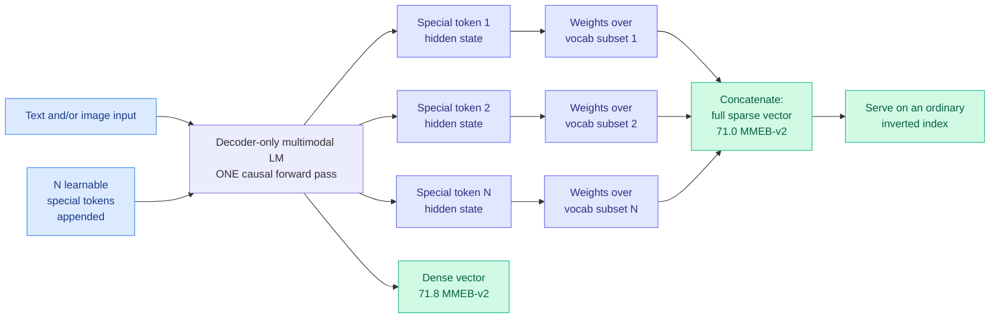

# UEmbed: sparse and dense retrieval from one decoder-only forward pass

**TL;DR.** Learned Sparse Retrieval (LSR) is the family of methods that predict per-term weights over a vocabulary so the result can be served on an ordinary inverted index, giving you lexical retrieval's exact-match behaviour and cheap serving with learned semantics on top. It has stayed tied to encoder-style bidirectional models, and extending it to images has meant bolting on auxiliary cross-modal modules. UEmbed produces **both a sparse lexical vector and a dense vector in one causal forward pass of a decoder-only multimodal model**. The trick is a vocabulary partition: append N learnable special tokens to the input, split the vocabulary into N disjoint subsets, have each special token's causal hidden state predict sparse weights over its assigned subset, then concatenate the N pieces into the full sparse vector. That is what makes a causal model able to emit a whole-vocabulary sparse representation despite each position only seeing its prefix. Released at 2B, 4B and 9B on public data. **UEmbed-9B reaches 71.8 dense and 71.0 sparse on MMEB-v2**, beating multimodal embedding models trained on public data such as RzenEmbed, and stays competitive with strong dense and sparse baselines on BEIR.

## Why the vocabulary partition is the whole idea

A bidirectional encoder can put one `[CLS]`-style position in charge of the entire vocabulary because that position attends to everything. A causal decoder cannot: a single appended token sees the input but the model was never trained to compress a full-vocabulary distribution into one position's hidden state, and asking one hidden state to score 150K terms is a hard bottleneck. Partitioning the vocabulary into N disjoint subsets and giving each subset its own dedicated special token turns one impossible prediction into N tractable ones, and because all N tokens sit at the end of the sequence they all see the full input. Concatenating disjoint subsets reconstructs the full sparse vector exactly, with no overlap to reconcile.

The practical consequence is that a **decoder-only** model, which is what every frontier multimodal model now is, becomes a first-class sparse retriever without a separate encoder in the stack, and images enter through the same pathway as text rather than through a bolted-on cross-modal adapter.

## How this relates to prior wiki pages

**It is a serving-cost result dressed as a retrieval result, and that is the angle this wiki cares about.** Sparse vectors run on inverted indexes, which are cheap, mature, and CPU-friendly; dense vectors need an ANN index and, at scale, GPU-adjacent infrastructure. Getting both from one forward pass means the retrieval tier can pick per query which representation to use without paying for two models or two encode passes. That is the same economic shape as the routing results on [llm-routing](../ai-routing/llm-routing.md), where the gain comes from having genuinely diverse options at comparable quality rather than from any single component being better. Here the diversity is in the **index type** rather than the model, and the reported near-parity (71.8 dense against 71.0 sparse) is what makes the choice free.

**It bears directly on the upstream-prior argument [KAP (08-02)](../inference-efficiency/2026-08-02-kap-knowledge-access-planning.md) made.** KAP named the Knowledge Selection-Runtime Consumption gap: a system spends real effort producing structured priors before the prompt exists (ranked evidence, graph topology, confidence scores), then flattens all of it into a token sequence, at which point the serving backend can only consume the KV state densely and uniformly, so **improving your retriever makes your serving worse**. A retriever that emits an interpretable sparse term-weight vector is producing exactly the kind of structured prior KAP wants to compile into a runtime access plan, and unlike a dense embedding those weights are term-addressable. Nobody has connected a learned-sparse retriever to a KV access plan, and it is the obvious composition: the sparse weights say which terms mattered, and a plan could use that to decide which cache regions to read.

**On the practitioner side it lands next to an infrastructure observation from the same week.** Simon Eskildsen's Turbopuffer talk, synced to `raw/youtube-ai-tech/` on 08-03, argues from hardware constants that vectors belong on object storage at roughly $1 per million instead of $100, and that the dominant architectural constraint is minimising round trips because P99 for a 256-512 KB S3 object is around 200 ms and a single query compounds P99 across tree levels. A model that can serve the same query from an inverted index instead of a vector index changes which of those round trips you need at all, so the two results are complementary: one lowers the cost of the dense path, the other offers a way to avoid it per query.

## Gaps

Zero upvotes on HuggingFace and no independent evaluation, so the MMEB-v2 numbers are self-reported. The comparison is explicitly scoped to "models trained on publicly available data," which excludes the strongest commercial embedding models and is a real qualifier on the headline claim. N, the number of special tokens and vocabulary partitions, is the central hyperparameter and the abstract reports no sweep, so how sensitive the sparse quality is to the partition count and to *how* the vocabulary is split (frequency-balanced? random? semantic?) is unknown, and a bad split is the obvious failure mode. The efficiency claim is asserted across "effectiveness, efficiency, and agentic applications" with no latency, index-size or throughput number in the abstract, which for a paper whose main practical argument is serving cost is the important omission. And BEIR performance is described as "competitive," which usually means not winning.

## Links

- Paper: [arXiv 2608.02583](https://arxiv.org/abs/2608.02583) · [HuggingFace](https://huggingface.co/papers/2608.02583)
- Raw source: [raw/huggingface/2026-08-04-uembed](../../raw/huggingface/2026-08-04-uembed-unified-sparse-and-dense-multimodal-embeddings.md)
- Related: [llm-routing](../ai-routing/llm-routing.md) · [KAP](../inference-efficiency/2026-08-02-kap-knowledge-access-planning.md) · [kv-cache](../inference-efficiency/kv-cache.md)
