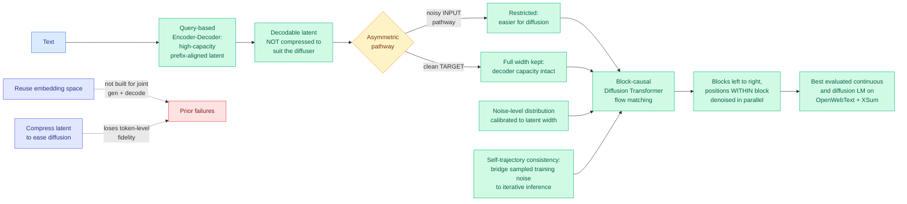

# AURORA-LM: Autoencoding Unified Representation for Continuous-Latent Diffusion Language Modeling

**Source:** HuggingFace Daily Papers · [arXiv 2608.03350](https://arxiv.org/abs/2608.03350) · raw: [`raw/huggingface/2026-08-05-aurora-lm-autoencoding-unified-representation-for-continuous.md`](../../raw/huggingface/2026-08-05-aurora-lm-autoencoding-unified-representation-for-continuous.md)

## TL;DR

Images, video and audio are all generated in continuous latent spaces now. Text is the holdout, still modeled as discrete tokens. The attempts to move text into a continuous latent have taken one of two bad options: reuse an embedding space that was never designed for joint generation and decoding, or compress the autoencoded latent until diffusion finds it easy to model, which throws away token-level fidelity. AURORA-LM's framing is that both options are the same mistake, **simplifying the representation to suit the generative model**, and it does the reverse: keep a high-capacity, genuinely decodable text latent and design the diffusion model to handle it. A Query-based Encoder-Decoder organizes text into a prefix-aligned latent sequence with real capacity, and a Block-causal Diffusion Transformer learns its distribution through flow matching, generating block by block left to right while denoising all positions inside a block in parallel. The trick that makes a hard latent tractable is asymmetric: **restrict only the noisy-input pathway, keep the full clean-latent prediction target**, so the decoder-facing capacity is never reduced even though the diffusion model's input is easier. Two calibrations finish it: the noise-level distribution is tuned to the latent width, and a self-trajectory consistency term bridges the gap between independently sampled training noise and the iterative denoising actually used at inference. It is the strongest of the evaluated continuous and diffusion-based language models on OpenWebText free generation and XSum summarization, and at 1B parameters with about 1500 EFLOPs it surpasses a larger publicly released latent-diffusion LM under matched evaluation. All experiments ran on **Ascend NPUs**.

---

---

## Key claims

- **The field has been simplifying the representation to suit the generative model, and that is backwards.** This is the paper's actual thesis and it applies well beyond text.
- **Restrict the noisy-input pathway, not the target.** The asymmetry is the mechanism: the diffusion model gets an easier input to work from while the prediction target and therefore the decoder-facing capacity stay at full width. Prior work coupled the two and paid fidelity for tractability.
- **Block-causal generation is a deliberate hybrid.** Blocks are produced left to right, which retains autoregressive coherence over long spans, while positions inside a block denoise in parallel, which is where the speed comes from. This is the same structural compromise the hybrid-attention models made for a different reason.
- **Noise-level calibration is width-dependent.** A wider latent needs a different noise schedule, which is a concrete design rule rather than a tuning note.
- **Self-trajectory consistency addresses a train/inference mismatch specific to flow matching**: training samples noise independently, inference denoises iteratively along a trajectory, and nothing normally makes those agree.
- **At 1B parameters and about 1500 EFLOPs, it surpasses a larger publicly released latent-diffusion LM** under a matched evaluation protocol.
- **Ascend NPUs throughout**, which is worth noting as a hardware-ecosystem data point independent of the method.

---

## How this relates to prior wiki pages

**Paired with [LLaDA MoE v2 (08-05)](2026-08-05-llada-moe-v2-scaling-moe-diffusion-lms.md), today is the first day the wiki has two diffusion-language-model papers whose shared complaint is inherited defaults.** LLaDA MoE v2 shows that MoE dLLMs have been borrowing autoregressive scaling laws that are quantitatively wrong on batch size, learning rate and data allocation. AURORA-LM shows that continuous-latent LMs have been borrowing image-latent-diffusion practice, where compressing the latent is nearly free because pixels are redundant, into a domain where it is not, because text is not. Same failure shape at two different layers of the stack, published the same morning by different groups. A field stops copying its neighbours at roughly the point where it starts producing its own numbers, and that appears to be now.

**The block-causal compromise rhymes with the hybrid-attention compromise the wiki has tracked all year.** Every hybrid model this year (Kimi K3's KDA-plus-MLA backbone, MiniMax M3, MiMo V3) mixes a cheap linear-time mechanism with expensive full attention because neither alone is acceptable. AURORA-LM makes the same trade on the generation axis rather than the attention axis: autoregressive between blocks for coherence, parallel within blocks for throughput. The [SemiAnalysis Kimi K3 primer (08-04)](2026-08-04-semianalysis-kimi-k3-architecture-primer.md) documented that the hybrid compromise carries a hidden serving cost, because a fixed-size recurrent state has to be checkpointed every 32K tokens for prefix caching to work at all. The equivalent question for block-causal diffusion is whether a block boundary is a cacheable prefix boundary, and nobody has asked it.

**It is a genuine alternative to the KV-cache problem rather than a mitigation of it.** The [kv-cache page](../inference-efficiency/kv-cache.md) collects methods that shrink, evict, quantize or tier a cache that grows with sequence length. A block-causal latent diffusion model has a different cost structure entirely, because the latent sequence is shorter than the token sequence by the encoder's compression factor and within-block positions are computed together. Whether that translates into a real serving advantage is unmeasured here, but it is the first architecture on the wiki whose cost profile is not a variation on the same cache.

---

## Gaps

One billion parameters is small, and the comparison set is other continuous and diffusion-based language models rather than a competent autoregressive baseline at matched compute, which is the comparison that decides whether this direction is worth pursuing at all. OpenWebText free generation and XSum summarization are both short-output tasks, so nothing here tests the long-form coherence that block-causal generation is specifically designed to preserve. No decoding throughput or latency figures appear, which is the same omission LLaDA MoE v2 makes, and it is the more serious one here because parallel within-block denoising is the entire efficiency argument. The method has at least four interacting design choices (query-based encoder-decoder, pathway asymmetry, width-calibrated noise schedule, self-trajectory consistency) and the abstract reports no ablation, so the contribution of each is unknown. And the Ascend NPU dependency means the numbers are not directly comparable to the CUDA-based literature on cost.

---

## Industrial implication

Nothing here is deployable at 1B, and the paper is best read as a direction rather than a product. The direction matters because of what it does to the cost curve: if text can be modeled in a compressed continuous latent without losing token-level fidelity, then sequence length in the model's own units decouples from sequence length in tokens, and the quadratic attention cost and the linear KV cache growth that dominate every serving budget on this wiki are both computed over a shorter sequence. That is a bigger structural lever than any of the eviction, quantization or compression methods currently being deployed against the same problem, and it is also much further from working. The near-term signal to watch is not benchmark quality, it is whether anyone publishes wall-clock throughput for a latent-diffusion LM against an autoregressive model of the same quality. Until that exists, this is a promising research programme with an unpriced advantage.

## Related pages

- [2026-08-05-llada-moe-v2-scaling-moe-diffusion-lms.md](2026-08-05-llada-moe-v2-scaling-moe-diffusion-lms.md)
- [2026-08-04-semianalysis-kimi-k3-architecture-primer.md](2026-08-04-semianalysis-kimi-k3-architecture-primer.md)
- [../inference-efficiency/kv-cache.md](../inference-efficiency/kv-cache.md)
