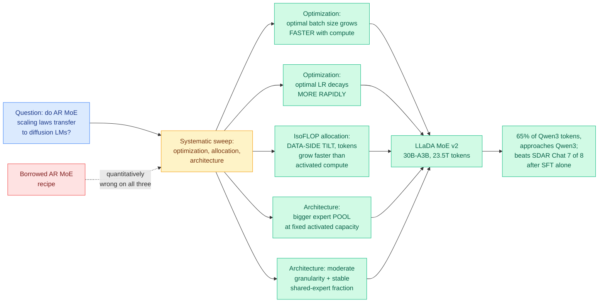

# LLaDA MoE v2: Scaling Mixture-of-Experts Diffusion Language Models

**Source:** HuggingFace Daily Papers · [arXiv 2608.03457](https://arxiv.org/abs/2608.03457) · raw: [`raw/huggingface/2026-08-05-llada-moe-v2-scaling-mixture-of-experts-diffusion-language-m.md`](../../raw/huggingface/2026-08-05-llada-moe-v2-scaling-mixture-of-experts-diffusion-language-m.md)

**Authors:** Fengqi Zhu, Shaoxuan Xu, Jingyang Ou, Zebin You, Yankai Lin, Wayne Xin Zhao, Chongxuan Li (corresponding), Ji-Rong Wen (corresponding), Gaoling School of AI, Renmin University of China; Yipeng Xing, Huabin Liu, Xiaolu Zhang, Jun Zhou, Zhenzhong Lan, Jianguo Li, **Ant Group**

## TL;DR

A diffusion language model (dLLM) generates text by iteratively denoising a corrupted sequence with a bidirectional model, instead of predicting one token after another left to right. That lets it decode many tokens per step, which is the reason anyone cares. Mixture-of-experts (MoE), where each token activates only a small subset of specialized sub-networks, is how the autoregressive world buys capacity without paying for it at inference. Putting the two together is obvious, and several groups have, but every existing MoE dLLM has borrowed its scaling recipe wholesale from autoregressive practice. This paper's contribution is to check whether that transfer is valid, and the answer is **no, in three specific and measurable ways**. For optimization, the optimal nominal batch size grows *faster* with compute than in AR models, and the optimal learning rate decays *more rapidly*. For compute allocation, an IsoFLOP analysis shows a data-side tilt: the optimal token budget grows faster than activated model-side computation, so a compute-matched dLLM should be trained on relatively more data than the AR rule would say. For architecture, larger scales increasingly favor **larger expert pools at fixed activated capacity**, while moderate expert granularity stays effective across scales and the preferred shared-expert fraction stays stable. They then use their own laws: **LLaDA MoE v2 is a 30B-A3B dLLM trained from scratch on 23.5T tokens**, roughly 65% of Qwen3's pretraining tokens, and it approaches Qwen3 on knowledge, reasoning and coding benchmarks. After supervised fine-tuning alone, no RL, it beats SDAR Chat on **seven of eight** reasoning and coding benchmarks.

---

---

## Key claims

- **AR MoE scaling laws do not transfer to MoE dLLMs, and the divergence is quantitative and reproducible.** This is the headline and it is a negative result about borrowed practice, which is more valuable than the model.
- **Batch size and learning rate both move differently with compute.** Optimal nominal batch size grows faster; optimal learning rate decays faster. Both directions matter because a lab tuning a dLLM from an AR playbook will systematically under-batch and over-LR at scale.
- **The IsoFLOP data-side tilt is the most consequential finding.** The optimal token budget grows faster than activated model-side computation, meaning a compute-matched dLLM should be *more data-hungry* relative to its activated size than the AR analogue. This is a direct planning input for anyone budgeting a dLLM pretrain.
- **Larger expert pools win at scale, at fixed activated capacity.** More experts, same tokens-per-expert activation. Moderate expert granularity remains consistently effective, and the shared-expert fraction is stable across scales, meaning two of the three MoE knobs can be set once and left alone.
- **30B-A3B on 23.5T tokens approaches Qwen3 with about 65% of its pretraining tokens.** The comparison is favourable but the paper says "approaches," not "matches."
- **Beats SDAR Chat on seven of eight reasoning and coding benchmarks after SFT alone.** No RL stage, which makes the comparison cleaner than most.

---

## How this relates to prior wiki pages

**This is a scaling-laws paper for the architecture family the wiki has been tracking as the most likely alternative to autoregression, and it is the first one to actually measure rather than assume.** [AURORA-LM (08-05)](2026-08-05-aurora-lm-continuous-latent-diffusion.md), landing the same day, attacks the other half of the dLLM problem, the representation, by keeping a high-capacity decodable text latent and building the diffusion model around it instead of compressing the latent to suit the model. Two papers, one day, both arguing that dLLM design has been inheriting defaults from adjacent fields (AR scaling in one case, image-latent-diffusion practice in the other) rather than deriving them. That is what an area looks like when it stops being a demonstration and starts being engineering.

**It gives the MoE-configuration thread a second, independent design equation.** The [SemiAnalysis Kimi K3 primer (08-04)](2026-08-04-semianalysis-kimi-k3-architecture-primer.md) derived MoE communication-to-computation ratio as `(P*F)/(6*m*B)*(1-1/E)` and used it to explain why every recent frontier AR model raised the expert intermediate dimension `m`: bigger `m` hides more communication behind computation. LLaDA MoE v2 says larger scales favour **more experts at fixed activated capacity**, which raises `E`. In the primer's equation the `(1-1/E)` term saturates quickly, so raising `E` costs little communication, while raising the expert count raises total parameter memory. The two results are compatible and together they say the frontier MoE configuration is converging on **many experts, wide intermediate dimension, moderate granularity**, from two completely different lines of evidence.

**It intersects directly with today's kernel result.** [Mixture-of-Kittens (08-05)](../inference-efficiency/2026-08-05-mixture-of-kittens-moe-megakernel.md), Cursor's open-source MoE training megakernel, reports 2.37x on isolated MoE layers and 1.41x end to end, and its test shapes run up to 512 experts. A scaling law that says "use more experts" is only actionable if dispatching to more experts is affordable, and the same-day kernel release is what makes it so. Neither work knows about the other.

**It is a straightforward extension of the wiki's diffusion-LM thread beyond the dense regime.** [Tide (04-30)](../inference-efficiency/2026-04-30-tide-cross-arch-diffusion-distillation.md) handled cross-architecture distillation into a diffusion LLM student, and the [Chimera work (07-31)](../inference-efficiency/2026-07-31-chimera-hybrid-visual-diffusion-scaling.md) looked at hybrid visual diffusion scaling. Both took dLLM training recipes as given. This paper is the one that says the recipes were wrong.

---

## Gaps

The scaling laws are characterized qualitatively in the abstract ("grows faster," "decays more rapidly," "slight data-side tilt") without the exponents, which is the whole content of a scaling law and the thing another lab would need to use it. The compute range of the sweep is unstated, and a law fitted below the target scale and then used to justify a single 30B run is not validated by that run succeeding. "Approaches Qwen3" is doing a lot of work: Qwen3 is an AR model with a mature post-training stack, and the comparison is to a dLLM after SFT only, so the two are not at the same point in their pipelines in either direction. The token-efficiency framing (65% of Qwen3's tokens) is favourable but the models differ in activated parameters, data mixture and tokenizer, so it is not a controlled comparison. Most importantly for anyone actually considering a dLLM: **no inference throughput or latency numbers appear**, and parallel multi-token decoding is the entire reason to prefer diffusion over autoregression. A dLLM that matches an AR model on quality while being slower in practice has no reason to exist, and this paper does not close that question. All experiments were run on Ascend NPUs for the sibling AURORA-LM work; the hardware here is unstated.

---

## Industrial implication

Ant Group co-authoring a 30B-A3B dLLM trained on 23.5T tokens is the signal, more than any benchmark number. That is a real pretraining budget spent on a non-autoregressive architecture by a company with production deployment ambitions, and it is the first entry on this wiki where a diffusion language model has been trained at a scale where the scaling laws being derived actually matter. The practical output for other labs is the planning correction: if the data-side tilt holds, everyone sizing a dLLM pretrain from an AR IsoFLOP curve is under-provisioning tokens relative to activated parameters, and that error compounds with scale. The commercial question the paper does not answer is the only one that decides adoption. Diffusion LMs are bought for parallel decoding speed, and until someone publishes tokens-per-second for a 30B-A3B dLLM against a comparable AR MoE under the same serving stack, "approaches Qwen3 on quality" is an argument for parity, not for switching.

## Related pages

- [2026-08-05-aurora-lm-continuous-latent-diffusion.md](2026-08-05-aurora-lm-continuous-latent-diffusion.md)
- [2026-08-04-semianalysis-kimi-k3-architecture-primer.md](2026-08-04-semianalysis-kimi-k3-architecture-primer.md)
- [../inference-efficiency/2026-08-05-mixture-of-kittens-moe-megakernel.md](../inference-efficiency/2026-08-05-mixture-of-kittens-moe-megakernel.md)
- [../ai-routing/2026-08-05-vi-mole-value-of-information-routing.md](../ai-routing/2026-08-05-vi-mole-value-of-information-routing.md)
