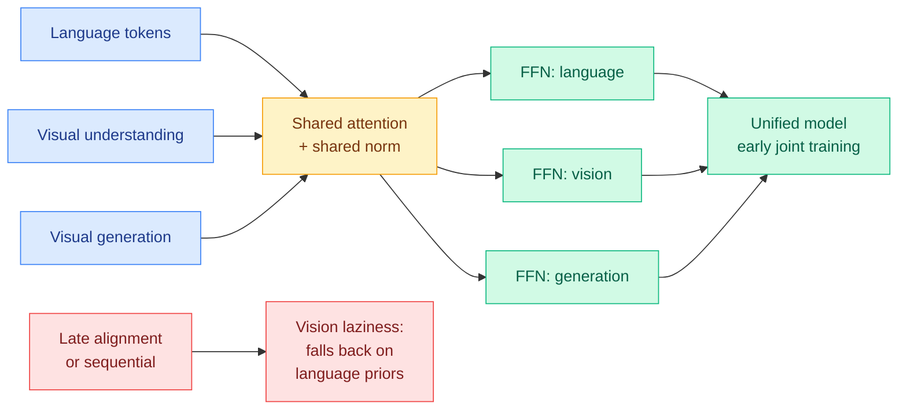

# Towards Physics of Multimodal Pretraining: Knowledge Flow, Modality Synergy, Early Unification, Recipes

**Source:** [arxiv 2608.05000](https://arxiv.org/abs/2608.05000) · [HuggingFace](https://huggingface.co/papers/2608.05000) · [raw](../../raw/huggingface/2026-08-06-towards-physics-of-multimodal-pretraining-knowledge-flow-mod.md)

## TL;DR

Natively unified multimodal pretraining, training one model on language, visual understanding, and visual generation jointly from the start, is where the field is heading and almost nobody has measured how the modalities actually interact while it happens. This paper runs controlled experiments on synthetic and large-scale real data and reports four findings, then validates them at scale by training multiple **13.5B MoE models on 2T tokens**. The headline for anyone working on cost: the derived recipes reach strong generative performance at **5% of the compute budget**. The architectural finding is specific and portable: **shared attention and normalization with modality-specific feed-forward layers** is what turns modality competition into synergy, and it holds across different visual tokenizer designs. The mechanism finding is the most interesting: unifying modalities from the very earliest stages beats both late alignment and sequential training, because delaying integration produces **vision laziness**, where the model learns to lean on language priors instead of reading the image.

## The four findings

**Knowledge flow is asymmetric.** Language, visual understanding, and visual generation transfer knowledge to each other in distinct patterns, and the transfer is not reciprocal. The paper disentangles the directions rather than reporting a single "multimodal helps" result, which is what makes it usable for deciding data mixtures.

**Synergy versus competition is decided by data complexity.** Whether two modalities help or fight each other is largely a function of how complex the data is, not of the architecture alone. Then the architectural lever: shared attention and normalization with **modality-specific feed-forward layers** promotes synergy, and this generalizes across visual tokenizer designs, which is the ablation that stops it being a tokenizer artifact.

**Early unification beats late alignment, and the failure mode has a name.** Joint training from the very early stages outperforms both late alignment and sequential curricula. The reason is **vision laziness**: if visual integration is deferred, the model has already learned to answer from language priors and never fully unlearns it.

**Recipes at 5% of compute.** The derived pretraining recipes achieve strong generative performance on 5% of the budget, then survive scaling to 13.5B MoE models on 2T tokens.

## How this relates to prior wiki pages

**Share-attention-split-FFN gets a second independent witness on the same day, from a completely different problem.** [Poly-OPD (08-06)](../inference-efficiency/2026-08-06-poly-opd-multi-teacher-pixel-bridge.md) consolidates two heterogeneous text-to-image teachers into one student and uses a gradient-compatibility diagnostic to decide which adapters can be shared: it finds **attention LoRA modules are shareable across teachers while feed-forward adapters must stay teacher-specific**, because their gradients conflict. That is the same partition this paper derives for modalities, reached by measuring gradient agreement instead of by ablating architectures. **Two papers, one on multi-teacher distillation and one on multimodal pretraining, independently concluding that attention is the shareable substrate and the feed-forward layer is where incompatible sources must be kept apart.** Neither cites the other. If the principle is real, it says something general: attention learns a routing and mixing operation that is source-agnostic, and the feed-forward layer is where source-specific knowledge is stored.

**Vision laziness is the pretraining-side cause of the post-training problem [OPD-V (08-06)](../inference-efficiency/2026-08-06-opd-v-modality-balance-self-distillation.md) measures.** OPD-V names **modality imbalance**: when text dominates generation, a multimodal model does not integrate its visual input, so carefully constructed privileged visual information goes unused, and its fix is to distil only on tokens inside a modality-balance trust region. This paper says where the imbalance comes from. **One paper locates the cause in the pretraining schedule, the other measures the consequence in post-training, on the same day, without either noticing the other exists.** That is a real cross-paper thread and the actionable version is a question: does a model pretrained with early unification need OPD-V's trust region at all, or does the trust region shrink to nothing?

**The 5%-compute recipe belongs on the efficiency beat, not just the multimodal one.** Most compute-efficiency results in this wiki are inference-side. This is a pretraining-budget result with a scaling validation attached, which makes it comparable to [OmniPack (08-05)](../vision-audio-video/2026-08-05-omnipack-token-compression-audio-video.md), the training-free token compression for audio-video models that keeps 98% of performance at 16.7% of the FLOPs. Different stage, same shape of claim: a large fraction of the compute currently spent on multimodal models is buying very little.

**Caution on the "physics" framing.** The controlled-experiment-then-scale-validation methodology is the right structure, and the wiki should note that the 13.5B validation confirms the findings *as recipes* rather than confirming the mechanisms. Vision laziness is inferred from a performance ordering across training schedules, not from a measurement of how much the model attends to image tokens, and the direct measurement is cheap and absent.

## Gaps

The compute figure is a headline without a stated baseline in the abstract, so 5% is 5% of something the reader has to take on trust. Vision laziness is named but not instrumented: no attention-mass-on-image-tokens curve, no ablation showing the effect reverses when visual signal is forced. The synergy finding depends on a "data complexity" variable that is doing a lot of explanatory work without an operational definition. And 13.5B on 2T tokens is a real scale but well below the frontier, which is exactly where the modality-competition question gets decided commercially.

## Links

- Same-day threads: [Poly-OPD](../inference-efficiency/2026-08-06-poly-opd-multi-teacher-pixel-bridge.md), [OPD-V](../inference-efficiency/2026-08-06-opd-v-modality-balance-self-distillation.md)
- Digest: [2026-08-06](../daily-digest/2026-08/2026-08-06.md)
