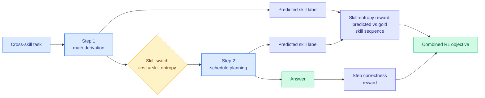

# Skill Entropy: Benchmarking and Training Cross-Skill Long-Horizon Reasoning

**Source:** HuggingFace Daily Papers 2026-08-06
**Paper:** [arxiv 2608.05139](https://arxiv.org/abs/2608.05139) · [code](https://github.com/Gen-Verse/Skill-Entropy-RL)
**Raw:** [raw/huggingface/2026-08-06-toward-skill-native-llms-skill-entropy-for-benchmarking-and.md](../../raw/huggingface/2026-08-06-toward-skill-native-llms-skill-entropy-for-benchmarking-and.md)

## TL;DR

Real long-horizon tasks make a model switch skills mid-chain: do a math derivation, then use the result to plan a schedule. Existing benchmarks test skills one at a time, so nothing measures the switch itself. This paper defines **Skill Entropy**, a measure of how hard it is to move from one skill to another, builds **Skill²-Bench** from 558 skills across 9 domains with every task carrying a skill-entropy score, and finds a clean **skill-switching gap**: accuracy falls as skill entropy rises, across 8 frontier and 4 open-source models. Then it turns the measure into a training signal. **Skill-Entropy RL** makes the model predict not just the answer at each step but the skill it used, and rewards the alignment between predicted and gold skill sequences alongside step correctness. Qwen3-4B-Instruct goes from 34.4% to 68.4%, Qwen3-1.7B from 14.6% to 40.1%.

## Diagram

## What the paper actually claims

The gap identified is measurement. Benchmarks evaluate whether a model can do math, or plan, or write code. They do not evaluate whether it can do math *and then* plan using the math result, which is what the paper calls a **cross-skill long-horizon task**: multi-step, each step requiring a different reasoning skill, each step depending on earlier outputs.

Skill Entropy quantifies the difficulty of a specific skill-to-skill transition. Skill²-Bench operationalises it over 558 skills across 9 verifiable and open-ended domains, with each task carrying a task-level skill-entropy score and sorted into three difficulty bands. The empirical finding is monotone and unsurprising once stated but not previously measured: **accuracy decreases as task skill entropy rises**, for frontier and open models alike. Difficulty here is not length or arithmetic size, it is transition cost.

The second half is the more interesting contribution because it converts a benchmark axis into a training signal. Skill-Entropy RL requires the model to emit, at each step, both the answer and a label for the skill it just used. The reward combines step-level correctness with a **skill-entropy reward measuring alignment between the model's predicted skill sequence and the gold skill sequence**. The model is therefore trained to be explicit about which mode it is in, and penalised when its self-reported trajectory through skill space diverges from the correct one.

The gains are large: 34.4% to 68.4% on Qwen3-4B-Instruct, 14.6% to 40.1% on Qwen3-1.7B, beating competitive baselines. The authors note the pipeline also applies to off-the-shelf data such as OpenR1-Math, arguing skill entropy is a **reusable** training signal rather than one tied to their benchmark.

## How this relates to prior wiki pages

**This is a second, independent argument this week that agents fail at meta-level operations rather than object-level ones, and the two disagree about the cure.** [ScrambleToolBench (08-04)](../agentic-systems/2026-08-04-scrambletoolbench-behavioral-tool-discovery.md) found that agents discover tool behaviour successfully but fail to *adapt* when the mapping drifts underneath them, showing belief inertia or falling back to exhaustive search rather than deducing the change, and crucially that **more test-time reasoning amplifies brute-force search instead of producing deduction**. That is a strategy-selection failure compute does not repair. Skill Entropy finds a related failure, the inability to switch modes cleanly, and claims compute *does* repair it, provided the compute is spent making the mode switch explicit and supervised. Those are compatible only if the distinction is that ScrambleToolBench's agents did not know a switch was needed while Skill-Entropy RL's are told. Which is precisely the untested question: does forcing skill self-labelling help when the correct skill sequence is not given?

**The self-labelling mechanism has an uncomfortable neighbour today.** [The Personalization Mirage (08-06)](../responsible-ai/2026-08-06-personalization-mirage-over-inference.md) reports a **Self-Monitoring Inversion**: across 12 models, self-assessed over-inference is negatively rank-correlated with judge-measured over-inference, so models that report the least fabrication are flagged as fabricating most. Skill-Entropy RL depends on the model's self-reported skill label being meaningful. The saving grace is that the label is trained against a gold sequence rather than trusted at face value, which is exactly the "external verification rather than model self-report" prescription the Mirage paper argues for. Worth stating explicitly because the two papers look contradictory and are not.

**It also extends the wiki's long-running skill thread onto a new axis.** The [self-evolving-agents](../agentic-systems/self-evolving-agents.md) page has tracked skill acquisition, curation, consolidation and internalization for months, and [SkillBench/PastBench (08-05)](../agentic-systems/2026-08-05-do-agents-learn-from-experience-skillbench-pastbench.md) found that agents largely fail to abstract reusable skills from their own past experience. Every one of those treats a skill as a **unit to be acquired**. Skill Entropy treats the *transitions between* skills as the unit, which is a genuinely different decomposition, and it makes the same-day [SKILL-KD](../inference-efficiency/2026-08-06-skill-kd-contrastive-skill-distillation.md) result read differently: if switching cost is where the difficulty lives, distilling individual skill patches into a student may improve each skill while leaving the expensive transitions untouched.

## Gaps

The gold skill sequence has to come from somewhere, and the paper does not say how expensive it is to annotate or how sensitive the reward is to a mislabelled step, which is the practical barrier to applying this outside a purpose-built benchmark. The gains are reported on 4B and 1.7B models only, so it is unknown whether skill-switching is a small-model deficiency that frontier scale already resolves, which the benchmark's own finding that frontier models also degrade would argue against but does not settle. There is no ablation separating the step-correctness reward from the skill-entropy reward, so the share attributable to the paper's actual novelty is unreported.

## Links

- Concept pages: [rl-for-llms.md](rl-for-llms.md), [self-evolving-agents.md](../agentic-systems/self-evolving-agents.md)
- Digest: [2026-08-06](../daily-digest/2026-08/2026-08-06.md)
