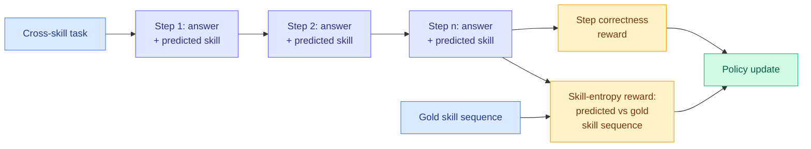

# Skill Entropy: Measuring and Training Cross-Skill Long-Horizon Reasoning

**Source:** [arxiv 2608.05139](https://arxiv.org/abs/2608.05139) · [HuggingFace](https://huggingface.co/papers/2608.05139) · [code](https://github.com/Gen-Verse/Skill-Entropy-RL) · [raw](../../raw/huggingface/2026-08-06-toward-skill-native-llms-skill-entropy-for-benchmarking-and.md)

## TL;DR

Long-horizon reasoning usually requires switching skills inside one chain: do a derivation, then use the result to plan a schedule. Existing benchmarks test skills one at a time and therefore cannot measure the switch. This paper defines **Skill Entropy**, a measure of how hard it is to move from one skill to another, builds **Skill²-Bench** over **558 skills across 9 verifiable and open-ended domains** with each task assigned a skill-entropy score and bucketed into three difficulty levels, and reports a clean **skill-switching gap** across 8 frontier and 4 open-source models: accuracy falls as task skill-entropy rises. Then it converts the measure into a training signal. **Skill-Entropy RL** has the model predict, at each step, not just the answer but **which skill it used**, and rewards step-level correctness plus alignment between the predicted and gold skill sequences. Qwen3-4B-Instruct goes from 34.4% to 68.4% on Skill²-Bench and Qwen3-1.7B from 14.6% to 40.1%. The pipeline also applies to off-the-shelf data such as OpenR1-Math, which is what makes skill entropy a reusable signal rather than a benchmark artifact.

## How this relates to prior wiki pages

**Making the model name the skill it is using is a supervision-selection move dressed as a reward-shaping move, and that connects it to the day's dominant cluster.** Seven papers today filter or reconstruct a dense supervision signal by asking which parts of it are trustworthy: [SA-OPD](../inference-efficiency/2026-08-06-sa-opd-input-groundedness-distillation.md) by input-groundedness, [RSTG](../inference-efficiency/2026-08-06-rstg-negative-group-teacher-guidance.md) by whether the RL group had any gradient at all, [OPD-V](../inference-efficiency/2026-08-06-opd-v-modality-balance-self-distillation.md) by modality balance, [SPOT](../inference-efficiency/2026-08-06-spot-sparse-probing-outcome-calibration.md) by verifier-scored outcomes. Skill-Entropy RL does something adjacent: it makes the model **emit a label for what kind of work each step is doing**, and rewards getting that label right. That is an explicit structural decomposition of the trajectory, which is what would let any of the seven filtering axes be applied per skill rather than per token. Nobody has tried it, and it is the natural composition.

**The gains are large enough to be suspicious in a specific way, and the honest read is that they are partly benchmark-shaped.** 34.4% to 68.4% at 4B and 14.6% to 40.1% at 1.7B is a doubling-to-tripling, on a benchmark the same authors built, with a reward that includes alignment to the benchmark's own gold skill sequences. The transfer claim, that the pipeline works on OpenR1-Math, is therefore the load-bearing evidence rather than the headline number, and the abstract does not say how much it gains there.

**It is also a benchmark-and-training-signal pair, which is a pattern worth flagging on the [agent-benchmarks page](../agentic-systems/agent-benchmarks.md).** A team defining a difficulty measure, building a benchmark graded by that measure, and then training against a reward derived from the same measure produces a closed loop, and the wiki has been increasingly sceptical of exactly this shape. [ContinualSkillBench (08-05)](../agentic-systems/2026-08-05-do-agents-learn-from-experience-skillbench-pastbench.md) was valuable precisely because it reported a negative result about the mechanism its own community ships. The generalisation test that would settle this is skill-entropy-trained models evaluated on a cross-skill benchmark somebody else built.

**The skill-switching gap itself is the finding worth keeping regardless.** Accuracy declining monotonically with a defined switching-difficulty measure, across 12 models including frontier ones, is a clean and reusable empirical fact. It also gives a plausible mechanism for the [shadow-evaluations (08-06)](../agentic-systems/2026-08-06-shadow-evaluations-open-ended-research.md) finding that agents retired their most ambitious research targets within the first day: open-ended research is maximally skill-switching, and a model that degrades with switching difficulty will retreat to the sub-chain it handles best.

## Gaps

Author-built benchmark, author-defined difficulty measure, author-designed reward keyed to that measure. Gold skill sequences require annotation, which the abstract does not price. Results at 1.7B and 4B only, so nothing says the gap closes or persists at frontier scale, which matters because the 8 frontier models were evaluated but not trained. And skill entropy is defined as switching difficulty without an independent validation that it measures anything other than task length.

## Links

- Concept page: [RL for LLMs](rl-for-llms.md)
- Related: [Shadow evaluations](../agentic-systems/2026-08-06-shadow-evaluations-open-ended-research.md), [SKILL-KD](../agentic-systems/2026-08-06-skill-kd-contrastive-skill-distillation.md)
- Digest: [2026-08-06](../daily-digest/2026-08/2026-08-06.md)
