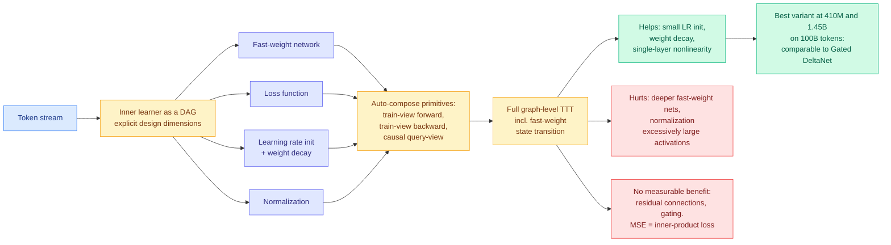

# Modular TTT: Rethinking Test-Time Training as Composable Modules

**Source:** HuggingFace Daily Papers 2026-08-10 · [arXiv 2608.07110](https://arxiv.org/abs/2608.07110) · [raw](../../raw/huggingface/2026-08-10-modular-ttt-rethinking-test-time-training-as-composable-modu.md)
**Topic:** test-time training, sequence architectures, ablation methodology

## TL;DR

Test-time training (TTT) treats sequence modeling as online learning: a small set of **fast weights** is updated by an internal learning rule as tokens arrive, so the model adapts within a single sequence rather than only at training time. The literature has produced a growing pile of TTT variants, each hard-coded separately, which makes it impossible to tell which component is doing the work. Modular TTT represents the inner learner as a **directed acyclic graph** and exposes fast-weight network, loss function, learning rate, weight decay and normalization as explicit dimensions, then automatically composes primitive train-view forward, train-view backward and causal query-view rules into the full graph-level computation including the fast-weight state transition. The payoff is a clean component-by-component ablation, and most of its results are negative in a useful way.

## Key findings

- **What helps is boring and small.** Small learning-rate initialization, weight decay, and a single-layer nonlinearity in the fast-weight network.
- **What hurts is what the field kept adding.** Deeper fast-weight networks and normalization both degrade performance, and the paper gives a mechanism: they induce excessively large activations.
- **What does nothing is what looked most principled.** Residual connections and gating provide little measurable benefit. MSE and inner-product losses perform about the same, so the inner objective, which several papers treat as their contribution, is close to a free choice.
- **The end result matches an existing strong baseline rather than beating it.** Trained at 410M and 1.45B on 100B tokens, the best composed variant reaches training loss and benchmark performance comparable to Gated DeltaNet. Honest framing: the value here is the ablation, not a new frontier.

## How this relates to prior wiki pages

**This is a methodology result and it belongs with the wiki's running measurement-validity thread.** [Beyond Geometric Complementarity (07-31)](../ai-routing/2026-07-31-coherent-overlap-moe-routing.md) found that expert-subspace similarity cannot determine MoE redundancy, invalidating similarity-derived compression ratios. [Eviction as Estimation (08-03)](../inference-efficiency/2026-08-03-eviction-as-estimation-rmm.md) found KV-eviction ablations do not measure the quantity they are trusted for. Modular TTT is the same shape applied to an architecture family: **the components each paper claims credit for do not survive being varied one at a time inside a shared harness.** Three subfields, one pattern, six weeks.

**It is the intervention the wiki should want for the on-policy-distillation cluster too.** [knowledge-distillation.md](../inference-efficiency/knowledge-distillation.md) has been documenting seven distillation filtering axes that never evaluate against each other. Modular TTT shows the alternative: build the shared scaffold first, then ablate. That the ablation mostly *deflates* the variants is exactly the reason the distillation cluster has not done it.

**It complements [Raven (08-04)](../ai-routing/2026-08-04-raven-sparse-memory-routing.md) from the other side.** Raven is a linear-time model with a routed sparse write into a fixed set of memory slots, and holds recall at 16x training context. Both are asking what the right inner-state update rule is. Raven answers with sparsity in *which slots* get written; Modular TTT answers that the *depth and normalization* of the update network should be minimal. Neither contradicts the other, and a Raven-shaped write rule inside the Modular TTT harness is an obvious untried experiment.

## Gaps

The largest run is 1.45B on 100B tokens, which is small enough that any component whose benefit appears only at scale would read as "no measurable benefit" here. That is the standard risk of a clean-ablation paper and it is not addressed. The DAG abstraction is validated by reproducing known variants, not by generating a genuinely new one that wins, so its claim to be a design tool rather than an analysis tool is unproven.

## Industrial implication

Little immediate production effect: TTT is not in serving stacks. The near-term value is negative-information value, meaning teams evaluating a TTT-flavored architecture can skip the deep fast-weight networks, the normalization layers and the gating, which is where implementation cost concentrates. If the "comparable to Gated DeltaNet" result holds at larger scale, the interesting consequence is that a simpler update rule reaches the same place, which lowers the kernel-engineering bill for anyone trying to serve one.

## Links

- [Attention Mechanisms concept page](attention-mechanisms.md)
- [Raven: sparse memory routing (08-04)](../ai-routing/2026-08-04-raven-sparse-memory-routing.md)
- [Daily digest 2026-08-10](../daily-digest/2026-08/2026-08-10.md)
