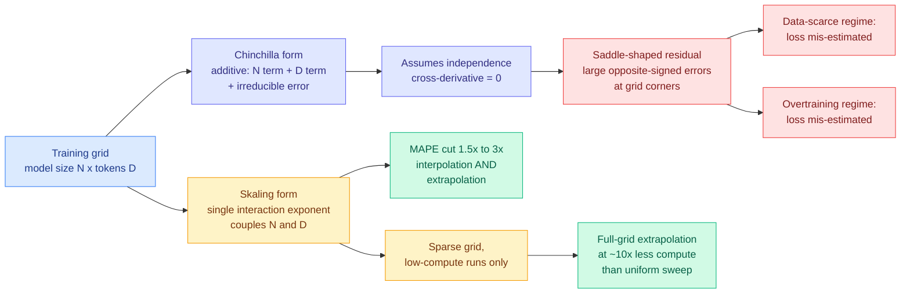

# Skaling: Chinchilla's Exponents Meet Kaplan's Coupling

**Source:** HuggingFace Daily Papers 2026-08-10 · [arXiv 2608.07222](https://arxiv.org/abs/2608.07222) · [raw](../../raw/huggingface/2026-08-10-skaling-chinchilla-s-exponents-meet-kaplan-s-coupling.md)
**Authors:** Mathurin Videau, Badr Youbi-Idrissi, David Lopez-Paz, Kartik Ahuja (FAIR at Meta)
**Topic:** scaling laws, compute budgeting
**Enrichment:** alphaxiv overview available and used

## TL;DR

The Chinchilla scaling law, the additive form that has set pretraining budgets since 2022, assumes model size N and training tokens D affect loss **independently**. That assumption is a structural flaw, not an approximation: it forces the cross-derivative to zero, which produces a saddle-shaped residual with large, oppositely-signed errors at the corners of the N-by-D grid. In other words, Chinchilla is systematically wrong precisely in the two regimes anyone actually cares about now, data-scarce and heavily overtrained. Skaling restores the coupling that Kaplan's 2020 form had and Chinchilla discarded, using **one extra interaction exponent**. That single parameter cuts mean absolute percentage error by 1.5x to 3x in both interpolation and extrapolation. Paired with a sparse grid restricted to low-compute runs, it extrapolates the full grid accurately using roughly **10x less compute** than a uniform sweep.

## Key findings

- **The flaw is structural and locatable.** Chinchilla's additive form implies the second mixed partial derivative of loss with respect to N and D is exactly zero. The observed residual is saddle-shaped, which is the signature of a missing interaction term, not of noise.
- **The errors sit at the boundaries, which is where the money is.** Under- and overestimation concentrate where N and D are imbalanced. Every current frontier decision, aggressive overtraining of small models and data-constrained scaling of large ones, is a boundary decision.
- **One parameter, not a new family.** Skaling is a minimal generalization. It does not add the parameter count of richer forms like Farseer, and the improvement is attributed to the interaction itself rather than to extra fitting freedom.
- **1.5x to 3x MAPE reduction, in both directions.** Improving interpolation is easy and mostly uninteresting. Improving *extrapolation* by the same factor is the claim that matters, because extrapolation from small runs is the entire practical use of a scaling law.
- **10x compute saving on the fit itself.** A sparse grid of low-compute runs plus Skaling predicts the full grid. The scaling law becomes cheaper to establish, not just more accurate.
- **Kaplan was closer than the field concluded.** Kaplan et al. coupled N and D; Chinchilla's additive form dropped the coupling and became the standard. This is a partial rehabilitation of the older form's structure with the newer form's exponents.

## How this relates to prior wiki pages

**This is the second scaling-law-is-wrong-in-your-regime result in six days, and the two are complementary rather than redundant.** [LLaDA MoE v2 (08-05)](2026-08-05-llada-moe-v2-scaling-moe-diffusion-lms.md) found that autoregressive scaling laws do not transfer to diffusion language models, and are wrong specifically about batch size, learning rate and data allocation. That is a *transfer* failure across model families. Skaling is a *functional-form* failure inside the family the law was fit on. Read together they say the received scaling law is unreliable both when you change the objective and when you stay inside it but move to the edges of the grid. See [scaling-laws.md](scaling-laws.md).

**It gives an independent reason to distrust the compute-optimal token-to-parameter ratio that this wiki has cited repeatedly.** The Chinchilla ratio is derived by optimizing the additive form. If the form is misspecified at imbalanced N and D, the optimum it implies is also misspecified, and in a direction the paper can now sign per regime rather than leave as unknown error.

**It composes with the cost-optimization thread running through the last two weeks of digests.** [Mixture-of-Kittens (08-05)](../inference-efficiency/2026-08-05-mixture-of-kittens-moe-megakernel.md) cut MoE training-layer cost 2.37x on isolated layers and 1.41x end to end by fusing dispatch into one kernel. That is a saving on the runs you decided to do. Skaling is a saving on **deciding which runs to do**, which is upstream and unusually under-attacked. The two are multiplicative and neither is aware of the other.

## Gaps

The paper reports MAPE improvements on its own grids; there is no external replication on a published third-party scaling suite yet. The interaction exponent's *interpretation* is not established, so it is currently a better-fitting term rather than an explained mechanism, which limits how far anyone should trust it outside the grid ranges tested. And the 10x sparse-grid saving depends on the sparse grid's design, which is a choice the paper makes rather than derives.

## Industrial implication

Any lab that has planned a pretraining budget from a Chinchilla fit on a small sweep should re-fit with the coupled form before committing the run, particularly if the plan is aggressive overtraining. The immediate value is not a better model, it is a cheaper and less biased answer to "how much will this run buy," which is the highest-leverage single number in a training program. Expect the interaction term to show up in internal budget tooling faster than in papers, because it is a one-line change to an existing fit.

## Links

- [Scaling Laws concept page](scaling-laws.md)
- [LLaDA MoE v2 (08-05)](2026-08-05-llada-moe-v2-scaling-moe-diffusion-lms.md)
- [Daily digest 2026-08-10](../daily-digest/2026-08/2026-08-10.md)
