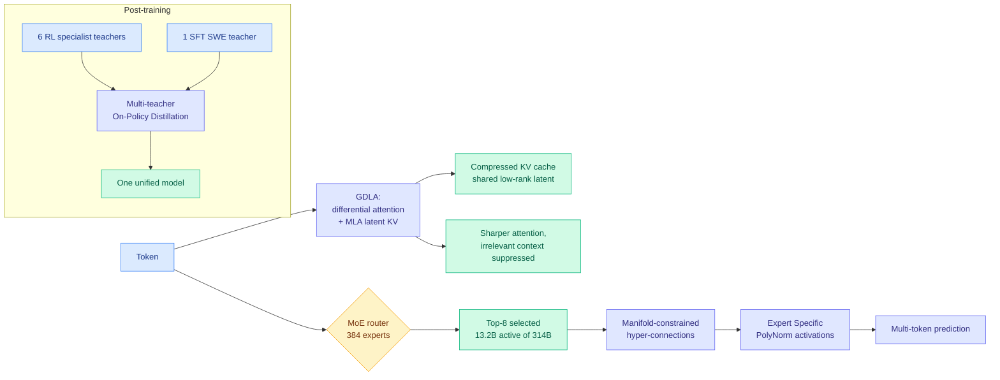

# Motif 3: Grouped Differential Latent Attention at 314B Total / 13.2B Active

**Source:** HuggingFace Daily Papers · [arXiv 2608.09119](https://arxiv.org/abs/2608.09119)
**Raw:** [raw/huggingface/2026-08-11-motif-3-technical-report.md](../../raw/huggingface/2026-08-11-motif-3-technical-report.md)
**Date:** 2026-08-11
**Org:** Motif Technologies (Korea), supported by MSIT / NIPA / NIA under the Sovereign AI Foundation Model Project

## TL;DR

Motif 3 is a decoder-only mixture-of-experts model with **314B total parameters and 13.2B activated per token**, using very fine-grained sparsity: 384 routed experts per MoE layer with eight selected per token. The architectural contribution worth this wiki's attention is **Grouped Differential Latent Attention (GDLA)**, which fuses two previously separate ideas: differential attention, which suppresses irrelevant context by subtracting two attention maps, and Multi-head Latent Attention (MLA), which compresses keys and values into a shared low-rank latent to shrink the KV cache. Pretrained on roughly 12.5T tokens with context up to 256K, using selective MXFP8 compute and communication, memory-efficient fused kernels, and window-aware context parallelism. Post-training combines general SFT, six RL-trained specialist teachers plus one SFT software-engineering teacher, and **Multi-teacher On-Policy Distillation (MOPD)** to consolidate them into one model.

## Why GDLA matters here

**It is the first architecture this wiki has logged that treats attention *selectivity* and KV *compression* as one design problem.** [attention-mechanisms.md](attention-mechanisms.md) has tracked these as separate lines. Differential attention improves what the model attends to. MLA, the DeepSeek low-rank latent-KV idea, improves what the cache costs, and [VideoMLA (06-02)](../inference-efficiency/2026-06-02-videomla-low-rank-latent-kv-cache.md) showed the surprising part: MLA works even where pretrained attention is *not* low-rank, because the MLA bottleneck dimension rather than the pretrained spectrum determines effective rank. GDLA composes the two, which is the obvious move and, until now, an unmade one at this scale.

**It is also a data point for the KV-throughput metric.** [SemiAnalysis's Kimi K3 primer (08-04)](2026-08-04-semianalysis-kimi-k3-architecture-primer.md) argued cache size is not a standalone model property and proposed KV throughput, cache size divided by prefill time, as the honest unit, then noted that **no open-weight model ships static KV compression**. Motif 3 does ship an architectural KV compression via the MLA half of GDLA, which makes it a candidate for exactly the comparison [kv-cache.md](../inference-efficiency/kv-cache.md) says nobody has run: KDA-plus-MLA against the GQA-sparse family (GLM 5.2's DeepSeek Sparse Attention, DeepSeek V4's Compressed Sparse Attention, MiniMax M3's sparse attention, MiMo V3's HySparse) at the same sequence lengths. The report does not publish cache-per-token, which remains this wiki's [standing gap since 07-30](../inference-efficiency/kv-cache.md).

## Multi-teacher On-Policy Distillation is the second story

The post-training pipeline trains **seven specialists and folds them into one model with MOPD**. That is the production instance of the pattern [knowledge-distillation.md](../inference-efficiency/knowledge-distillation.md) has been documenting from the research side all quarter, and it lands on a live tension:

- The [Interconnects 06-16 podcast](../inference-efficiency/knowledge-distillation.md) named MOPD as the technique behind DeepSeek V4, MiMo-V2-Flash and others, all using **in-house teachers**, because dense on-policy distillation supervises over a shared vocabulary and therefore requires a shared tokenizer. [BPM (07-29)](../inference-efficiency/2026-07-29-bpm-cross-tokenizer-opd.md) removed that constraint by marginalizing into byte space, recovering the byte-prefix marginal exactly at over 99% of training positions. Motif 3's teachers are its own specialists, so it does not need BPM, and it is a clean example of why the in-house-teacher pattern persists.
- [Poly-OPD (08-06)](../inference-efficiency/2026-08-06-poly-opd-multi-teacher-pixel-bridge.md) found, in the multi-teacher setting, that **attention LoRA modules can be shared across teachers while feed-forward adapters must stay teacher-specific**, a partition independently reached the same day by [Physics of Multimodal Pretraining (08-06)](2026-08-06-physics-multimodal-pretraining.md). Motif 3's Expert Specific PolyNorm activations are a different instance of the same instinct, source-specific parameters in the feed-forward path, and the report does not connect them.

The claim the report leaves open is the one that matters: whether MOPD from seven specialists actually consolidates capabilities or merely averages them. The abstract asserts consolidation across reasoning, coding, tool use, long-context, calibrated abstention and instruction following, with "competitive performance against leading open weight models."

## Gaps

- **No ablation isolating GDLA's two halves.** Differential attention alone and MLA alone are both established; the report does not show what the fusion buys over either.
- **No cache-per-token or KV-throughput number**, which is the number that would let anyone compare it to the GQA-sparse family.
- **"Competitive" is doing a lot of work.** No head-to-head against a same-active-parameter dense or coarser-MoE baseline trained on the same 12.5T tokens, so the fine-grained-sparsity claim (384 experts, top-8) is not isolated either.
- **MOPD's contribution is not separated from the seven specialists' contribution.** A model that trained seven RL specialists and then merged them has spent a lot of compute; how much of the final quality is MOPD versus simply having done seven RL runs is unreported.

## Industrial implication

The interesting part is not the benchmark table, it is that a national sovereign-AI program shipped a 314B fine-grained MoE with an in-house multi-teacher distillation pipeline. That is the full frontier recipe reproduced outside the five labs that invented it, which is the strongest evidence yet for the [AI Breakfast claim (08-10)](../ai-industry/2026-08-11-nvidia-compute-asset-class.md) that open-weight models trail the frontier by roughly six months and hardware is the moat. If GDLA's KV saving is real at 256K context, it also lands squarely in the deployment class the [local model KV economics report (07-30)](../inference-efficiency/2026-07-30-local-model-kv-cache-economics.md) measured, where architecture chosen at model-selection time moves resident memory by more than an order of magnitude.

## Related

- [attention-mechanisms.md](attention-mechanisms.md), [kv-cache.md](../inference-efficiency/kv-cache.md), [knowledge-distillation.md](../inference-efficiency/knowledge-distillation.md)
- [Kimi K3 architecture primer (08-04)](2026-08-04-semianalysis-kimi-k3-architecture-primer.md), [VideoMLA (06-02)](../inference-efficiency/2026-06-02-videomla-low-rank-latent-kv-cache.md), [Poly-OPD (08-06)](../inference-efficiency/2026-08-06-poly-opd-multi-teacher-pixel-bridge.md)
