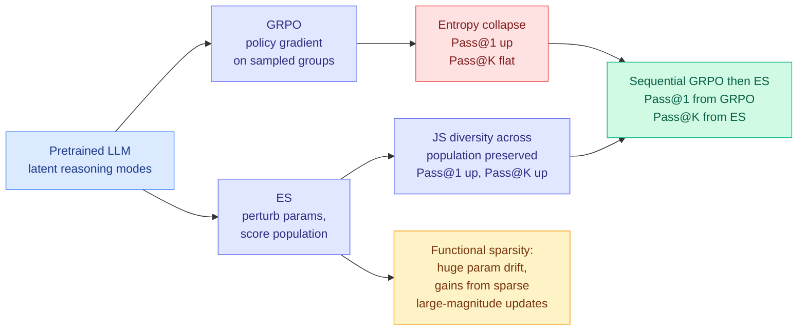

# Understanding Evolution Strategies for LLM Reasoning: Broader Reasoning Coverage than GRPO

**Source:** HuggingFace Daily Papers, [arXiv 2608.27351](https://arxiv.org/abs/2608.27351)
**Raw:** [raw/huggingface/2026-08-28-understanding-evolution-strategies-for-llm-reasoning-broader.md](../../raw/huggingface/2026-08-28-understanding-evolution-strategies-for-llm-reasoning-broader.md)

---

## TL;DR

Evolution Strategies (ES) is the gradient-free alternative to reinforcement learning: instead of backpropagating a policy gradient, perturb the whole parameter vector many times, score each perturbation, and move toward the ones that scored well. Because it never stores activations for a backward pass it is **memory-efficient**, which is why it showed up for LLM post-training at all. The field treated it as the budget option: same idea as GRPO (group relative policy optimization, the standard reinforcement-learning recipe that scores a group of sampled answers and pushes toward the better ones) but weaker. This paper argues that is wrong on the merits. ES has a **different** advantage profile: it produces broader reasoning coverage, improving Pass@1 while also reaching higher Pass@K, where **GRPO exhibits entropy collapse** and narrows.

---

## Three findings, in order of how much they change things

**1. ES has broader reasoning coverage, and there is a theory for why.** The paper shows that **verifier-projected Jensen-Shannon diversity across the ES population** helps Pass@K, and then confirms it empirically: unlike GRPO, which collapses entropy, ES lifts Pass@1 *and* attains higher Pass@K. The framing that follows is the useful one: ES is better at **exploiting reasoning capability the pretrained model already has** rather than sharpening one path. Pass@K is a measurement of how many distinct correct routes the model can still find, and GRPO trades that away for first-attempt accuracy.

The practical consequence is a **sequential GRPO-then-ES recipe** that takes Pass@1 from the first stage and Pass@K from the second. That is a scheduling result, not a new operator, and it is the third or fourth time this wiki has recorded that shape (see below).

**2. Functional sparsity: huge parameter drift, sparse functional change.** ES moves the whole parameter vector substantially, which looks alarming, and the paper shows the task gains come from **only a sparse subset of larger-magnitude updates**. Held-out evaluations show it does not produce catastrophic forgetting. Stated plainly: **large parameter movement need not imply widespread functional change.** This is the most transferable finding in the paper, because it dissolves the main intuitive objection to gradient-free post-training. It is also a mild embarrassment for the practice of measuring how much a fine-tune "changed" a model by weight-space distance.

**3. Population size scales inversely with model size.** ES needs a *smaller* population for a larger LLM. That is a concrete hyperparameter law and it matters economically: the per-step cost of ES is population size times a forward pass, so if population requirements fall as models grow, ES gets relatively cheaper exactly where memory pressure is worst.

## How this relates to prior wiki pages

**It reframes a paper this wiki already holds.** The [rl-for-llms concept page](rl-for-llms.md) treats GRPO as the reference post-training method, and the entropy-collapse-narrows-the-distribution problem has been visible in this wiki from the other direction for months. The clearest prior statement is the **AIMO 3 result (04-17)**, which argued that prompt diversity is a dead end for inference-time scaling because it cannot close the Pass@20 gap. This paper says the gap AIMO 3 could not close from the *prompting* side is partly an artifact of the *training* algorithm: GRPO created the narrowness, and a different optimizer does not. Those are compatible claims and together they are stronger than either. The open question they jointly raise is whether an ES-trained model makes inference-time diversity methods work again, which nobody has tested.

**It is the fourth "the schedule beats the operator" instance the wiki has recorded, and this one is the most consequential.** The [agent-harness-engineering page](../agentic-systems/agent-harness-engineering.md) tracks the pattern: ICBQ block order (08-12), ReOrder-OPD prompt order (08-13), LycheeMemory V2 segment consolidation (08-14), and [Task-CoEvolve (08-25)](../agentic-systems/2026-08-25-task-coevolve-adaptive-validation-selection.md), which left the harness-rewrite operator untouched and got its entire 80% evaluation saving from changing *what gets measured when*. Sequential GRPO-then-ES is the same shape at the level of the whole post-training pipeline: neither algorithm is modified and the gain is in the ordering. Five instances across five subfields is well past this wiki's three-instance threshold. **The pattern to carry forward: before designing a better operator, check whether the existing operators are being run in the wrong order.**

**And it belongs beside today's other two post-training-dependency-removal papers.** [TTPO (08-28)](../inference-efficiency/2026-08-28-ttpo-test-time-policy-optimization.md) removes the ground-truth label; [Self-OPD (08-28)](../inference-efficiency/2026-08-28-self-opd-teacher-free-flow-matching.md) removes the specialized teacher; this one removes the backward pass and the memory it needs. Three papers on one day each deleting a different expensive dependency from the post-training loop, none citing each other.

## Gaps

The obvious missing number is **wall-clock and dollar cost against GRPO at matched final quality.** ES is memory-efficient per step and needs a population of forward passes per step, so "memory-efficient" and "compute-efficient" are not the same claim and the paper's positioning depends on the first. Without the second, a team deciding between them cannot.

The functional-sparsity finding is reported on held-out evaluations, which is the right control for catastrophic forgetting, but sparse large-magnitude updates are also exactly the signature that would make an ES-trained model fragile to subsequent quantization or pruning: if the gains live in a small set of high-magnitude weights, a compression pass that treats magnitude as importance may preserve them, while one that prunes for uniform sparsity may not. That interaction is untested and it is directly relevant, since today's Kurate board also carries [When Pruning Meets Interpretability](../responsible-ai/2026-08-28-pruning-sae-robustness.md), which finds pruning silently invalidates tools trained on the dense model's activations.

Finally, the sequential recipe is reported as a strategy, not as a swept schedule. How much GRPO before switching, and whether the order can be reversed or interleaved, is unaddressed, and for a paper whose main practical output is an ordering that is the ablation that was owed.

## Industrial implication

The immediate audience is anyone post-training a large model under a memory ceiling, which after the [08-26 Global View](../daily-digest/2026-08/2026-08-26.md)'s power-limited framing is most people: if the datacenter is power-limited rather than budget-limited, an algorithm that trades activation memory for extra forward passes may fit a cluster that a backward pass does not. The second audience is anyone shipping best-of-K or agentic sampling in production, because those pipelines are paid for in Pass@K, and this paper says the standard post-training recipe has been actively destroying the property they depend on.

## Related

- [rl-for-llms](rl-for-llms.md) (concept)
- [scaling-laws](scaling-laws.md) (concept)
- [TTPO (08-28)](../inference-efficiency/2026-08-28-ttpo-test-time-policy-optimization.md)
- [Self-OPD (08-28)](../inference-efficiency/2026-08-28-self-opd-teacher-free-flow-matching.md)
- [Spectral Allocation: why Muon beats Adam (08-28)](2026-08-28-spectral-allocation-muon.md)
