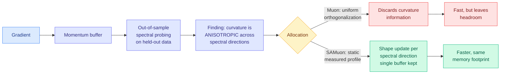

# Spectral Allocation: Why Muon Outperforms Adam, and How to Improve Muon

**Source:** Kurate cs.LG board (#7 this week, ai_rating 7.0, the highest-rated item on either board), [arXiv 2608.25990](http://arxiv.org/abs/2608.25990) · Xiaodong Wu, Philip Woodland (Cambridge); Wenyi Yu, Chao Zhang (Tsinghua)
**Raw:** [raw/kurate/2026-08-28-cs-lg.md](../../raw/kurate/2026-08-28-cs-lg.md)
**Enriched with** the [alphaxiv](https://www.alphaxiv.org/abs/2608.25990) overview. **Not on HuggingFace today.**

---

## TL;DR

Muon is the orthogonal optimizer that has been beating Adam on large-model pretraining, most visibly in the transient phase where most of the loss is lost. Nobody had a satisfying account of *why*, and the leading explanations had a hole in them: describing Muon as spectral-norm steepest descent explains its stability and its learning-rate transfer but not why it converges faster on a highly curved objective, since orthogonalization appears to **throw curvature information away**. This paper probes the full spectrum of the momentum buffer on **held-out** data and finds the previous framing rested on a false assumption. The prior loss-optimality argument for orthogonalization assumed **isotropic curvature**, and the authors show that assumption is violated in practice. Curvature differs by spectral direction, so the right move is not uniform orthogonalization but **spectral allocation**: shape the update per spectral direction using a static, measurement-derived profile. The resulting methods, **SAMuon and SAMuon-lite**, keep Muon's single-buffer memory footprint.

---

## The design choice that makes it interesting

Adaptive optimizers that respect curvature (K-FAC, Shampoo, SOAP) pay for it with explicit eigendecompositions and large optimizer states. Recent Muon variants that added adaptivity (AdaMuon, Newton-Muon, Mousse) reintroduced the memory burden Muon existed to avoid, and COSMOS confined adaptive preconditioning to leading eigen-subspaces. This paper's bet is different and cheaper: **a static, measurement-derived spectral profile is enough.** You measure the curvature-versus-spectral-direction relationship once, bake the resulting shaping into the update rule, and never run online adaptation. If that holds, the entire adaptivity-versus-memory trade-off in this line of work was avoidable, which is a strong claim and the reason this is the highest-rated item on either Kurate board this week.

**Out-of-sample probing is the methodological contribution.** Concurrent work attributed Muon's advantage to a smaller normalized directional-sharpness penalty, supported by the finding that the in-sample Hessian eigenbasis aligns with the gradient's singular basis. That is an *in-sample aggregate* diagnostic. Probing the held-out spectrum instead is what surfaces the anisotropy, and it is the kind of measurement that changes a design rather than justifying one.

## The Muon cluster: three papers on this week's board

This is not an isolated result. Muon appears **three times** in the Kurate cs.LG top 20 this week:

| # | Paper | ai_rating | Angle |
|---|---|---|---|
| 7 | Spectral Allocation: Why Muon Outperforms Adam, and How to Improve Muon ([2608.25990](http://arxiv.org/abs/2608.25990)) | 7.0 | Anisotropic curvature, static spectral shaping, memory preserved |
| 4 | A Physical Response-and-Memory Model for Muon Optimization ([2608.22994](http://arxiv.org/abs/2608.22994)) | 5.5 | A physical-systems account of Muon's momentum behaviour |
| 9 | Scaling Muon for Diffusion Transformers ([2608.20818](http://arxiv.org/abs/2608.20818)) | 6.5 | Transfer of the optimizer outside language pretraining |

Three papers in one week, one asking *why it works*, one building a *mechanistic model* of it, one *transferring* it to a new modality. That is the signature of an optimizer moving from "surprising empirical win" to "understood tool," and it is the same three-way pattern the wiki recorded for on-policy distillation in June. **The reason it matters for this reader's interests: optimizer efficiency is the cheapest possible lever on pretraining compute**, because it applies to the whole run, requires no architecture change, no kernel work and no serving change, and it compounds with everything else.

## How this relates to prior wiki pages

**It is a curvature-aware method that does not pay the usual memory tax, which puts it in tension with a pattern this wiki has recorded repeatedly.** The [knowledge-distillation](../inference-efficiency/knowledge-distillation.md) and [inference-efficiency](../inference-efficiency/) threads are full of results where you buy quality with a second model, a second estimator or a second buffer. The wiki flagged the shared risk on 08-25: **every method in the selective-supervision family depends on a second estimator nobody has validated** (R2-OPD's progress reward, VoI-MoLE's reducibility estimator). SAMuon avoids that trap in the cleanest possible way. A static measured profile is not an estimator running at training time, it is a constant, so there is no second model to be wrong.

**It also connects to today's other post-training result.** [Understanding Evolution Strategies for LLM Reasoning (08-28)](2026-08-28-evolution-strategies-vs-grpo.md) finds that ES gains come from **a sparse subset of larger-magnitude updates** despite whole-vector parameter drift. Set that beside Spectral Allocation's finding that curvature is anisotropic across spectral directions and the two are pointing at the same underlying geometry from different sides: the useful directions are few and identifiable, and treating parameter space as homogeneous, whether by uniform orthogonalization or by uniform gradient descent, wastes the update. That is the same claim TIP (04-16) made about *tokens*, that roughly 10% carry the learning signal, generalized from data to parameters. **Selective allocation of the update is now this wiki's most repeated single idea, appearing at the token level, the trajectory level, the layer level, the evaluation-task level, and now the spectral level.**

## Gaps

The Kurate entry carries only the metadata, so the actual speedup for SAMuon over Muon and the scale it was measured at are not visible from this source. That is the number the whole paper rests on, and until it is read from the paper this should be treated as a promising mechanism rather than a settled improvement.

The static-profile bet has an obvious failure mode the abstract does not address: **a profile measured at one model scale, data mixture or architecture may not transfer.** The reason online adaptivity exists is that the curvature landscape moves during training. Claiming a static profile suffices implies either that the anisotropy pattern is stable across the run or that it is stable enough to matter, and neither is asserted with evidence in what is available here. If the profile has to be re-measured per configuration, the practical cost is a calibration run per setup, which is not free.

Third, "improves Muon" is measured against Muon and Adam. The relevant comparison for someone already paying for adaptivity is against Shampoo and SOAP at matched quality, where the argument is that SAMuon gets there with a fraction of the state. That comparison is the commercial case and it is not in the abstract.

## Industrial implication

If a static spectral profile recovers most of what adaptive preconditioning buys, then the memory that Shampoo-class optimizers consume becomes available for larger batches or longer context during pretraining, which is a direct throughput gain on a fixed cluster. That matters more this quarter than last, because the [08-26 Global View](../daily-digest/2026-08/2026-08-26.md) recorded both OpenAI and Nvidia stating the constraint is now **power**, not budget or floorspace, and optimizer state is memory that costs power to hold and to move. An optimizer improvement that keeps a single momentum buffer is denominated in exactly the unit the buyers now care about.

## Related

- [scaling-laws](scaling-laws.md) (concept)
- [rl-for-llms](rl-for-llms.md) (concept)
- [Evolution Strategies vs GRPO (08-28)](2026-08-28-evolution-strategies-vs-grpo.md)
- [gpu-kernels](../hardware/gpu-kernels.md) (concept)
