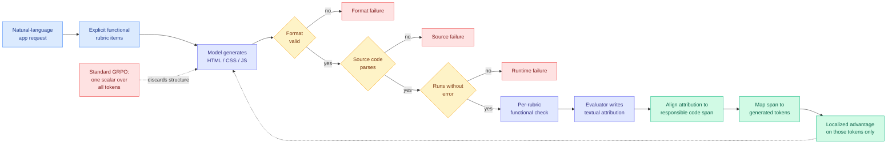

# RCCA: Rubric-to-Code Credit Assignment for Reinforcement Learning

**Source:** [arXiv 2608.27906](https://arxiv.org/abs/2608.27906) · [HuggingFace](https://huggingface.co/papers/2608.27906) · InclusionAI / Ant Group (Ling model family)
**Raw:** [raw/huggingface/2026-08-31-rubric-to-code-credit-assignment-for-reinforcement-learning.md](../../raw/huggingface/2026-08-31-rubric-to-code-credit-assignment-for-reinforcement-learning.md)
**Date ingested:** 2026-08-31

## TL;DR

Generating a working interactive web app from a natural-language request is not one task, it is a bundle of independent functional requirements ("the dropdown filters the list", "the counter persists on reload"), each of which lives in a specific, localizable piece of the generated code: one event handler, one state update, one DOM fragment, one CSS selector. Standard GRPO (Group Relative Policy Optimization, the RL method that scores a whole generated sequence with one number and applies the resulting advantage identically to every token in it) throws that structure away. RCCA keeps it. It builds training tasks around explicit functional rubrics, separates failures into a four-level hierarchy (format, source code, runtime, functional), and then aligns each evaluator-written textual attribution with the code span responsible and with the tokens that generated that span. The resulting model, Ling-RCCA-Flash, scores **41.25 on MiniAppBench, +32.20 over its Ling-3.0-Flash base**, slightly ahead of Claude Opus 4.5, and **76.19 on ArtifactsBench**, a new top score under the official leaderboard setting, **3.64 above GPT-5**.

## Diagram

## Why the hierarchy matters as much as the localization

The four-level reward hierarchy is easy to skim past and it is doing real work. In naive rubric scoring, an app that fails to parse and an app that parses but gets one checkbox wrong both land somewhere in the low-reward region, and the policy cannot tell which direction to move. Separating format from source-code from runtime from functional failures means each level only becomes the active gradient once the level below it is satisfied, which is a curriculum the model gets for free from the reward structure rather than from a training schedule.

The localization step is the harder engineering. An evaluator says "clicking the filter button does not update the list." Turning that sentence into a token mask over the generated sequence requires attributing the complaint to a code region and then attributing that region to the tokens that emitted it. RCCA does this with the evaluator's own textual attribution as the bridge, which is cheaper than any program-analysis approach and inherits the evaluator's errors.

## Relation to prior wiki state

**This is the same move [CriPO (08-03)](2026-08-03-cripo-rubric-rl-self-distillation.md) argued for in general form, executed on a new substrate.** CriPO found that over 57% of training samples had *Suppressed Criteria*, criteria some rollout genuinely satisfied whose signal was destroyed because scalar reward aggregation gave that rollout a non-positive aggregate advantage, at an average of 1.8 suppressed criteria per sample. Its stated general principle was that any factorized reward with a locatable span lets you partially undo GRPO's credit-assignment approximation. CriPO located the span in reasoning text and flipped advantages on criterion-relevant tokens. RCCA locates it in executable code, where localization is far more reliable because a DOM event handler is a syntactically bounded object and a "criterion-relevant token" in prose is not.

**With [ContextPilot (08-31)](../agentic-systems/2026-08-31-contextpilot-proactive-context-management.md) and StepGuard's Balance-GRPO, this crosses the wiki's three-paper threshold for declaring a pattern.** Four papers now, counting CriPO: same diagnosis (the scalar advantage smears signal the reward already contained), different spans (reasoning tokens, context-edit actions, code regions, action-safety classes). The pattern is established. The implication worth stating: **the value of a reward signal is not its accuracy but its addressability.** A less accurate reward you can attribute to a span beats a more accurate one you can only attribute to the whole rollout.

**It also lands on the reward-hacking thread with an unusual property.** [More Convincing, Not More Correct (07-26)](2026-07-26-self-play-reward-hacking-llm-judges.md) showed a reference-free LLM judge's pass rate climbing from 0.72 to 0.94 under self-play while true accuracy stayed pinned at 0.20, because conditioned on a candidate answer the judge scores plausibility rather than correctness. RCCA's rubrics are checked by *running the app*, which makes most of its reward total rather than learned. The functional checks are executions, not opinions. That puts it on the trustworthy side of the total-versus-learned verifier split this wiki has been tracking, with the caveat that the attribution step is still learned even when the check is not.

## Gaps

The headline comparison is against Claude Opus 4.5 and GPT-5 on two benchmarks in one domain, interactive web app generation, which is the domain where rubric-to-span alignment is easiest. Whether the technique survives in a domain where functional requirements are not localizable, such as a backend refactor whose correctness is a global property, is untested and is the interesting question. No cost accounting for the evaluator, which must run every generated app and write attributions for every rubric item on every rollout. No ablation isolating the hierarchy from the localization, so the split between "curriculum from reward levels" and "localized gradient" is unknown.

## Related pages

- [rl-for-llms](rl-for-llms.md)
- [ContextPilot (08-31)](../agentic-systems/2026-08-31-contextpilot-proactive-context-management.md)
- [StepGuard (08-31)](../responsible-ai/2026-08-31-stepguard-step-level-guardrails.md)
- [Daily digest 2026-08-31](../daily-digest/2026-08/2026-08-31.md)
