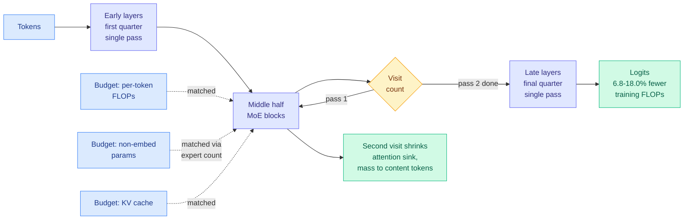

# SMELT: Scaling Laws for Compute-Matched MoE Looped Transformers

**Source:** HuggingFace Daily Papers, 2026-09-02
**Paper:** [arXiv 2609.01343](https://arxiv.org/abs/2609.01343)
**Authors:** Shaowen Wang, Ge Zhang, Kairong Luo, Yuhao Wu, Shaofan Liu, Jiaheng Liu, Wenhao Huang, Shen Yan, Jian Li (Tsinghua University, ByteDance Seed, M-A-P, TokenWave.AI)
**Raw:** [raw/huggingface/2026-09-02-smelt-scaling-laws-for-compute-matched-moe-looped-transforme.md](../../raw/huggingface/2026-09-02-smelt-scaling-laws-for-compute-matched-moe-looped-transforme.md)

## TL;DR

Looped Transformers add depth by running the same block of layers more than once. Every prior comparison of looped against unlooped models leaked extra resources into the looped side, so nobody knew whether looping was an architectural win or just more compute. SMELT closes the accounting. It matches **three budgets simultaneously** (per-token FLOPs, total non-embedding parameters, and KV cache size), which is only feasible because Mixture-of-Experts decouples total parameters from per-token FLOPs. Under that matching, the recipe that survives ablation is narrow: **loop the middle half of the layers twice**. Scaled to four sizes up to 54B non-embedding parameters with a separate Chinchilla-style scaling law fit per architecture, SMELT's loss falls faster with compute and saves **6.8 to 18.0% of training FLOPs on the compute-optimal frontier**. The advantage is largest on Code, grows with sequence length and with the number of in-context examples, and exceeds what validation loss predicts on downstream benchmarks.

## What problem it solves

The looped-transformer literature has a control problem, not a results problem. Huginn and Ouro showed looped models matching or beating unlooped models several times their size, but those comparisons either fixed the *stored* parameter count while letting recurrent depth inflate per-token FLOPs and KV cache, or emphasized parameter efficiency against a much larger unlooped baseline. Both conflate the architectural effect with extra spend. One prior dense study controlled per-token FLOPs but had to shrink the looped model's unique parameters to do it, which suppresses the very advantage it was testing. SMELT's answer is that MoE makes three-way matching possible: narrow the hidden dimension to hold FLOPs fixed, then recover knowledge capacity by raising the expert count. Matching KV cache matters separately because KV size bounds the maximum servable context length, so a looped model that quietly needs a bigger cache is not a drop-in replacement at serving time.

## Core novelty

Two things, and the second is the one that will get cited.

**The recipe.** Not "loop everything," and not adaptive per-input depth. Loop the **middle half** twice. Early layers and late layers get one pass. This came out of an ablation series rather than from theory.

**The mechanism.** SMELT reports that the second visit **reduces the attention sink** (the well-documented tendency of attention mass to pile onto a few early or delimiter tokens that carry little information) and redirects that mass toward content-relevant tokens. That is a concrete, measurable inductive bias rather than a hand-wave about "more computation per token," and it explains the shape of the gains: sinks hurt most when there is a lot of context to discriminate among, which is exactly why the advantage grows with sample length and with in-context example count.

## Key takeaways

- Under simultaneous FLOPs, parameter, and KV matching, looping still wins. That is the first clean version of this claim in the wiki.
- **6.8 to 18.0% training-FLOP saving** on the compute-optimal frontier, from a separate scaling law fit per architecture rather than a single-point comparison.
- Downstream gains exceed what validation loss predicts, and are largest on **Code**.
- The advantage **grows** with sequence length and in-context example count, so it is not a fixed offset.
- Mechanistic account: second visit suppresses the attention sink.

## How this relates to prior wiki pages

**It resolves the loop-count question [looped-transformers.md](looped-transformers.md) has carried since 06-17, and it resolves it by agreeing with LoopCoder-v2.** That page recorded LoopCoder-v2 (06-17), a 7B Parallel Loop Transformer coder, finding empirically that **two loops is optimal** and that three-plus loops regress, diagnosing later loops as oscillatory and low-diversity while a fixed positional-mismatch cost keeps accruing. SMELT arrives at loop-twice independently, at a different scale, on a different architecture family (MoE rather than dense), under much stricter budget control, and supplies a mechanism LoopCoder-v2 did not have. **Two papers, two and a half months apart, converging on the same loop count with one now explaining why** is a stronger result than either alone.

**It half-settles the page's "saturation vs adaptivity" tension and sharpens the other half.** That tension was LoopCoder-v2's hard ceiling at two fixed loops against [Looped World Models](2026-06-17-looped-world-models.md)'s (06-17) claim that *adaptive* per-step loop depth is a feature. SMELT lands squarely on the fixed-depth side and adds a spatial dimension the page did not have: loop depth should vary by **layer position**, not by input. The unresolved question is now better posed. Nobody has ablated adaptive-per-input against fixed-middle-half looping on the same task under matched budgets.

**It removes the page's gating constraint by construction.** [looped-transformers.md](looped-transformers.md) recorded that "KV cost is the gating constraint," and that looping was only practical because LoopCoder-v2 shared KV across loops with gated sliding-window attention. SMELT does not need a KV-sharing trick because it holds KV cache fixed as a *budget* in the comparison. The instinct is the same one [kv-cache.md](../inference-efficiency/kv-cache.md) tracks across heads and layers, but the framing is stronger: KV is not an implementation detail of the loop, it is one of the three things you must hold constant before the loop's benefit is even a well-defined quantity.

**It adds a fourth failure of the received scaling law, of a new kind.** [scaling-laws.md](scaling-laws.md) records two: Skaling (08-10) showed the Chinchilla additive form is misspecified at the grid corners because it forces the N-by-D cross-derivative to zero, and LLaDA MoE v2 (08-05) showed autoregressive laws do not transfer to diffusion language models. SMELT adds that **the law is architecture-specific within one objective**: fitting a separate Chinchilla-style law per architecture is what makes the 6.8-18.0% frontier saving legible, and a single law fit across both architectures would have averaged the effect away. That is not a misspecification like Skaling's and not a transfer failure like LLaDA's. It is a claim that architecture belongs in the law, and it bears directly on the page's open question about whether sparse-model laws need a third interaction term.

## Gaps

The paper reports a training-FLOP saving on the compute-optimal frontier, which is the right currency for a pretraining decision and the wrong one for a serving decision. Sequential looping serializes computation, so wall-clock and latency behavior under matched FLOPs is not the same as FLOP behavior, and the abstract does not address it. Concurrent work cited in the framing (MoEUT, LoopMoE) matched wall-clock time instead, so the two literatures are optimizing different objectives and no head-to-head exists. The attention-sink mechanism is offered as an explanation that "may underlie" the gains, which is honest but means it is correlational at this point. And 54B non-embedding parameters is a real scale but well short of where the frontier labs would have to be convinced.

## Related

- [looped-transformers](looped-transformers.md) — the concept page this updates
- [scaling-laws](scaling-laws.md) — architecture-specific law fitting
- [kv-cache](../inference-efficiency/kv-cache.md) — KV as a matched budget rather than a loop cost
- [attention-mechanisms](attention-mechanisms.md) — the attention-sink mechanism
