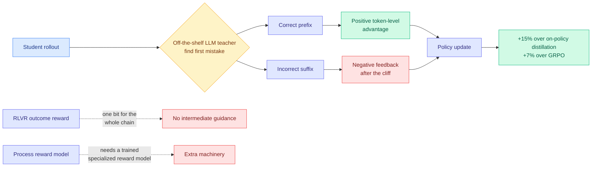

# Cliff: Learning Process Rewards from the First Mistake

**TL;DR.** Reinforcement learning with verifiable rewards, RLVR (post-training where the reward is a checkable answer rather than a human preference score), gives one bit of feedback for a whole reasoning chain, so the model learns nothing about *where* it went wrong. The existing fixes both add machinery: process reward models need a trained specialized reward model, and on-policy distillation assumes teacher and student reason the same way. Cliff starts from an observation that makes most of that machinery unnecessary. **Once a reasoning chain first goes wrong, evaluating everything after it adds almost no information, because it is all conditioned on an invalid prefix.** So the only judgement worth making is: where is the first mistake? Cliff uses an off-the-shelf LLM as teacher to locate it, which splits the rollout into a correct prefix and an incorrect suffix, then converts that split into **token-level advantages**, positive on the prefix and negative after. Across 12 scenarios it beats on-policy distillation by **15%** and standard GRPO (Group Relative Policy Optimization, the ratio-free policy-gradient method used for most open RLVR work) by **7%**, and it works with teachers of only modest capability.

**Source:** [HuggingFace Daily Papers](https://huggingface.co/papers/2609.02817) · [arXiv 2609.02817](https://arxiv.org/abs/2609.02817) · [raw](../../raw/huggingface/2026-09-03-cliff-learning-process-rewards-from-the-first-mistake.md)

---

## The insight

The paper's contribution is mostly an information argument, and it is a good one. Process reward modelling tries to score every intermediate step, which is expensive and requires a trained scorer whose reliability is itself unverified. Cliff observes that **step scores after the first error are nearly worthless**: they are evaluations of reasoning that is already conditioned on a false premise, so a step can be locally coherent and globally useless, and a scorer that grades it is measuring the wrong thing. The information content of a reasoning trace's correctness profile is therefore concentrated almost entirely at one point, the transition. Find that point and you have extracted nearly all the available process signal with one judgement instead of n.

That converts a hard scoring problem into an easier localization problem, which is why a **modest teacher suffices**. Locating the first mistake in a chain is substantially easier than assigning calibrated quality scores to every step, and the empirical result that low-capability teachers still work is the strongest evidence for the framing.

The reward shaping is then mechanical: positive token-level advantage across the correct prefix, negative after. No reward model to train, no assumption that teacher and student share a reasoning style, which is the assumption on-policy distillation needs and the reason it underperforms here by 15%.

## Key results

- **Beats on-policy distillation by 15%** and **standard GRPO by 7%**, across 12 different scenarios.
- **Works with teachers of modest capability**, which is the load-bearing practical claim: it means the method is not a disguised way of distilling a frontier model.
- Includes an analysis of the role of ground truth in Cliff plus training dynamics, so the paper interrogates its own mechanism rather than only reporting deltas.

## How this relates to prior wiki pages

**Cliff and today's [IDA-OPD (09-03)](../inference-efficiency/2026-09-03-ida-opd-influence-directed-distillation.md) converge on the same unit of credit assignment from unrelated starting points, and neither cites the other.** Both convert a per-position diagnosis into **signed token-level advantages**, and both work by treating positions asymmetrically rather than reweighting them uniformly. Cliff splits at the first mistake and signs the advantage on either side; IDA-OPD splits updates by their signed effect on the student's entropy and shrinks only the entropy-contracting ones. One comes from RLVR reward design, the other from distillation diversity collapse. **Two papers on one day arriving at signed position-local advantage shaping is a convergence worth naming**, and it says the field's working unit has moved from the trajectory to the token, with a sign attached.

**It is the fifth axis of the selective-supervision program, arriving on the same day as the fifth axis.** [knowledge-distillation.md](../inference-efficiency/knowledge-distillation.md) tracks four axes: which tokens (TIP, 04-16, most teacher tokens carry no learning signal and roughly 10% suffice), which layer (OPRD, 06-05), which trajectories ([OPDVR, 08-26](../inference-efficiency/2026-08-26-opdvr-distillation-verifiable-reward.md)), which teacher ([QAH, 08-26](../inference-efficiency/2026-08-26-quantization-aware-healing.md)). Cliff's answer to "which tokens" is the sharpest yet stated: **everything up to the first mistake, and nothing after.** TIP said roughly 10% of tokens carry signal but selected them by teacher-agreement weighting; Cliff selects by a structural property of the trace with a defensible information argument for why the rest is noise.

**It resolves, by circumventing, the load-bearing weakness this wiki flagged in the R2-OPD family.** [R2-OPD (08-25)](../inference-efficiency/2026-08-25-r2-opd-reasoning-progress-filtering.md) diagnosed that on-policy distillation's dense reward derives from teacher agreement and is implicitly treated as a proxy for reasoning progress, and the two come apart exactly when the student finds a *different valid path*: agreement falls, real progress is fine, and the student is punished for independent correct reasoning. R2-OPD's fix added a second cheap progress-reward model, and [knowledge-distillation.md](../inference-efficiency/knowledge-distillation.md) generalized the objection immediately, that the progress estimator is an unvalidated learned model with no sensitivity ablation, and that VoI-MoLE (08-25) had the identical structural flaw. **Cliff needs no progress estimator at all.** It asks a teacher one localization question and derives the dense signal from the answer, and because it does not require teacher and student to reason alike, the different-valid-path failure does not arise: an alternative correct prefix is simply a prefix with no mistake in it yet.

**It is the same structural claim as today's [CRISP (09-03)](../inference-efficiency/2026-09-03-crisp-cliff-aware-sparse-prefilling.md), in a different domain, and the shared name is not an accident of vocabulary.** CRISP formalizes the **post-softmax mass cliff**, the point after which retained attention mass is background noise, and proves that cumulative thresholds accumulate O(n) of it at long context. Cliff formalizes the **first-mistake cliff**, the point after which evaluating reasoning yields no information. Both papers say: there is a sharp threshold in a sequence, everything past it is noise, and the standard practice of integrating uniformly across the whole sequence therefore imports noise that grows with length. **That is one idea with two instantiations, attention selection and credit assignment**, and the fact that it shows up twice on one day in unconnected subfields is the strongest cross-paper pattern in today's batch.

**RLVR context.** [rl-for-llms.md](rl-for-llms.md) carries the outcome-versus-process reward debate. Cliff's position is a third option: **process-grade one transition rather than every step**, which keeps process-level density without a process reward model.

## Gaps

- **The teacher's localization accuracy is never reported.** The whole method rests on finding the first mistake correctly, and there is no stated precision for that judgement, nor a study of what happens when the teacher localizes early (throwing away correct reasoning) or late (rewarding invalid steps). The asymmetry of those two failure modes is likely to matter a lot.
- **"12 different scenarios" is not a domain breakdown.** Whether the first-mistake concept is well defined outside math and code, where correctness is locally checkable, is the natural limit. In open-ended reasoning there may be no single first mistake.
- **Baseline strength.** "Standard GRPO" is the weakest member of a family that has moved on considerably, and a 7% gain over the standard variant is less impressive than a gain over the current best.
- **Teacher cost unpriced.** One teacher call per rollout to locate the mistake is cheaper than a process reward model but not free, and no per-step token cost is given.
- **No pass@k.** Given that IDA-OPD, published the same day, demonstrates that selective supervision can silently collapse solution diversity, a method that assigns negative advantage to everything after one point should be checked for exactly that failure. It is not.

## Industrial implication

This is a cheap upgrade to any RLVR pipeline: no reward model to train and maintain, no requirement that the teacher be stronger than the student in general, only that it can spot where a chain broke. For teams running GRPO on math or code, the described change is a rollout-annotation step plus an advantage-shaping function. The broader consequence is on process reward models as a product category. **If one localization query recovers most of the process signal, the case for training and serving a full step-scorer weakens considerably**, and process reward models were on their way to becoming standard infrastructure.

## Related

- [IDA-OPD (09-03)](../inference-efficiency/2026-09-03-ida-opd-influence-directed-distillation.md) — signed token-level advantages from the distillation side, same day
- [CRISP (09-03)](../inference-efficiency/2026-09-03-crisp-cliff-aware-sparse-prefilling.md) — the same cliff structure in attention
- [R2-OPD (08-25)](../inference-efficiency/2026-08-25-r2-opd-reasoning-progress-filtering.md) — the progress-proxy problem Cliff avoids
- [rl-for-llms.md](rl-for-llms.md) · [knowledge-distillation.md](../inference-efficiency/knowledge-distillation.md) — concept pages
