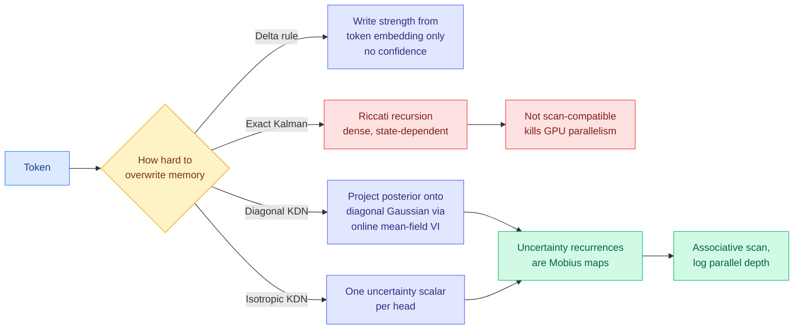

# Kalman Delta Networks: Uncertainty-Aware Associative Memory

**Source:** HuggingFace Daily Papers · [arXiv 2609.07816](https://arxiv.org/abs/2609.07816)
**Raw:** [`raw/huggingface/2026-09-09-kalman-delta-networks-uncertainty-aware-associative-memory.md`](../../raw/huggingface/2026-09-09-kalman-delta-networks-uncertainty-aware-associative-memory.md)

## TL;DR

Linear attention buys constant-memory decoding by replacing the growing KV cache with a fixed-size recurrent memory. The price is an irreversible online decision at every token: **what to write, and how hard to overwrite what is already there**, before you know what future queries will ask for. Delta-rule models learn that write strength from the current token embedding. What they do not do is track **how confident the memory currently is**, so a write into a well-established association is treated the same as a write into an empty slot.

Kalman Delta Networks fix that by recasting recurrent associative memory as a **linear-Gaussian state-space model**, for which the Kalman filter is the optimal recursive estimator. The transition then propagates both the memory state and its uncertainty, and the **Kalman gain weights each residual write by accumulated evidence and observation reliability**. Delta-rule updates fall out as a special case that substitutes a token-wise isotropic surrogate for the predictive covariance and drops covariance tracking entirely. Across controlled pre-training at **750M and 1.3B**, KDN variants improve perplexity and mean downstream accuracy over state-of-the-art linear-attention models.

## The engineering problem, which is the interesting part

Exact Kalman tracking needs a dense, state-dependent **Riccati recursion**, and a Riccati recursion is exactly the wrong shape for a GPU-parallel linear-attention scan: it is sequential and dense where the whole point of linear attention is an associative scan with logarithmic parallel depth. The paper's real contribution is two scan-compatible approximations that keep the parallelism:

**Diagonal KDN** projects each one-step posterior onto the diagonal Gaussian family through online mean-field variational inference. **Isotropic KDN** keeps a single uncertainty scalar per head. Both work because their uncertainty recurrences turn out to be **Mobius maps**, which compose associatively and therefore run as a parallel scan.

## How this relates to prior wiki pages

**It is the constructive answer to a hazard this wiki flagged two days ago and could not act on.** [When Quantization Breaks Memory (09-07)](../inference-efficiency/2026-09-07-quantization-breaks-recurrent-state.md) found that in a recurrent network the state is stored and read back, so the **write-back rule changes the dynamical system rather than approximating it**: deterministic 4-bit state storage on a fixed trained GRU raised error roughly 70x and 300x on two targets, because repeated sub-threshold updates are silently discarded while the network keeps proposing change. That paper diagnosed a write-back pathology. **KDN is a model in which the write-back rule is explicitly the object being learned, with a confidence term attached.** The testable consequence is direct and nobody has run it: a KDN should be **more** robust to state quantization than a delta-rule model at the same bit width, because a write the filter considers low-confidence is one it was already going to attenuate, so discarding it costs less. If it is not more robust, the confidence term is not doing what the derivation says.

**It also lands on the open branch of the [KV cache page](../inference-efficiency/kv-cache.md).** That page tracks two live answers to KV capacity: compress the cache, or bound it with a fixed-size recurrent memory in the [Maglev (08-16)](../inference-efficiency/2026-08-16-maglev-sliding-recurrent-memory.md) style. Everything on the bounded branch has treated the write rule as a learned scalar. KDN says the right object is a scalar *and* a covariance, and that you can keep the second one cheaply enough to stay in the scan.

**Against the [attention mechanisms page](attention-mechanisms.md)'s framing of linear attention as a quality-for-memory trade,** this is a case where a better-principled memory update improves perplexity *and* downstream accuracy at fixed memory, which is the direction that makes the trade less of a trade.

## Gaps

- **750M and 1.3B, controlled pre-training only.** Linear-attention advantages at small scale have historically compressed at larger scale, and this page should not quote the perplexity win as a frontier claim.
- **No wall-clock number.** Scan-compatible is not the same as fast: the covariance recurrence adds work per token, and whether Diagonal KDN's mean-field projection is cheap in practice is unreported here.
- No long-context evaluation, which is the regime the fixed-size memory exists for and where the confidence-weighted write should help most.
- The reduction of the delta rule to a special case is elegant and also means the two are close; the ablation separating "covariance tracking" from "any second learned parameter" is not reported.

## Related

- [Attention Mechanisms](attention-mechanisms.md) (concept page)
- [KV Cache](../inference-efficiency/kv-cache.md) (concept page)
- [When Quantization Breaks Memory (09-07)](../inference-efficiency/2026-09-07-quantization-breaks-recurrent-state.md)
- [Maglev: sliding recurrent memory (08-16)](../inference-efficiency/2026-08-16-maglev-sliding-recurrent-memory.md)
