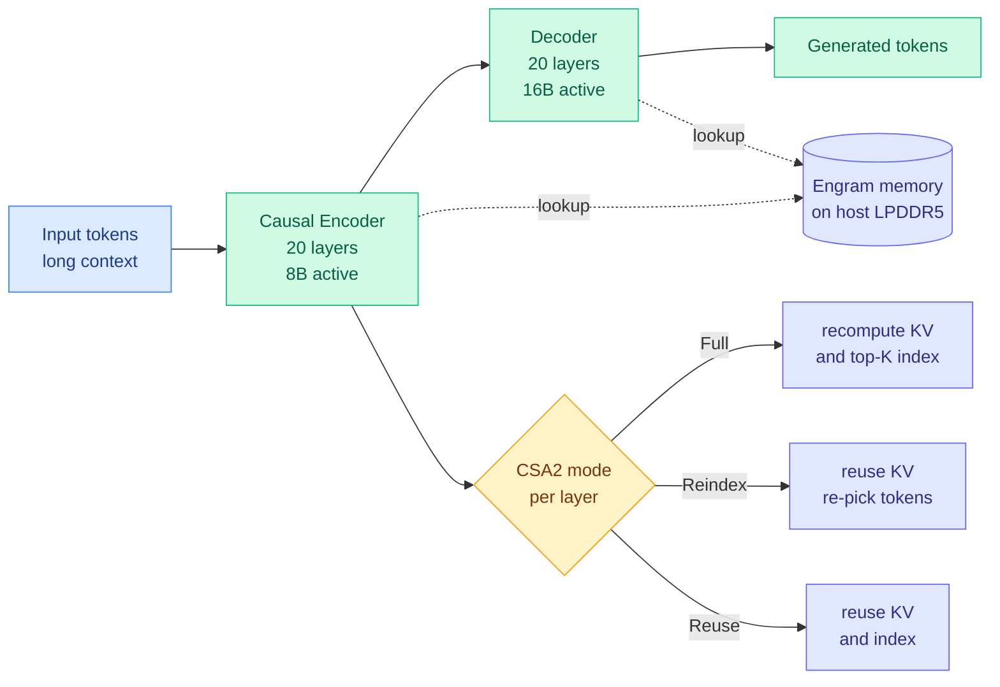

# DeepSeek V4.1 Flash: four ways to not compute something

**Source:** DeepSeek model release + tech report, surfaced across the X feed (@eliebakouch, @Thom_Wolf, @MaxForAI, @bookwormengr, @teortaxesTex) and a WorldofAI walkthrough video · [Weights + tech report](https://huggingface.co/deepseek-ai/DeepSeek-V4.1-Flash)

## TL;DR

DeepSeek released V4.1 Flash at 02:17 UTC on 2026-09-10: **552B total parameters, 8B active on input and 16B active on output**, trained on 45T tokens, MIT licence, native vision. It beats GPT-5.6 Sol on several coding and agent benchmarks (deepswe 74.2 vs 73.0, automationbench 54.8 vs 45.8, agents' last exam 31.8 vs 26.7, cybergym 88.1 vs 84.5) at roughly **$0.14 per million input tokens and $0.56 per million output tokens** off-peak. The architecture is not a scale-up of V4. It is four independent mechanisms that each answer the question *which computation can we avoid entirely*, and the most consequential of them moves nearly half the model's parameters off HBM (the expensive high-bandwidth memory soldered next to the GPU die) and onto ordinary host LPDDR. DeepSeek is retiring V4-Pro into it: **from 2026-09-14 every V4-Pro API request routes to V4.1 Flash and Pro pricing drops 77%.**

## The architecture

**1. Asymmetric encoder-decoder.** V4.1 Flash runs 20 layers of causal encoder followed by 20 layers of decoder, and activates a *different* number of parameters on each side: 8B while reading, 16B while writing. This is not a return to BERT/T5. The premise, as @MaxForAI put it after reading the paper's architecture figure, is that **reading a million tokens and generating the next one were never the same computational task**, so there is no reason to run them through the same structure at the same width. Prefill is the FLOP-heavy phase and gets the narrower activation; decode is the memory-bound phase and gets the wider one.

**2. Engram on host memory.** Engram is DeepSeek's conditional-memory module, introduced in their January 2026 paper and already recorded on this wiki as part of [the V4 architecture (04-24)](2026-04-24-deepseek-v4-architecture.md), where it provided O(1) factual retrieval so the model looks facts up rather than recomputing them through dozens of attention layers. V4 shipped it; V4.1 Flash changes *where it lives*. Nearly half the model's parameters are Engram embeddings, and they **reside on host LPDDR5 rather than HBM**. The trade is explicit: you give up backbone parameters, which must sit in HBM, and buy embeddings, which need not. That cuts the HBM bill and the prefill FLOP bill at once, because a looked-up fact costs a memory read instead of forty layers of arithmetic. The backbone that remains on HBM is mostly 4-bit. Reported result: **a quarter of the HBM and an eighth of the SSD of the previous generation.**

**3. CSA2 with cross-layer index reuse.** V4's hybrid CSA/HCA attention cut inference FLOPs 73%. V4.1 drops HCA and keeps the harder half, upgrading conditional sparse attention to CSA2 with three per-layer modes: **Full** recomputes both the KV projections and the top-K token index; **Reindex** reuses the KV but re-decides which tokens this layer should attend to; **Reuse** reuses both. The released pattern interleaves them, roughly Full then Reuse, Reuse, Reindex, Reuse. The insight is a separation this wiki has not seen stated before: **hidden states change at every layer, but which tokens are worth attending to does not need re-deciding at every layer.** So cache what can be cached and share across depth what can be shared.

**4. Sparsity everywhere else.** A new sparse indexer, an updated mHC (manifold-constrained hyper-connections, the training-stability mechanism from V4), and MoE (mixture-of-experts, where each token routes through a small subset of specialized sub-networks) on top. Stacked, the four mechanisms read as one design philosophy: MoE says not every parameter should activate, sparse attention says not every token should be looked at, CSA2 says not every layer should re-decide, and Engram says some things need not be computed at all.

The tech report also contains a preliminary **Agent Swarm RL recipe**. Its official ProgramBench score is 20.3%, but @teortaxesTex reports a V4.1 team configuration reaching 30%, well above single-model Sol and close to twice Kimi K3.

## How this relates to prior wiki pages

**It ships the depth axis that [kv-cache.md](../inference-efficiency/kv-cache.md) called the highest-leverage unexplored direction three days ago.** The 09-07 entry recorded KVShare's finding that adjacent layers' KV projections have high cosine similarity in 60-plus-layer topologies, so anchor layers can serve follower layers for an additional 50-75% memory reduction, and noted that **every other method on that page compresses along tokens, heads or the upstream sequence, and none along depth**. CSA2's Reuse mode is exactly cross-layer KV-and-index sharing, in a frontier open-weight model, three days later. The page's framing was that depth-wise sharing is multiplicative with the other axes rather than competing with them; V4.1 Flash composes it with MoE sparsity, token sparsity and quantization simultaneously, which is the strongest available evidence for that claim.

**It extends the page's "compression has become placement" pattern from the cache to the weights.** [kv-cache.md](../inference-efficiency/kv-cache.md) declared on 09-08 that the cache's frontier had moved from shrinking a tensor to placing it on a storage tier, naming KVMem (paging KV across GPU, host RAM and NVMe), Google's TPU-Sync disaggregated transfer and Mooncake's pooled DRAM as three independent instances. Engram-on-LPDDR is the same move applied to **parameters** rather than cache state, and it is the first frontier model this wiki has recorded that puts a large fraction of its weights on a deliberately slower tier as a design choice rather than an offload fallback.

**It confirms [memory-hierarchy.md](../hardware/memory-hierarchy.md)'s founding thesis in the most direct way available.** That page's organizing claim is that the binding constraint moved from FLOPs to memory, derived from the roofline result that on a 70B model **99.66% of every decode step is spent moving bytes**. A lab whose HBM supply is constrained responded by redesigning the architecture so that half its parameters do not need HBM at all. That is the thesis being acted on commercially, not just measured.

**It sits in unresolved tension with the same page's supply analysis, published one day earlier.** [Where does a robot think (09-10)](../hardware/2026-09-10-robot-inference-on-device-vs-datacenter.md) reports that most incremental DRAM capacity is being absorbed by HBM for AI accelerators, leaving **commodity and LPDDR supply competing for a shrinking pool of non-HBM wafers**. DeepSeek's answer to an HBM shortage is to consume more LPDDR. If Engram-style architectures spread, and @bookwormengr notes LongCat 2 from Meituan and Qwen-3.8-Flash-Next have already adopted the approach, then **the relief valve for HBM scarcity routes demand into the memory pool that the same analysis says is already being squeezed.** Nobody has priced that second-order effect.

**It answers V4's open question in the wrong direction to be comfortable.** The [04-24 page](2026-04-24-deepseek-v4-architecture.md) flagged V4's **94% hallucination rate despite O(1) factual retrieval** and asked whether Engram was retrieving correctly while the reasoning layers overrode it. V4.1 Flash doubles down on Engram and reports no hallucination figure in anything surfaced today. That is the single most important number missing from this release.

## Gaps

The benchmark deltas over Sol are single-digit on three of four cited tasks and come from third-party posts rather than an independent harness, which matters especially given [Raschka's observation the same week](2026-09-10-raschka-looped-transformers-recurrent-depth.md) that agentic evaluations are harness-dependent and models are tuned against one primary harness. @iScienceLuvr's own reaction ("perhaps benchmarkmaxxed?") is the right prior until someone reproduces under a shared scaffold. No hallucination rate. No wall-clock serving numbers for the Engram host-memory path under concurrency, which is the regime where a PCIe round trip to LPDDR either amortizes or does not. And @Halex623's practitioner reaction, that supporting encoder-decoder plus Engram plus a new sparse indexer in an inference engine is a serious engineering lift, is the real adoption constraint: **the architecture is only cheap once vLLM and SGLang implement it well.**

## Industrial implication

The retirement of V4-Pro is the part to take seriously. A lab looked at its flagship and its efficiency model, concluded the efficiency model was better on quality *and* cost, and **routed the flagship's traffic into it with a 77% price cut**. That is a routing decision made at the product level rather than the request level, and it is the strongest confirmation this wiki has recorded that architectural efficiency work now decides which model a lab is willing to serve. For anyone running long-context agents, the quarter-HBM and eighth-SSD cache figures change the arithmetic on what is affordable to keep resident. And the strategic read is unavoidable: an MIT-licensed model that matches a frontier closed model at a fraction of the serving cost lands the same week Anthropic's IPO pitch is reported to be wobbling on price.

## Related

- [2026-04-24 DeepSeek V4 architecture](2026-04-24-deepseek-v4-architecture.md) — CSA/HCA, Engram, mHC, the direct predecessor
- [kv-cache](../inference-efficiency/kv-cache.md) — the depth axis and the compression-to-placement shift
- [memory-hierarchy](../hardware/memory-hierarchy.md) — HBM/LPDDR contention and the memory-wall thesis
- [model-pruning-sparsity](../inference-efficiency/model-pruning-sparsity.md) — MoE expert skipping, the sparsity family
- [attention-mechanisms](attention-mechanisms.md) — conditional sparse attention lineage
