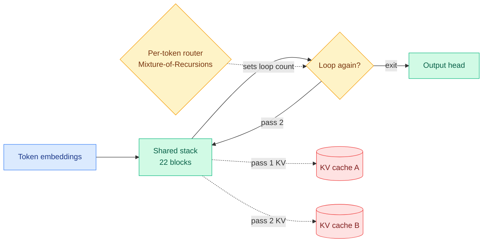

# Raschka on looped transformers: a third independent two-loop result, and a KV-sharing failure

**Source:** Sebastian Raschka, *Ahead of AI* — "GPT-6 Astra, Looped Transformers, and Hidden Reasoning" · [Post](https://magazine.sebastianraschka.com/p/gpt-6-astra-looped-transformers-and) · Raw: [raw/rss/2026-09-09-ahead-of-ai-gpt-6-astra-looped-transformers-and-hidden-reasoning.md](../../raw/rss/2026-09-09-ahead-of-ai-gpt-6-astra-looped-transformers-and-hidden-reasoning.md), also starred in [Gmail](../../raw/gmail/2026-09-10-starred.md)

## TL;DR

A long technical essay prompted by The Information's report that GPT-6 Astra uses "recurrent depth." Raschka walks the looped-transformer family (pass the hidden states back through the *same* transformer blocks instead of stacking new ones, so effective depth rises without new weights), then argues the looping has nothing to do with the separate rumour that Astra hides its reasoning traces. Two findings matter most for this wiki. First, **Nanbeige4.2-3B independently lands on two loops as the efficiency optimum**, making three papers that have now converged there. Second, and more valuable because it is a negative result, **Nanbeige tried sharing the KV cache across loop passes, which halved cache size and made the model worse**, so they shipped the separate-cache version. That directly complicates the KV-sharing assumption this wiki's looped-transformer page has carried since June.

## The mechanism

**The parameter saving is real; the compute and cache savings are not.** Nanbeige4.2-3B applies the same 22-block stack twice, so unrolled it performs 44 block applications while storing weights for 22 blocks. That halves transformer-block parameters against a conventional 44-block model, which reduces the memory needed to hold weights. But the forward pass still runs 44 block applications and backprop still flows through all of them, so **the compute cost is close to a 44-block model, and only the optimizer sees fewer distinct parameters**. The KV cache is the sharper point: pass 1 and pass 2 feed *different* intermediate states into block 1, so they produce different keys and values, and **a looped stack of 22 blocks therefore needs the same KV cache as 44 distinct blocks**. Looping buys weight memory, not cache memory.

**Two loops, for a third time.** Nanbeige's report says two passes was the efficiency optimum: three can improve quality but the extra compute is not worth it, and more passes destabilised optimisation. They also found **training the looped architecture from scratch beat upcycling a pretrained transformer**.

**Adaptive depth is a routing problem.** The 2018 Universal Transformer allowed per-position loop counts via a learned halting probability accumulated across steps until it crosses a threshold. Mixture-of-Recursions (2025) replaces that with **a small learned router that decides how many times each token passes through the shared recursion block**, structurally the same idea as MoE routing except the decision is depth rather than expert identity. Two variants: **expert-choice routing**, where each recursion step selects which tokens continue, and **token-choice routing**, where one router assigns each token a one-, two- or three-pass path up front. Because the router reads the token's contextual hidden state, the same word gets different depths in different contexts. Results are scale-dependent in a way worth noting: at 135M parameters the vanilla transformer wins, and only at larger sizes does Mixture-of-Recursions catch up and often win, **especially at smaller training-compute budgets**. Raschka's own caveat is the useful one: looking only at the small model would have produced the opposite conclusion.

**Inference-time loop budgets exist too.** Geiping et al.'s recurrent-depth latent-reasoning model (3.5B on 800B tokens) sandwiches a shared four-block stack between two initial and two final blocks, feeds the initial-block output back in at every loop alongside the previous hidden state, and **randomises the loop count during training** so the operator can pick 8, 32 or 64 at inference. It halts per token when the KL divergence between successive rounds falls below a threshold. Task-dependent payoff: HellaSwag flattens after about eight loops while GSM8K and HumanEval keep benefiting. ByteDance's Ouro-Thinking 2.6B runs 48 blocks four times (192 applications) with a learned exit gate, though the released implementation computes all four passes before selecting an output, so the adaptivity is effectively inert.

**On Astra and hidden reasoning, Raschka says the two rumours are unrelated.** He thinks Astra probably does use looping, but that its quality comes mainly from training recipe and data. On monitorability: Astra does not use fewer output tokens overall, though it does at fixed accuracy, and that is what a more capable model looks like rather than a more opaque one. His comparison is the clean one: **GPT-5.6 Luna uses roughly 80% more tokens than Sol at similar task performance, and nobody claims Sol is therefore less interpretable.** Astra's system card does report reduced trace monitorability, but associated with shorter and less informative traces, not with architecture. OpenAI's chief scientist stated the computation-graph depth of current frontier models including Astra is within a factor of two of GPT-4, and pushed back explicitly on "a race into unmonitorability kicked off by confused reporting."

## How this relates to prior wiki pages

**Two loops crosses from empirical ceiling to established constant.** [looped-transformers.md](looped-transformers.md) recorded [LoopCoder-v2 (06-17)](../inference-efficiency/2026-06-17-loopcoder-v2-parallel-loop-transformer.md), a 7B coder where two loops was optimal and three-plus regressed, then [SMELT (09-02)](2026-09-02-smelt-moe-looped-transformers.md), which matched per-token FLOPs, non-embedding parameters and KV cache simultaneously, landed on looping the middle half of layers twice for a 6.8-18.0% training-FLOP saving, and supplied a mechanism (the second visit reduces the attention sink, the pile-up of attention mass on a few uninformative early tokens). Nanbeige is a **third independent arrival at two**, at a different scale, from a different lab, with a different objective. Three instances is this wiki's threshold, and the count is met.

**But the KV-sharing thread now has a genuine contradiction, and it is the most useful thing in this essay.** The page's standing note was that "looping is only practical because LoopCoder shares KV across loops (gated sliding-window attention)," framing cross-loop KV sharing as the enabling trick. **Nanbeige tried precisely that, got the expected 50% cache reduction, and lost accuracy, so they shipped separate caches.** Both cannot be generally true. The reconciliation candidates are concrete: LoopCoder's sharing came packaged with cross-loop position offsets and a gated sliding window, so the gating may be what makes shared KV survivable, and Nanbeige's naive sharing may simply be the ablation that shows the gate is load-bearing rather than incidental. Somebody should run gated versus ungated cross-loop KV sharing on one model. Until then **the honest statement of the page's position is that cross-loop KV sharing costs accuracy unless mediated, and SMELT's decision to hold KV cache fixed as a budget rather than mitigate it looks better-founded than it did.**

**It moves the page's "saturation vs adaptivity" tension without closing it.** The page recorded SMELT landing hard on fixed depth varying by *layer position* and called adaptivity "the burden of proof," noting nobody had ablated adaptive-per-input against fixed-middle-half looping under matched budgets. Mixture-of-Recursions is the strongest adaptive result, and it wins at scale and at low training budgets, which is suggestive rather than decisive because it was never run against fixed-middle-half looping under SMELT's three-way budget match. **The experiment the page asked for still has not been run, but the adaptive side is no longer the minority position on evidence, only on rigour.**

**It ties the loop line to [llm-routing.md](../ai-routing/llm-routing.md), which the page had not done.** Mixture-of-Recursions routes *compute depth* per token with a learned router, and expert-choice versus token-choice is the same design fork this wiki tracks in model-level routing. That makes recursion depth a routing target rather than only an architecture hyperparameter, and it is the tightest available link between the routing and architecture halves of this wiki.

**Its harness aside belongs on the harness page and matches a practitioner cluster exactly.** Raschka reports that agentic benchmark suites use different harnesses (Stirrup for GDPval-AA and AA-Briefcase, Terminus 2 for Terminal-Bench v2.1, the tau-Bench harness for tau-cubed-Banking), that **models are typically developed against one primary harness and fine-tuned less on others**, and that shared-harness evaluations may therefore understate a model in its native scaffold. He then relays advice from a colleague and the Claude Code lead to **delete or archive parts of existing AGENTS.md and SKILL.md files**, because newer models understand prompts more efficiently and extra hand-holding can constrain them into worse solutions. That is the same claim as two items in the reader's saved cluster ("Delete 80% of Claude Code's prompt," "33% of Claude Code skills make the agent worse") and as an AI Engineer conference talk circulating today on how long a skill can be before the agent forgets it. See [agent-harness-engineering](../agentic-systems/agent-harness-engineering.md).

## Gaps

The essay is a survey plus commentary, so its claims inherit the source papers' limits: Nanbeige's KV-sharing negative result is reported from their technical report without an ablation isolating why sharing hurt, and no paper here reports serving latency, which [looped-transformers.md](looped-transformers.md) already names as the unresolved axis. Looping serialises computation, so matched FLOPs is not matched wall-clock, and every quality result on this page is still reported in the currency that flatters looping most.

## Industrial implication

If Astra really uses recurrent depth, the commercial reading is that **a frontier lab chose to buy depth with weight-sharing rather than parameters**, which is a bet that weight memory is scarcer than compute. That is the same bet DeepSeek made today from the opposite direction by moving Engram embeddings to host LPDDR, and both point at the same conclusion for anyone sizing an inference fleet: parameter memory is now a first-class design variable rather than a consequence of the model card. The near-term practical item is smaller: **audit your agent instruction files down, not up.**

## Related

- [looped-transformers](looped-transformers.md) — the concept page this updates
- [SMELT (09-02)](2026-09-02-smelt-moe-looped-transformers.md) — the matched-budget MoE looping result
- [kv-cache](../inference-efficiency/kv-cache.md) — cross-loop sharing sits inside the cache-sharing family
- [llm-routing](../ai-routing/llm-routing.md) — per-token depth routing
- [agent-harness-engineering](../agentic-systems/agent-harness-engineering.md) — the harness-dependence aside
- [test-time-compute-allocation](../inference-efficiency/test-time-compute-allocation.md) — looping as test-time compute that does not lengthen output
