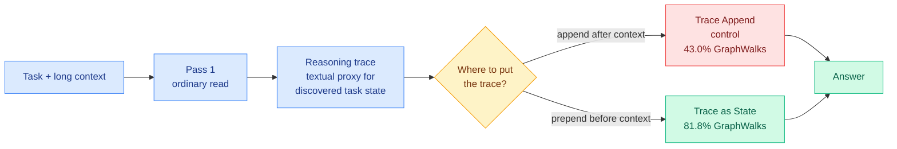

# Trace as State: put the reasoning trace before the context, not after

**Source:** arXiv, surfaced via the X feed (@NFT_Chen), not in today's HuggingFace or Kurate boards · [Paper](https://arxiv.org/abs/2609.02702)

## TL;DR

Transformers read causally, left to right. Long-context reasoning often depends on task state that is only discovered *late*, after most of the document has already been encoded. The paper formalizes this as a **conditional state update task** and proves a separation: for a causal state-update processor, **providing the condition first can require exponentially less memory in the worst case than providing it last.** The practical method that follows is almost embarrassingly simple. Run one pass, collect the reasoning trace, then **re-read the long context on a fresh pass with that trace placed in front of it**. The matched control, Trace Append, uses the identical trace placed *after* the context. Across three models and three long-context datasets, Trace as State wins **26 of 27** model-task-metric combinations. On GraphWalks Parents exact match, DeepSeek V4 Pro Preview goes from 29.2% on the initial pass to 43.0% with the trace appended and **81.8%** with the trace prepended; GLM-5.2 goes from 66.4% to 83.2% to **100.0%**.

## The mechanism

## Key points

- **The control is what makes this a result.** Trace Append uses the same tokens, the same trace, the same total context. The only variable is position. A 38-point swing on GraphWalks from position alone is not a prompting trick, it is a statement about what causal attention can and cannot recover.
- **The theory names a worst-case exponential gap, not a constant factor.** Condition-first versus condition-last is a memory-complexity separation for causal state-update processors, which is why the empirical gap widens on the harder graph-traversal tasks rather than staying flat.
- **It keeps the causal transformer intact.** No architecture change, no bidirectional encoder, no retraining. The cost is one extra full read of the context.

## How this relates to prior wiki pages

**It is the prompting-layer twin of [PARSER (09-10)](../inference-efficiency/2026-09-10-parser-parallel-read-deep-reason.md), which decouples reading from reasoning by having frozen per-chunk subagents read in parallel while a trained lead agent interrogates them across rounds, cutting long-context latency up to 11x.** Both papers identify the same defect: a causal model cannot retroactively change how it encoded early text once it learns what mattered. PARSER removes the fixed read order; Trace as State re-runs the read with the answer to "what mattered" already in the prefix. PARSER pays in parallel serving capacity, Trace as State pays in one extra sequential pass. Nobody has compared them, and the comparison is cheap.

**It is in direct tension with the append-only cache discipline on [kv-cache.md](../inference-efficiency/kv-cache.md).** That page recorded on 08-14 that DeepSeek repriced cache-hit tokens roughly 6x and shipped a harness whose organizing rule is that written history is never altered, because editing the prefix invalidates every cached token downstream. Trace as State does the maximally expensive thing under that pricing: it **prepends new content to a long prefix**, guaranteeing a full recompute. The 09-06 [ContextPipe](../agentic-systems/2026-09-06-contextpipe-database-context-assembly.md) entry on the same page already showed that deliberately breaking prefixes can win when it shrinks total tokens. Trace as State breaks the prefix and *grows* total tokens, so it must pay for itself entirely in accuracy. On GraphWalks it clearly does. On cheaper tasks the crossover is unmeasured and is the number a serving team would need.

**It also touches the recurrent-depth thread from [Raschka's looped-transformer piece (09-10)](2026-09-10-raschka-looped-transformers-recurrent-depth.md), which argues GPT-6 Astra's gains may come from recurrent depth rather than hidden chain-of-thought.** Re-reading a context with your own prior trace in front is a two-iteration loop implemented in token space rather than in weight space. Whether that is a poor man's recurrent depth or a genuinely different mechanism is open.

## Gaps

Every reported gain requires a second full forward pass over the long context, so the accuracy is bought at roughly 2x prefill cost and the paper reports no accuracy-per-dollar comparison against simply using a larger model or more test-time samples. The trace is a "textual proxy" for task state with no principled selection of what goes into it. And GraphWalks Parents going to 100.0% for GLM-5.2 suggests that particular benchmark saturates, which weakens it as evidence for harder settings.

## Related

- [Attention mechanisms](attention-mechanisms.md) · [Looped transformers](looped-transformers.md) · [KV cache](../inference-efficiency/kv-cache.md)
