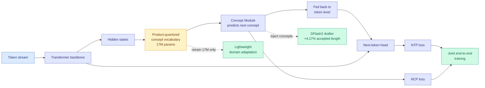

# NCP-ArchPreview: Moving towards Latent Space Language Models through Next Concept Prediction

**Source:** HuggingFace Daily Papers, arXiv 2609.10715 (The Intern-NCP Team: Shanghai AI Lab + LUMIA Lab, Shanghai Jiao Tong University. Project lead Zhouhan Lin; advisors Zhouhan Lin, Qi Zhang, Dahua Lin, Bowen Zhou)
**Raw:** [raw/huggingface/2026-09-11-ncp-archpreview-technical-report-moving-towards-latent-space.md](../../raw/huggingface/2026-09-11-ncp-archpreview-technical-report-moving-towards-latent-space.md)
**Links:** [arXiv](https://arxiv.org/abs/2609.10715)

## TL;DR

Standard pretraining asks a model to predict the next token, over and over, for trillions of tokens. NCP-ArchPreview keeps that objective and adds a second one running alongside it: predict the next **concept**, where a concept is a discrete code that spans several tokens. The concept vocabulary is not hand-designed or imported. The model builds it from its own hidden states using product quantization (splitting each hidden vector into sub-blocks and learning a small codebook per block, so a large effective vocabulary comes from a few small tables). A dedicated Concept Module predicts the next code, and the prediction is fed back down to the token level to steer the next tokens. Both objectives train jointly end to end. At 8.9B parameters on 5.73T tokens of Dolma-3, this is the largest latent-space language model published, and the number that matters for this wiki is that it reaches **OLMo-3-7B's final pretraining loss on 51.3% of the tokens**.

## What problem it solves

Next-token prediction learns high-level abstractions implicitly. Nothing in the objective *asks* for them, so the model is free to spend capacity on local surface statistics that happen to reduce the loss, and there is no explicit representation you can point at, reuse, or adapt. Prior latent-space language models tried to fix this by generating in a continuous latent space and giving up token-level autoregression, which breaks compatibility with every serving and sampling technique built for token models. NCP-ArchPreview's design choice is to refuse that trade: **the concept objective is added alongside standard token-level generation, not in place of it**, so the model still emits tokens the ordinary way and every downstream tool still works.

## Key results

- **51.3% of the training tokens to reach OLMo-3-7B's final pretraining loss.** Roughly a 2x sample-efficiency improvement against a well-known open baseline, which is a compute saving expressed at the point where compute is most expensive.
- **+2.45 points on the downstream macro-average over OLMo-3-7B after full pretraining, including +5.99 on GSM8K.** The disproportionate math gain is the interesting part: grade-school math word problems are exactly the task where multi-token units (a quantity, a relation, an operation) should be the natural prediction granularity.
- **85% of the standard computation to approach the training loss of a strictly parameter-aligned 8.9B baseline.** A separate, cleaner comparison than the OLMo one because the parameter count is held fixed.
- **Updating only the 17M-parameter vector-quantization module gives a working domain-adaptation interface.** The concept vocabulary remains editable after pretraining without touching the 8.9B backbone. That is a sub-0.2% parameter footprint for a domain shift.
- **Injecting concept representations into a DFlash2 drafter improves mean accepted length by 4.17% with negligible overhead.** DFlash2 is the current state of the art in speculative decoding, where a small draft model proposes several tokens and the large model verifies them in one pass; accepted length is the average number of proposals that survive verification, and it maps almost linearly onto serving speedup.
- Controlled ablations separate the gain from the latent architecture from the gain from the NCP objective, which is the ablation most technical reports of this kind skip.

## How this relates to prior wiki pages

**It is the clearest instance yet of the pattern this wiki has been calling selective supervision, moved from the fine-tuning stage to pretraining.** The [knowledge distillation page](../inference-efficiency/knowledge-distillation.md) has tracked a year of results converging on one claim: uniform per-token supervision is wasteful, and the field keeps finding better ways to decide *which* signal to learn from. TIP found most teacher-generated tokens carry no learning signal and roughly 10% suffices; token teachability made per-token learnability the selection criterion. Those all operate on a teacher's output during post-training. NCP-ArchPreview changes the *granularity of the prediction target itself* during pretraining, which is a different and more fundamental lever: rather than choosing which tokens to weight, it adds a target that is not a token at all.

**The DFlash2 result connects two threads that have been separate on this wiki.** The [speculative decoding page](../inference-efficiency/speculative-decoding.md) treats draft quality as a property of the draft model. Here a *pretraining objective in the target model* improves the drafter's acceptance rate, because the concept representation gives the drafter a multi-token-ahead signal that token-level hidden states do not carry. That makes speculative-decoding throughput a downstream consequence of a pretraining decision, which is a link neither page had. It also lands on the same day the X feed carried a practitioner report of pushing DFlash2's training recipe to a further 33% acceptance-length gain, so the same lever is being pulled from both ends in the same week.

**It is the second architecture in two days whose organizing question is which computation to avoid.** [DeepSeek V4.1 Flash (09-10)](2026-09-10-deepseek-v41-flash-architecture.md) activates 8B parameters reading and 16B writing and puts 196B of Engram parameters on host LPDDR instead of HBM, avoiding memory cost. NCP-ArchPreview avoids *training* cost by making each gradient step carry more information. Different resource, same instinct, and the two compose in principle since nothing about a concept objective conflicts with a sparse encoder-decoder.

## Gaps

The headline 51.3% comparison is against OLMo-3-7B, a 7B model, from an 8.9B model. The parameter-aligned comparison exists and is the honest one, and its number is weaker (85% of compute to *approach* the baseline loss, not beat it), so the 2x framing should be read as the generous reading rather than the controlled one. Nothing is reported about inference cost: the Concept Module and the VQ lookup run at generation time, and the report does not say what they add per token, which matters because the DFlash2 gain is a serving-side claim that has to net out against that overhead. Product quantization also has a well-known pathology, codebook collapse, where most codes go unused, and there is no utilization analysis. And "concept" is doing heavy lifting: the codes are whatever the quantizer found, and no interpretability evidence is offered that they correspond to anything a human would call a concept.

## Research angle

The domain-adaptation interface is the most under-sold result in the report and the most testable. If a 17M-parameter VQ update genuinely retargets an 8.9B model, that is a parameter-efficient fine-tuning method operating on a completely different surface from LoRA, adapting the *representation vocabulary* rather than a low-rank weight delta. The comparison against LoRA at matched parameter budget is the experiment, and it is missing. The second open item: concept codes are discrete, which makes them a natural routing key. Every result on the [LLM routing page](../ai-routing/llm-routing.md) routes on an embedding or a learned score of the raw input; routing on a predicted next concept would be routing on a model-internal forecast of what comes next, which no published router does.

## Related

- [DeepSeek V4.1 Flash architecture (09-10)](2026-09-10-deepseek-v41-flash-architecture.md)
- [Speculative decoding](../inference-efficiency/speculative-decoding.md)
- [Knowledge distillation](../inference-efficiency/knowledge-distillation.md)
- [LLM Routing](../ai-routing/llm-routing.md)
