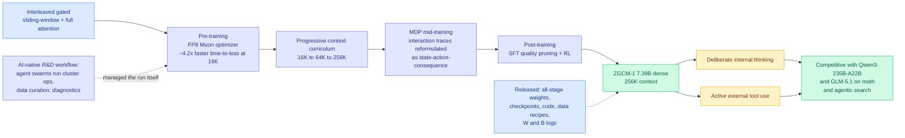

# ZGCM-1: A Fully Open and Extremely Efficient Foundation Model for Math and Agentic Search

**arXiv:** [2609.13356](https://arxiv.org/abs/2609.13356) · **HF Daily Papers:** [page](https://huggingface.co/papers/2609.13356) · **Date:** 2026-09-15
**Authors:** ZGCM Team, led by Jiyan He, with Shuxin Zheng, Tie-Yan Liu and others (Zhongguancun Academy / Zhongguancun Institute of Artificial Intelligence)
**Raw:** [farmer file](../../raw/huggingface/2026-09-15-zgcm-1-a-fully-open-and-extremely-efficient-foundation.md)

## TL;DR

A 7.39B dense model trained from scratch, released with everything: weights from the pre-training, mid-training and post-training stages, intermediate checkpoints, training code, per-stage data and data recipes, and the Weights & Biases logs. "Fully open" here means the run is reproducible, not just the artifact downloadable, and that is rarer than the phrase usually implies.

The premise is a capacity argument. **A compact model cannot passively memorize the open web, but it can get past its parametric limit by pairing deliberate internal reasoning with active external tool use.** So rather than treating tool use as a post-hoc capability bolted on after general pre-training, ZGCM-1 builds it in during mid-training, reformulating interaction traces as **Markov Decision Processes** (state, action, consequence) so the model learns state-conditioned action prediction rather than imitating a transcript.

The efficiency claims are where a reader in this area should spend attention. Architecture and system co-design pairs **interleaved gated sliding-window and full attention** (most layers attend to a local window, some retain global reach, which is how you get 256K context without quadratic cost everywhere) with a **stable FP8 Muon optimizer**. Muon is the newer matrix-aware optimizer that has been displacing AdamW in efficiency-focused runs; making it stable in FP8 is the non-trivial part. Training runs a progressive curriculum scaling context across 16K, 64K and 256K. The reported payoff: **roughly 4.2x efficiency improvement in 16K pre-training time-to-loss.**

Results: competitive across the 7B family on general benchmarks, and on several hard mathematical-reasoning and agentic-search suites, competitive with frontier models **orders of magnitude larger**, naming Qwen3-235B-A22B and GLM-5.1. The paper also distils eight empirical findings across architectural scaling, supervised fine-tuning quality pruning, long-context generalization and agentic co-training dynamics.

The detail most likely to be skipped is the one that connects to the rest of today: the team ran an **AI-native R&D workflow in which agent swarms autonomously managed cluster operations, data curation and rapid diagnostic evaluation.**

---

---

## How this relates to the rest of the wiki

**The capacity premise is the clearest statement yet of a thesis [parametric-context-internalization](../inference-efficiency/parametric-context-internalization.md) has been circling: there is a substitution rate between parameters and retrieval, and nobody has measured it.** ZGCM-1 asserts the substitution is favourable at 7B for math and agentic search specifically, and backs it with a comparison against models roughly 30x larger. It does not report the token cost of the tool calls that make the substitution work, which is the number that decides whether this is cheaper in production or only cheaper to train. **A 7B model that calls a search tool ten times may cost more per answer than a 235B MoE that answers directly, and until someone publishes that comparison the efficiency claim is about training, not serving.**

**The architecture is the third instance this month of the same structural bet on [attention-mechanisms](attention-mechanisms.md).** [SAS (09-14)](../inference-efficiency/2026-09-14-sas-attention-sparsification-end-to-end.md) trained a sparse-attention selector end-to-end on the language-modeling loss instead of distilling dense attention, winning hardest at the tightest budgets. ZGCM-1 takes the coarser route, fixing the sparsity pattern by construction with interleaved local and global layers rather than learning it. **The pair frames the live design question cleanly: learn which tokens to attend to, or hard-wire a pattern and spend the saved complexity elsewhere.** ZGCM-1 is evidence that hard-wiring is enough to reach 256K affordably; SAS is evidence that learning beats hard-wiring when the budget is genuinely scarce. They have not been compared at matched budget and that is a clean experiment.

**Its most consequential paragraph for today is the one about agent swarms.** ZGCM-1 says agent swarms autonomously managed cluster operations, data curation and diagnostic evaluation for this training run. Three days earlier, Dario Amodei's [pace-the-frontier essay](../ai-industry/2026-09-15-pacing-the-frontier-debate.md) named **agent swarms specifically** as his central fear, writing that within 6 to 12 months such a swarm could take over the internet with a persistent botnet. **A lab published a model whose infrastructure was run by the thing the essay asked the field to slow down for, in the same week, and the paper presents it as a methodological improvement worth copying.** Neither side is aware of the other. That gap is the sharpest research-versus-policy divergence in the wiki right now.

**Full-stack openness is also a cost argument, not only a values one.** Publishing intermediate checkpoints and per-stage data recipes means the next group does not pay for the same failed configurations. The eight distilled empirical findings are the compressed form of that. Whether anyone actually reuses them is measurable, and it is the right signal to watch.

## Gaps

- Time-to-loss at 16K is a training-efficiency metric measured at the *short* end of a model whose selling point is 256K context. The 4.2x almost certainly does not hold at full context, and no long-context training-cost figure is given.
- No inference cost. Sliding-window attention reduces KV growth, but the size of that reduction and the serving cost per answer including tool calls are both absent.
- "Competitive with models orders of magnitude larger" is on *several* math and agentic-search suites, which are exactly the domains where tool use substitutes best for parametric knowledge. The general-benchmark claim is the much weaker "competitive across the 7B family."
- Stable FP8 Muon is presented as a result but the stability conditions are not in the abstract. That is the finding most likely to transfer to other labs and the one hardest to reproduce from a headline.

## Links

- [attention-mechanisms](attention-mechanisms.md) · [scaling-laws](scaling-laws.md) · [parametric-context-internalization](../inference-efficiency/parametric-context-internalization.md)
- [SAS (09-14)](../inference-efficiency/2026-09-14-sas-attention-sparsification-end-to-end.md)
- [Daily digest 2026-09-15](../daily-digest/2026-09/2026-09-15.md)
