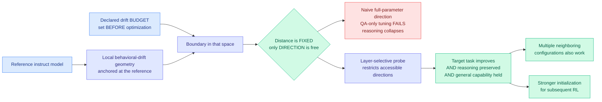

# Drift-Constrained Optimization: Only Direction Matters in Fine-Tuning Instruct Models

**Date ingested:** 2026-09-16
**Source:** HuggingFace Daily Papers · [arXiv 2609.13680](https://arxiv.org/abs/2609.13680) · [code](https://github.com/CONE-MT/DCO)
**Raw:** [raw/huggingface/2026-09-16-drift-constrained-optimization-only-direction-matters-in.md](../../raw/huggingface/2026-09-16-drift-constrained-optimization-only-direction-matters-in.md)

## TL;DR

Fine-tuning an instruct model improves the target task and quietly degrades everything else. That degradation is usually treated as an unfortunate consequence of optimization. DCO treats it as a **budget you set in advance**: declare how far the model is allowed to drift behaviorally from the reference checkpoint, and then the only remaining degree of freedom is the **direction** of the update. This reframes fine-tuning as a direction-selection problem, and the reframing makes a falsifiable prediction: change which directions are accessible and you should be able to qualitatively change the outcome, not just the magnitude of the result.

## The reframing

## The test

The experimental setting is deliberately stringent. Strong instruct models are fine-tuned **only on final answers**, with no reasoning supervision, and are then required to still produce multi-step reasoning at inference. That mismatch normally destroys reasoning: the model learns to emit answers directly. DCO's claim is that a **coarse layer-selective probe reverses the failure**, and that multiple neighbouring layer configurations also work, meaning effective directions are not a knife-edge.

## Results

- QA-only fine-tuning, which normally collapses multi-step reasoning, is **reversed** by restricting the update to a selected layer subset.
- Across **Qwen3-8B and Qwen3-14B**, these directions substantially improve scientific reasoning and multilingual translation.
- Over **more than 100 languages**, the resulting models match or outperform **dedicated translation systems**.
- The tuned models are a **stronger initialization for subsequent reinforcement learning**, which is the part with the most downstream leverage.
- **Multiple neighboring configurations work**, so the result is a region rather than a single lucky setting.

## How this relates to prior wiki pages

**The one-line thesis, "fine-tuning is not about how much a model changes but how that change is spent," is the same claim the wiki's selective-training cluster has been converging on from four other angles.** LongAct showed long-context training signal concentrates in the first few percent of tokens, so the gradient is what matters. TIP reframed distillation as token weighting, finding most teacher-generated tokens carry no signal. [VGF](../inference-efficiency/knowledge-distillation.md) worked at the distribution-transport level, asking where probability mass should move. DCO works at a fifth level: **the geometry of the update itself, under a declared budget**. That is now enough instances to call it settled: the field has moved from "train more" to "train where," and DCO is the most formally-stated version.

**It is the fine-tuning-side mirror of today's [specialist-distillation paper](../inference-efficiency/2026-09-16-specialist-distillation-latent-trajectories.md), and the pairing is the more interesting story.** That paper shows that controlling a specialist's distributional drift moves both the teacher and every student distilled from it along a domain-precision versus general-capability curve. DCO shows that declaring a drift budget up front turns fine-tuning into a direction-selection problem with a usable answer. **Two papers on the same HuggingFace page on the same day, both treating behavioral drift as a designed parameter rather than a side effect, neither aware of the other.** That is the kind of simultaneous convergence this wiki exists to name.

**The layer-selective mechanism connects to the depth-pruning thread in a way neither literature has noticed.** [WRP (09-10)](../inference-efficiency/2026-09-10-wrp-forward-free-depth-pruning.md) identifies layers redundant enough to delete, and today's [directional decomposition paper](../inference-efficiency/2026-09-16-directional-decomposition-compression-error.md) separates layer updates into direction-preserving and direction-changing components. DCO selects layers to *update*. **Whether the layers worth updating are the complement of the layers worth pruning is a cheap experiment nobody has run**, and if the answer is yes, one layer-importance profile serves both compression and fine-tuning.

**And the RL initialization result matters for [rl-for-llms](rl-for-llms.md).** The wiki's RLVR thread has repeatedly found that the SFT stage before RL determines how much headroom RL has. A method that produces a better RL starting point without spending more drift budget is a free improvement to every SFT-then-RL pipeline, which is most of them.

## Gaps

- "Coarse layer-selective probe" is doing a lot of work and the abstract does not say how the layers are chosen. If selection requires a sweep per task, the method's cost is understated.
- The drift budget must be specified in advance, and nothing here says how to choose it. Too tight and the target task does not improve; too loose and you are back to unconstrained fine-tuning.
- Two model sizes from one family. The claim is geometric and should be family-independent, but it has not been shown to be.
- The translation result (matching dedicated systems over 100+ languages) is strong enough that it deserves its own scrutiny, and the abstract does not name the baselines.

## Industrial implication

Every team fine-tuning an instruct checkpoint currently discovers capability regression after the fact, through evals, and then retreats by lowering the learning rate. DCO says the right control is a declared drift budget plus a restricted update subspace, which is a change to the training config rather than to the model. The near-term form is a `max_drift` parameter in fine-tuning libraries alongside learning rate, with a layer mask chosen by a cheap probe. That is a small enough change that it could appear in an open fine-tuning stack quickly, and the signal to watch is any library exposing a behavioral-drift constraint rather than a KL coefficient, since the two are not the same thing.
