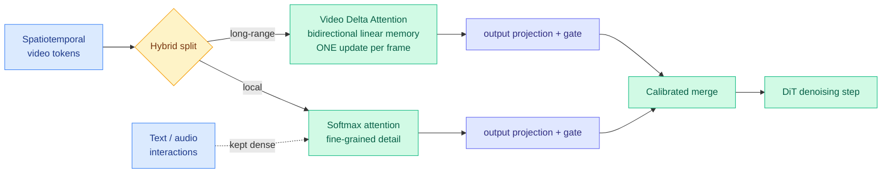

# Video DeltaNet: linear attention finally survives contact with video, by not doing all the work

**Source:** HuggingFace Daily Papers, 2026-09-18 · [arXiv 2609.20744](https://arxiv.org/abs/2609.20744) · [raw](../../raw/huggingface/2026-09-18-video-deltanet-a-video-native-hybrid-attention-for-livestrea.md)

## TL;DR

Video diffusion models re-process very long spatiotemporal token sequences at every denoising step, which makes attention the dominant cost. Linear attention (an approximation that replaces the quadratic all-pairs comparison with a running memory state, so cost grows linearly with sequence length) is the obvious fix and has been adopted widely in language models, but applied naively to video it destroys the fine-grained interactions that image quality depends on. **Video DeltaNet (VDN) refuses the choice**: it runs local Softmax attention alongside a bidirectional linear memory for long-range context, with **separate output projections and learnable gates calibrating the two branches**. Its linear branch, **Video Delta Attention**, updates memory **once per frame** by jointly absorbing that frame's spatial tokens rather than token by token. Instantiated on MiniMax H3 with eight-step distillation and an optimized SGLang serving stack, it denoises a **14.3-second 768p video in 6.70 seconds on eight NVIDIA B200 GPUs, a 14.5x speedup over the 50-step dense baseline** on the same GPU count.

## The two design decisions that matter

**Frame-level memory updates, not token-level.** Standard linear attention updates its memory state once per token. VDA updates **once per frame**, absorbing all of that frame's spatial tokens together. This is the video-native part of the design: a frame is the natural unit of temporal structure, and updating at token granularity both wastes updates and imposes a spurious ordering on tokens that are spatially simultaneous. It also cuts the number of sequential memory updates by the spatial token count per frame, which is where a large share of the speedup comes from.

**Selective application by interaction type.** VDN applies the hybrid **only to video-to-video interactions and keeps Softmax for anything involving text or audio.** That is a deliberate admission that linear approximation is safe where the signal is dense and redundant, and unsafe where it is sparse and load-bearing. Conditioning signals get the expensive treatment.

The **staged teacher-alignment recipe** is what makes it a retrofit rather than a from-scratch architecture: the new linear pathway is introduced progressively into a pretrained model, aligned against the original as teacher. That is why this can ship on MiniMax H3 rather than requiring a new pretrain.

## How this relates to prior wiki pages

**It is production evidence for the hybrid-attention position [attention-mechanisms.md](attention-mechanisms.md) has been accumulating, in the modality where the choice is hardest.** The page's recurring finding is that pure linear or pure state-space attention gives up something real, and that hybrids which keep a local exact path alongside a cheap global one dominate both extremes. Video is the strongest test of that claim because the quality failure is immediately visible rather than showing up as a benchmark point. **VDN passing it, at 14.5x, on a shipped model, is the most concrete confirmation the page carries.**

**The gating design rhymes with three mechanisms from the last two weeks, and the rhyme is worth naming.** [DeepSeek V4.1 Flash's CSA2 (09-10, paper 09-18)](../inference-efficiency/2026-09-18-deepseek-v41-flash-kv-cache-compression.md) gives each layer a three-way choice between recomputing KV and the token index, reusing KV while re-picking tokens, or reusing both. [C2C (09-18)](../inference-efficiency/2026-09-18-c2c-cache-to-cache-communication.md) learns a per-layer gate for which layers benefit from a cache transfer. VDN learns gates calibrating a cheap branch against an exact one. **Three systems in nine days whose core mechanism is a learned per-unit decision about how much computation this particular unit deserves.** That is the same idea [llm-routing.md](../ai-routing/llm-routing.md) has been cataloguing at coarser granularity, arriving inside the layer.

**It is a Tier 3 topic carrying a Tier 1 result**, and the efficiency mechanism is the transferable part. The frame-level update rule generalizes to any modality with a natural chunk structure, which includes audio frames and, arguably, document pages.

## Gaps

One model family, one instantiation. The 14.5x compares against a 50-step dense baseline while VDN uses eight-step distillation, **so step-count reduction and attention-mechanism change are bundled into a single headline number** and the paper as abstracted does not separate them. That is the most important missing ablation: how much of 14.5x is the hybrid attention and how much is distilling 50 steps to 8, a technique that works on dense models too. No quality metrics in the abstract beyond the implicit claim of preservation, and video quality is exactly where a linear approximation degrades subtly. B200-only, so how it behaves on parts with less memory bandwidth is open.

## Industrial implication

For livestream and real-time video generation the arithmetic changes category: **14.3 seconds of 768p output in 6.70 seconds of compute is faster than real time**, which is the threshold that separates a rendering product from an interactive one. Eight B200s is still a serious allocation, so this is a platform capability rather than a consumer one this year. The broader read for anyone outside video: **the hybrid pattern of an exact local path plus a cheap global path, with learned gates and a staged teacher-alignment retrofit onto a pretrained model, is now demonstrated in the hardest modality.** The retrofit recipe is the reusable asset, because it means the hybrid does not require a new pretraining run.

## Related pages

- [attention-mechanisms.md](attention-mechanisms.md)
- [kv-cache.md](../inference-efficiency/kv-cache.md)
- [gpu-kernels.md](../hardware/gpu-kernels.md)
