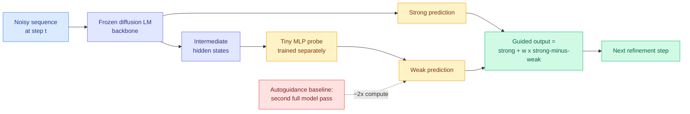

# Probe Guidance: the weak model you need for guidance is already inside the strong one

**Date:** 2026-09-20
**Topic:** llms-foundation-models
**Source:** X home feed ([@shumpeiMaxwell](https://x.com/shumpeiMaxwell/status/2101339294035632427))
**Link:** [arXiv:2609.19356](https://arxiv.org/abs/2609.19356)
**Authors:** Rohit Dilip, Tianrong Chen, Yuyang Wang, David Van Valen, Josh Susskind, Miguel Angel Bautista (Apple; Caltech)
**Enrichment:** alphaxiv overview available
**Raw:** `raw/twitter/feed/2026-09-20-morning-ranked.json`

---

## TL;DR

Diffusion language models generate a sequence by iteratively refining a noisy representation rather
than emitting tokens left to right. They inherit guidance techniques from image diffusion, where you
improve sample quality by extrapolating away from a weaker prediction. The standard version,
**autoguidance**, needs an actual weak model (an earlier checkpoint, or a degraded copy), and running
it **roughly doubles inference compute**. Classifier-free guidance, the other standard option, needs
a class condition that language generation usually does not have.

Probe Guidance removes the second model. It trains a **small multilayer perceptron on the strong
model's own intermediate hidden states** to act as the weak predictor, then guides using the
strong-minus-weak difference. The backbone stays frozen. The probe reads activations the forward
pass already computed, so there is no second full model evaluation. The result is guidance at
roughly the cost of no guidance.

---

---

## Why the mechanism is more interesting than the benchmark

The paper's own positioning is efficiency: get autoguidance's benefit without autoguidance's second
forward pass. That is a clean inference-cost win and it is real. But the reason this matters to this
wiki is that it is the **third independent result in three days arguing that a model's intermediate
hidden states already contain a signal the field has been paying a separate model to compute.**

- [Gavel (09-16)](../ai-routing/2026-09-16-gavel-native-skill-routing-frozen-llm.md) claims the skill
  routing signal is already present in an agent model's mid-layer hidden states and should be read
  out with a lightweight head rather than derived from a separate router model.
- [C2C (09-18)](../inference-efficiency/2026-09-18-c2c-cache-to-cache-communication.md) projects one
  model's KV cache directly into another's with a learned per-layer gate, on the premise that forcing
  model-internal state through human vocabulary destroys information, reporting a 2.5x speedup over
  text handoff.
- Probe Guidance trains a tiny MLP on intermediate activations to serve as the weak model in a
  guidance pair, replacing a full second evaluation.

Three different subfields (agent routing, multi-agent communication, diffusion sampling), three
different target quantities (which skill, what the other model knows, what a worse model would have
predicted), and the same architectural move: **stop re-deriving it, read it off the residual stream.**
The [09-18 routing entry](../ai-routing/llm-routing.md) called C2C "a point on the board for reading
internals rather than re-deriving them through a separate model." This is the second point, and the
threshold for declaring a pattern on this wiki is three. **The pattern is now established: the
intermediate representation is an underexploited free resource, and the field has been buying a
second model to recompute what it already has.**

The contrast with the day's other dominant story is sharp and worth stating. The Jev ecosystem
([09-20](../ai-routing/2026-09-20-jev-ecosystem-census-72h.md)) is 160 projects betting that a
**separate, purpose-built, external** model should make the cheap decisions. Gavel, C2C and Probe
Guidance are three results betting the signal is **internal and already paid for**. These are
opposite answers to the same question and neither camp has run the other's experiment.

---

## Method details worth keeping

Autoguidance works only when the strong and weak models have *related dynamics*, which is why
degradation tricks like isotropic dropout can produce a weak model that guides in an unhelpful
direction. Probe Guidance gets that relatedness structurally rather than by luck: the weak prediction
is a function of the strong model's own activations, so the two prediction paths are coupled by
construction. The authors flag this as a design advantage and it is the most defensible part of the
argument.

Because the backbone is frozen and the probe is separate, the method is **applicable to released
checkpoints** and easy to ablate. That is a deployment property, not just a research convenience.

The experiments target continuous diffusion language models, covering both latent-space and
data-space formulations. This is a narrower setting than "language models" and should not be read
across to autoregressive systems without evidence.

---

## Gaps

The obvious one is scope: continuous diffusion language models are a small and fast-moving corner,
and it is unclear whether the probe trick survives in discrete-diffusion or autoregressive settings
where there is no analogous guidance step. The probe must be trained, so the "free" claim is about
inference cost and not total cost, and the abstract-level material does not state how much data the
probe needs. No head-to-head against the internal-signal results in adjacent areas exists, which is
exactly the comparison that would turn three isolated findings into a usable principle.

---

## Related pages

- [Attention mechanisms](attention-mechanisms.md)
- [LLM routing](../ai-routing/llm-routing.md)
- [KV cache](../inference-efficiency/kv-cache.md)
- [Test-time compute allocation](../inference-efficiency/test-time-compute-allocation.md)
- [C2C: cache-to-cache communication (09-18)](../inference-efficiency/2026-09-18-c2c-cache-to-cache-communication.md)
