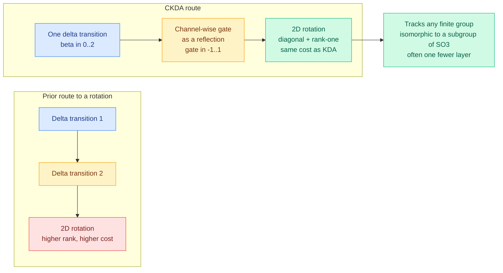

# Complex KDA: a gate and a reflection buy a rotation for free

**Source:** Kurate cs.LG weekly leaderboard #16 (2026-09-23 scrape, ai_rating **7.0/10**, the joint-highest on either board) · [arxiv 2609.24797](https://arxiv.org/abs/2609.24797)
**Raw:** [raw/kurate/2026-09-23-cs-lg.md](../../raw/kurate/2026-09-23-cs-lg.md)
**Note:** absent from HuggingFace Daily Papers. LLM-rated highest, community-unnoticed.

## TL;DR

Linear RNNs built on the delta rule (an update that corrects a stored memory by a low-rank amount each step, which is what makes them cheap: constant memory, linear time, no growing KV cache) are efficient but limited in what state they can track. Prior work showed that **composing two delta-rule transitions in one recurrent update lets the model represent a 2D rotation**, which is the capability that unlocks a large class of state-tracking problems, but composing two transitions raises the rank and the cost of every update. This paper shows that **Kimi Delta Attention already contains the second ingredient for free**: its channel-wise gate can supply a *reflection*, and one delta-rule transformation composed with one reflection is a rotation. The only change needed is widening two parameter ranges that already exist, letting the gate take values in [-1, 1] and the delta coefficient β in [0, 2]. The resulting model, **Complex KDA (CKDA)**, reaches the state-tracking expressivity of DeltaProduct₂ while keeping transitions diagonal-plus-rank-one, non-expansive, and at KDA's original cost.

## Why this is a good paper

Three things separate it from the usual architecture-tweak submission.

**It is a free lunch with a proof attached, not a free lunch with a benchmark attached.** The authors characterize CKDA's expressivity exactly: **every orthogonal diagonal-plus-rank-one matrix is a CKDA transition matrix**. That is an if-and-only-if, not a "we can represent at least." A single CKDA layer can track every finite group isomorphic to a subgroup of SO(3), and many state-tracking results need one fewer layer than with other diagonal-plus-rank-one linear RNNs. Depth is cost, so "one fewer layer" is an efficiency claim dressed as a theory claim.

**The change is two interval endpoints.** Gates in [-1, 1] instead of [0, 1], β in [0, 2] instead of [0, 1]. Both range extensions existed separately in prior work. The contribution is noticing that *combining* them is what produces the reflection, and therefore the rotation. That is a cheap thing to try in any existing KDA codebase, which is the best property an architecture paper can have.

**The stability properties survive.** Transitions remain non-expansive, which is the condition that keeps a linear RNN from blowing up over long sequences, and diagonal-plus-rank-one, which is the structure that makes the update cheap. Expressivity gains in recurrent architectures usually cost stability; this one does not.

Empirically: strongest length extrapolation among tested KDA range settings on the symmetric groups S₃ and S₄ and on periodic audio continuation, and in language modelling it beats Transformers and other linear RNNs while matching a KDA baseline, with "promising scaling behavior." Code and models open-sourced.

## How this relates to what the wiki already knows

**It is a direct efficiency result on the [attention-mechanisms](attention-mechanisms.md) page's central trade-off.** The page's running thread is that linear-attention and state-space alternatives buy constant memory (no growing KV cache) at a cost in what they can represent, and every proposal since has been an attempt to buy back expressivity without buying back the quadratic cost. CKDA buys back a specific, characterized amount for zero extra cost. That is the cleanest instance of the trade the page has recorded.

**The honest caveat is in the paper's own results.** In language modelling CKDA "obtains similar results to a KDA baseline." So the expressivity gain shows up on state-tracking tasks (S₃, S₄, periodic audio) and on length extrapolation, not yet on the loss curve. **That pattern, formal expressivity gains that do not translate to perplexity at tested scale, has appeared repeatedly in the linear-RNN literature**, and it is the reason to treat "promising scaling behavior" as the load-bearing and unverified claim.

**It matters to the KV cache thread by negation.** Everything else in today's digest ([Flash-dLLM](../inference-efficiency/2026-09-23-flash-dllm-io-aware-kv-cache.md), [KV-COBRA](../inference-efficiency/2026-09-23-kv-cobra-bit-rank-allocation.md), [KVMEM](../inference-efficiency/2026-09-23-kvmem-paged-agent-memory.md), [ARM](../ai-routing/2026-09-23-arm-routed-memory-attention.md)) is an attempt to make a growing KV cache affordable. The linear-RNN line's answer is to not have one. Given the [09-21 arithmetic](../inference-efficiency/2026-09-21-ultra-long-context-dca-yarn-minference.md) that a single million-token stream needs 137.44 GB of cache on a 70B model, the constant-memory alternative is not a niche interest, it is the only approach whose cost does not grow with context at all. **CKDA is the week's evidence that the expressivity gap, long the reason that alternative was dismissed, is narrower and more precisely characterized than it was.**

## Gaps

The language-modelling result matching rather than beating KDA is the weak point, and "promising scaling behavior" without a scaling curve at frontier sizes is the standard place this literature has over-promised before. S₃, S₄ and periodic audio continuation are diagnostic tasks chosen because they are known to require the capability being added, which makes them the right tasks for a theory paper and the wrong tasks for a deployment argument. No inference throughput or memory numbers are reported against a transformer baseline at matched quality, which is what would make the efficiency case concrete. And the result is about KDA specifically, so how much transfers to Mamba-family or GLA-family gated linear attention is unaddressed.

## Related pages

- [attention-mechanisms](attention-mechanisms.md) · [scaling-laws](scaling-laws.md) · [kv-cache](../inference-efficiency/kv-cache.md)
- [ARM](../ai-routing/2026-09-23-arm-routed-memory-attention.md) · [Flash-dLLM](../inference-efficiency/2026-09-23-flash-dllm-io-aware-kv-cache.md)
