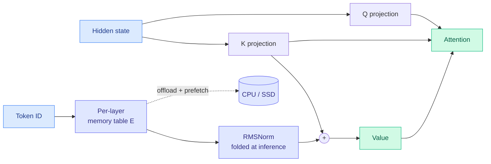

# Memory Attention: token-indexed memory replaces the value projection

**Source:** arXiv [2609.28399](https://arxiv.org/abs/2609.28399) · Jiale Kang · #1 trending on alphaxiv · surfaced via X home feed ([@Jo1uck](https://x.com/Jo1uck/status/2102986568885834204))
**Raw:** `raw/twitter/feed/2026-09-24-evening-ranked.json` · alphaxiv overview via `connectors/alphaxiv/enrich.py 2609.28399`

## TL;DR

In standard attention, queries and keys decide *where* to look and values carry *what* gets combined, each produced by its own dense projection of the hidden state. Memory Attention (MA) deletes the value projection. Each layer gets a lookup table indexed by token ID, and the value becomes **V = K + Norm(E[token])**: the key supplies context, the table supplies token-specific content. At inference the normalization folds into the table, so building a value is **a lookup plus an addition**, and because the table is indexed by token ID it can be **offloaded to CPU or SSD and prefetched**, freeing GPU parameter memory. At a fixed 10B-token budget, an MHA pair improves WikiText perplexity from **31.55 to 28.64** and the downstream average from **40.68 to 41.39**.

## Key claims

- Values built from keys plus a per-layer token memory; no independent value projection.
- Online value construction reduces to lookup plus add; the table is offloadable with prefetching.
- Across five Standard/MA pairs (MHA, GQA, MQA, gated, and one larger MHA at 20B tokens), MA has lower perplexity and higher downstream averages.

## The honest caveat, and it is large

**The comparison is not parameter-matched.** In the headline MHA pair the standard model has **373M parameters and MA has 1,135M**, three times more, because the memory tables are large. The alphaxiv overview says as much: the result does not isolate architecture from capacity. Individual tasks do not all improve (ARC-Challenge and OpenBookQA fall in that pair). The right reading is that MA converts GPU-resident dense compute into offloadable lookup capacity, which is a *placement* result, not a free quality win.

## Relation to prior wiki pages

- **Same family as [conditional memory / Engram-style embeddings](../inference-efficiency/conditional-memory-embeddings.md)**, where token-indexed tables add capacity that lives off the GPU. @eliebakouch's same-day survey notes DeepSeek V4.1 Flash and Qwen 3.8 Next Flash both ship Engram. MA pushes the idea inside attention itself.
- **Joins the week's SSD-offload cluster**: [LM-CXD](../hardware/2026-09-24-lm-cxd-cxl-ssd-prefix-cache.md) (KV prefixes on CXL flash) and [Disaggregated Quantization's ODP](../inference-efficiency/2026-09-24-disaggregated-quantization-prefill-decode.md) (prefill weights streamed from SSD).

## Research angle (not claimed by the paper)

If V = K + Norm(E[token]), a value is fully determined by its key and its token ID. **A serving stack could then cache only K and token IDs and reconstruct V on the fly with one lookup**, roughly halving the [KV cache](../inference-efficiency/kv-cache.md). The paper does not make this claim or measure it, and RoPE complicates it (values use pre-rotation keys, so the unrotated key would need to be kept). But it is the most important consequence of the design for inference, and the experiment is cheap.

**Related:** [attention-mechanisms](attention-mechanisms.md) · [conditional-memory-embeddings](../inference-efficiency/conditional-memory-embeddings.md)
