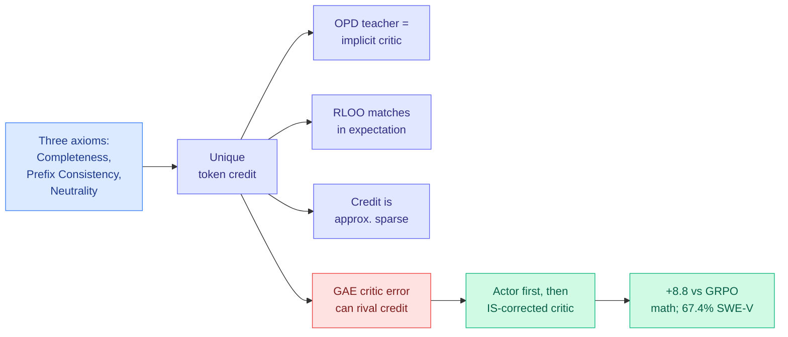

# PACT: From Credit Assignment to Critic Alignment

**Source:** HuggingFace Daily Papers 2026-09-24 (15 upvotes) · arXiv [2609.26355](https://arxiv.org/abs/2609.26355) · Fu, Xu, Zhang, Luo, Hu, Zhao, Chuan
**Raw:** `raw/huggingface/2026-09-24-pact-from-credit-assignment-to-critic-alignment.md`

## TL;DR

Reinforcement learning for LLMs assigns credit to tokens, but "token-level credit" has never had a formal definition. PACT proposes three conditions (**Completeness**, **Prefix Consistency**, **Neutrality**) and proves they determine token credit uniquely. That lens explains several known algorithms at once: an ideal teacher in **on-policy distillation (OPD, where a student trains on its own samples scored by a teacher)** acts as an implicit critic whose expected gradient is proportional to true token credit; response-level **RLOO** (REINFORCE Leave-One-Out) matches token credit's expected gradient despite being coarse; credit is **approximately sparse** under bounded outcome rewards; and **GAE** critic errors can grow as large as the credit they estimate. The fix, Policy Aligned Critic Training, updates the actor first and then the critic with importance-sampling correction so the critic tracks the *updated* policy. Results: **72.87%** average on four agentic-math benchmarks (+8.80 over GRPO, +13.16 over PPO) and **67.4% on SWE-bench Verified** (+2.0 over GRPO).

## Relation to prior wiki pages

- **Theory for [IER's "1% of tokens" (09-22)](../inference-efficiency/2026-09-22-ier-one-percent-tokens-opd.md)**, which found on-policy distillation gradients can be estimated from about 1% of tokens. PACT's approximate-sparsity result is the reason that works: most tokens carry near-zero credit under bounded rewards. A compute-allocation result now has a derivation.
- **Frames [Cal-OPD (09-21)](../inference-efficiency/2026-09-21-cal-opd-calibrated-discrepancy.md)**, which calibrated teacher-student discrepancy: if the teacher is an implicit critic, calibrating it is critic alignment by another name.
- **SWE-bench Verified caveat:** the same day, [SchrodingerRepo](../agentic-systems/2026-09-24-schrodinger-repo-swe-bench-memorization.md) showed agents partly navigate SWE-bench by memorized repository cues, and [SWE-Bench Pro V2 (09-23)](../agentic-systems/2026-09-23-swe-bench-pro-v2-contamination-gap.md) measured a 17.8-point public/private gap. A 2-point gain on the public split should be read with that in mind.
- Updates [rl-for-llms](rl-for-llms.md) and [knowledge-distillation](../inference-efficiency/knowledge-distillation.md).

## Gaps

The uniqueness theorem depends on the three axioms being the right ones; Neutrality in particular is a modelling choice. Benchmarks are agentic math plus one contaminated coding suite.

**Related:** [rl-for-llms](rl-for-llms.md) · [knowledge-distillation](../inference-efficiency/knowledge-distillation.md)
