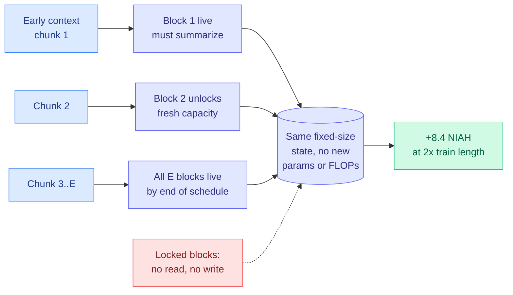

# Proteus: Incremental Memory Activation for Long-Context Sequence Modeling

**Source:** arXiv [2608.16844](https://arxiv.org/abs/2608.16844) (Reza Bayat, Ali Behrouz, Vahab Mirrokni, Aaron Courville), accepted to NeurIPS 2026. Surfaced on the X home feed via the author's [thread](https://rezabyt.github.io/threads/proteus_thread.html) ([@reza_byt](https://x.com/reza_byt/status/2103163045866262650)).
**Raw:** `raw/twitter/feed/2026-09-25-morning-ranked.json` (thread in `articles[].content`)

## TL;DR

Linear-time attention variants (recurrent memory models such as Titans, Comba, SWLA, Hope-Attention) replace the transformer's growing KV cache with a fixed-size state. That is why they scale. The state saturates as context grows, and that is why they disappoint at long range. Proteus names a specific cause: **every model in the family exposes its full state from token one**. Early tokens face no compression pressure and spread across capacity they do not need. Later tokens inherit a full state and can only overwrite. Proteus partitions the memory into E blocks (16 by default) and **unlocks one more block every N/E tokens**, gating both reads and writes so locked blocks are neither read nor updated. The state never grows. Only the live fraction changes. It adds **no parameters and no compute**, improves four architectures by +0.37 to +1.05 average accuracy points on language modeling and commonsense tasks, and adds **up to +8.4 needle-in-a-haystack points at 2x the training context length**.

## Key findings

- **Two forces aimed at two failure modes.** An early bottleneck forces early tokens to compress rather than memorize. Fresh blocks later give new information somewhere to land that is not already written. Activation is monotone, nothing is discarded.
- **Orthogonal to the rest of the design.** It changes neither the memory objective, the update rule, the optimizer nor the memory type, so the same gate drops into Titans, Comba, SWLA and Hope-Attention unchanged.
- **The ablation shows the trade.** Perplexity improves from E = 1 (the base model) through E = 16 and gets worse at E = 32, where squeezing the first tokens into 1/32 of the memory costs more than the compression buys.
- **A proof of concept on parameters.** Through the Nested Learning view (MLPs as associative memory), the authors apply the same schedule to Hope-Attention's MLP blocks, activated progressively over training rather than over context.

## How this relates to prior wiki pages

- **A cousin of [Memory Attention (09-24)](2026-09-24-memory-attention-token-indexed-values.md)**, which replaced the value projection with a token-indexed lookup. Both argue the default architecture spends capacity it did not need to spend, and both are free to adopt.
- **Drops into the Gated DeltaNet family** tracked on [attention-mechanisms](attention-mechanisms.md). Gated DeltaNet-2, also accepted to NeurIPS this week, is the linear-attention backbone class Proteus targets.
- **Contrasts with ARM (09-23)**, the routed-memory attention paper where a learned Gumbel-Softmax router decides which slot each piece of context writes to. ARM learns the allocation. Proteus schedules it deterministically by position. Whether a learned schedule beats a fixed one is now a clean open question.

## Gaps

Gains on short-context tasks are small (under one point). The deterministic schedule assumes the context length is roughly known in advance, since blocks unlock every N/E tokens. Behavior when a sequence runs far past the planned N, or at frontier scale, is not shown in the thread.

## Research angle

A fixed schedule is the simplest case. The natural extension is content-adaptive unlocking, where a new block opens when the current live blocks saturate (measured by write interference) rather than on a clock. That would turn Proteus into a memory-bandwidth allocation policy, the same family as ARM's adaptive read-width router.
