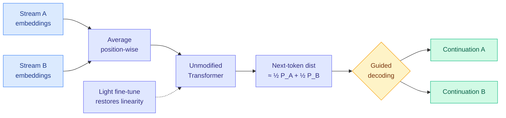

# Your Transformer Can Hold Two Thoughts at Once: Evidence of Linear Superposition in LLMs

**Source:** HuggingFace Daily Papers 2026-09-25 (44 upvotes, #2 of the day), arXiv [2609.29845](https://arxiv.org/abs/2609.29845) (Tikhonov, Korznikov, Mikhalchuk, Dragunov, Rahmatullaev, Druzhinina, Razzhigaev, Oseledets, Tutubalina)
**Raw:** `raw/huggingface/2026-09-25-your-transformer-can-hold-two-thoughts-at-once-evidence-of-l.md`, alphaxiv overview

## TL;DR

Average the token embeddings of two unrelated text streams, position by position, and feed the mixture through a standard decoder-only LLM. The model's next-token distribution comes out close to **the average of the two distributions it would have produced separately**. The authors call this the Superposition Linearity Hypothesis. Three surprises follow. First, it looks **architectural rather than learned**: the property is present early and *weakens* as pretraining progresses. Second, **lightweight fine-tuning restores it**, sharply reducing the divergence between the mixed output and the averaged separate outputs. Third, a guided decoding procedure **disentangles the superposed output and generates two coherent continuations from a single forward pass**.

## Key findings

- **Linearity at the whole input-to-output level**, extending prior work by Razzhigaev et al. that found layer-to-layer transitions in the residual stream are often nearly affine.
- **No multiplexing modules needed.** Earlier approaches (DataMUX, MIMONets, RevMUX) built explicit encoders and decoders to pack several inputs into one representation. Here, an ordinary pretrained model already preserves both streams.
- **Training erodes it.** The property diminishes over pretraining, which argues it comes from the architecture's near-linear pathways (residual stream, attention mixing) rather than from anything the objective rewards.
- **It can be bought back cheaply.** A light fine-tune restores much of the linearity.

## How this relates to prior wiki pages

- **An efficiency angle hiding in an interpretability paper.** Two continuations per forward pass is a form of batching without the batch dimension. On [speculative-decoding](../inference-efficiency/speculative-decoding.md), the wiki has tracked many ways to get more tokens per pass. This is a new axis: more *streams* per pass.
- **Relates to the superposition literature on [responsible-ai](../responsible-ai/responsible-ai.md)**, where "superposition" usually means many features sharing fewer dimensions. This paper is about whole inputs superposing, which is a different claim but uses the same geometric intuition.
- **Parts-of-Speech in SAE latent space (same HF day)** finds grammatical categories are carried by distributed groups of SAE latents, not single features. Both papers push against the "one clean unit per concept" picture.

## Gaps

Two streams only in the abstract. Output quality, not just distribution divergence, of the two decoded continuations is the number that decides whether this is useful. No wall-clock or throughput comparison against simply batching two sequences, which on a GPU is already nearly free at small batch sizes.

## Research angle

The practical question is where batching is *not* free: memory-bound decode at long context, where each sequence carries its own KV cache. If two superposed streams can share one KV cache, the saving is on cache memory, not FLOPs, and that would be a real result. The paper does not test it.
