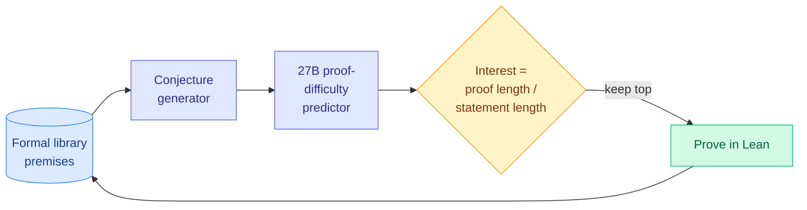

# Learning to Discover Interesting Mathematics

**Source:** arXiv [2609.28603](https://arxiv.org/abs/2609.28603) (Kempe Lab). HuggingFace Daily Papers (09-26 list, 6 upvotes) and posted by [@KempeLab](https://x.com/KempeLab/status/2103491263240585649), so cross-source confirmed via social.
**Raw:** `raw/huggingface/2026-09-26-learning-to-discover-interesting-mathematics.md`, `raw/twitter/feed/2026-09-26-morning-ranked.json`

## TL;DR

LLM provers can now produce true theorems in bulk. The open question is whether any of them are worth having. This paper gives a computable answer. It defines a theorem's **intrinsic interestingness** as the ratio of its proof length to its statement length: a short statement that needs a long proof compresses a lot of reasoning. That ratio correlates strongly with an extrinsic measure, how useful the theorem is downstream. The authors identify proof difficulty conditioned on a premise set as the primitive both metrics need, and train a 27B model that predicts it more accurately than frontier general models. Optimizing a generator for the metric produces more interesting theorems and cuts overlap with Mathlib (Lean's community library) from 91.9% to 30.6%. The system generates candidates, keeps the most interesting, adds them to its library, and builds on them.

## Why it matters

- **It is a compression metric.** Interestingness as proof-to-statement ratio is a description-length argument: a good theorem is a short name for a long computation. It gives an RL reward for open-ended discovery that is not "match a human target."
- **Novelty is measurable.** The drop from 91.9% to 30.6% Mathlib overlap shows the optimized generator leaves the training distribution instead of rediscovering known results.
- **A learned cost model guides search.** The 27B difficulty predictor plays the role a cost model plays in a query planner: it prices candidates before you spend compute proving them.

## Gaps

- Proof length depends on the prover and the premise set, so the metric can be gamed by awkward proofs. The abstract does not say how this is controlled.
- "Downstream utility" is measured inside the same formal library.

## How this relates to prior wiki pages

- Sits with the recursive self-improvement thread on [self-evolving-agents](../agentic-systems/self-evolving-agents.md), and offers something that thread keeps lacking: a reward for *what to work on next* that does not need a human.
- Counterpoint to the same day's [reward-hacking study](../responsible-ai/2026-09-26-reward-hacking-autonomous-research-agents.md): any self-directed metric an agent can optimize, it can also exploit.
