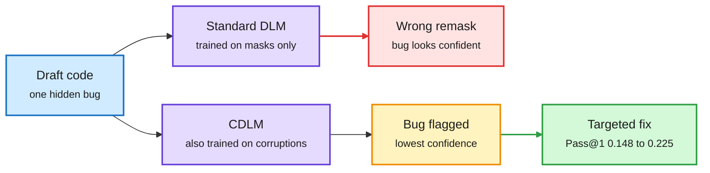

# CDLM: diffusion LMs that can find their own bugs

**Source:** arXiv [2512.15596](https://arxiv.org/abs/2512.15596), NeurIPS 2026 · [code](https://github.com/zhangshuibai/CDLM). Surfaced via the X home feed ([@ShuibaiZ69721](https://x.com/ShuibaiZ69721/status/2103759909959409913)), 2026-09-26. Raw: `raw/twitter/feed/2026-09-26-evening-210005.json`.

## TL;DR

Diffusion language models (DLMs) generate by filling in masked positions over several steps, so in principle they can rewrite any token in place. In practice they rarely fix their own mistakes. The reason is the training loss: standard masked-diffusion training only supervises [MASK] positions, so visible tokens never get a gradient, even when they are wrong. The model ends up as confident in a bug as in correct code. CDLM (Corrective Diffusion LM) adds one change in post-training: it also replaces some visible tokens with random wrong ones and trains the model to recover them. On a new executable Code Revision Benchmark, Pass@1 after four refinement steps rises from 0.148 to 0.225.

A model trained only on blanks cannot see a wrong token

One extra training signal turns confidence into a bug detector.

Blue is input, purple is a model, amber is the detection step, red is the failure path, green is the fix.

## Key points

- **Diagnosis.** Even LLaDA-8B and Dream-7B rank the real bug as their least-confident token less than 20% of the time, so confidence-based remasking overwrites correct tokens and leaves the error.
- **Benchmark.** The Code Revision Benchmark corrupts HumanEval and MBPP solutions with type-preserving edits (operators, identifiers, literals), each verified by execution to fail.
- **Fix.** An absorbing plus uniform mixture objective: mask some tokens as usual, corrupt some visible ones, recover both. Same data, optimizer and steps as the baseline.
- **Wider effect.** On Sudoku the clean-to-corrupted confidence ratio goes from 8.2x to over 10,000x. On high-entropy ParallelBench tasks (LLaDA2.0-mini, 16B), standard training cannot use remasking (0.47 to 0.45) while CDLM reaches 0.62.
- **Scale signal.** The thread notes LLaDA2.1 uses the same recipe for token editing at 100B scale; CDLM is the controlled study of why it works.

## Relation to prior wiki pages

- Extends the diffusion-LM line: [LLaDA-MoE v2 (08-05)](2026-08-05-llada-moe-v2-scaling-moe-diffusion-lms.md) scaled DLMs with experts, and [Sumi (06-18)](2026-06-18-sumi-open-uniform-diffusion-llm.md) trained a uniform-noise DLM. CDLM shows the uniform component is what gives DLMs working self-correction.
- Efficiency link: parallel decoding (committing many tokens per step) is the main speed argument for DLMs, and [Flash-DLLM (09-23)](../inference-efficiency/2026-09-23-flash-dllm-io-aware-kv-cache.md) worked on their KV cache. Error-aware confidence makes aggressive parallel decoding safer, which is where DLM speed comes from.

## Gaps

- Code and puzzles only; no open-ended text revision.
- Post-training on existing checkpoints, not pretraining with the objective from scratch.
- No wall-clock comparison of how many refinement steps the better confidence saves.
