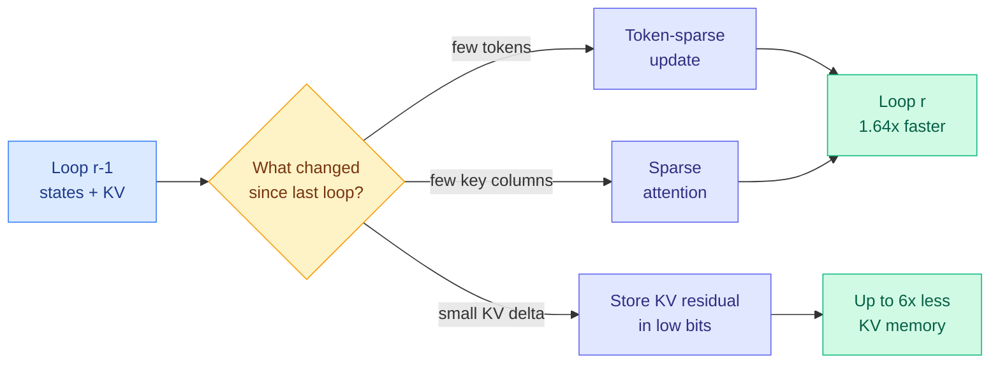

# FlashLoop: Fast and Memory-Efficient Looped Transformers via Lazy Updates

**Source:** arXiv [2609.29812](https://arxiv.org/abs/2609.29812) (Wanqi Yang, Shiwei Liu; ELLIS Institute Tübingen / MPI-IS). Surfaced via the X home feed ([@Shiwei_Liu66](https://x.com/Shiwei_Liu66/status/2103754339286147190)), 2026-09-26. Raw: `raw/twitter/feed/2026-09-26-afternoon-ranked.json`.

## TL;DR

A looped transformer reuses one block several times to get more depth per parameter, but every loop costs another full pass and another KV cache (the stored attention keys and values), so serving cost grows linearly with loop count. FlashLoop measures what actually changes between loops and finds three "lazy update" patterns: only a few tokens' states move in later loops, attention-output changes concentrate in a small and stable set of key columns, and the KV residual between adjacent loops shrinks enough to quantize to low bits. It exploits all three at inference time with no retraining: token-sparse updates, sparse attention, and KV-residual quantization. Reported result: lossless accuracy, up to 1.64x end-to-end speedup and up to 6x less KV-cache memory across several looped models.

## Key points

- **The motivating number.** Ouro-2.6B with four loops at 32K context on an A100 needs about 27 s of prefill and 48 GiB of KV cache, versus about 3 s and 4 GiB for the non-looped Llama-3.1-8B. Fewer parameters did not mean cheaper serving.
- **Lazy updates are the mechanism.** Refinement across loops is not uniform. It concentrates on a shrinking subset of tokens and key columns, and adjacent-loop KV states converge.
- **Training-free.** No architecture or weight changes, so it applies to existing looped checkpoints.
- **Three techniques, one per observation:** skip recomputing unchanged tokens, attend only to the stable column set, and store per-loop KV as a quantized delta from the previous loop.

## Relation to prior wiki pages

- **Fills the gap the concept page named.** [looped-transformers](looped-transformers.md) recorded on 09-02 that "the unresolved axis is now latency, not loss": [SMELT (09-02)](2026-09-02-smelt-moe-looped-transformers.md), which found two loops optimal under matched FLOPs, parameters and KV, reported only training-FLOP savings. FlashLoop is the first entry on the page that attacks serving wall-clock and memory directly.
- **KV as a delta is a new KV-compression family.** It sits next to cross-layer KV sharing (the instinct behind [LoopCoder-v2 (06-17)](../inference-efficiency/2026-06-17-loopcoder-v2-parallel-loop-transformer.md), which shared KV across loops through gated sliding-window attention). FlashLoop keeps separate per-loop caches but stores them as cheap residuals. See [kv-cache](../inference-efficiency/kv-cache.md).
- **Same week, same thesis from the vision side.** [TWT (09-27)](../inference-efficiency/2026-09-27-twt-smaller-transformer.md) finds neighboring ViT layers form redundant "phases" and fuses them. Both say repeated depth mostly repeats work.
- **Pairs with the scaling result.** [Sparse Layers are Critical to Scaling Looped LMs (09-27)](2026-09-27-sparse-layers-looped-moe.md) says looped models only scale when the shared layers are MoE. FlashLoop makes the resulting deep loops affordable to serve.

## Gaps

- Tested on existing small looped checkpoints (Ouro-class). No result at frontier scale or on Looped-MoE models, where token sparsity may interact with expert routing.
- Lossless is claimed on the paper's benchmarks; long-generation drift from reusing stale states is not stress-tested in the abstract.
