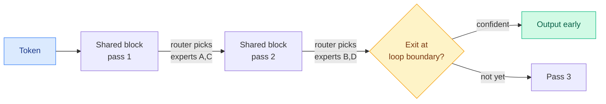

# Sparse Layers are Critical to Scaling Looped Language Models

**Source:** arXiv [2605.09165](https://arxiv.org/abs/2605.09165) (Ryan Lee, Jonathan May, Edward Hu et al.), accepted at NeurIPS 2026. Surfaced via the X home feed ([@_ryantlee](https://x.com/_ryantlee/status/2103642587915846057)), 2026-09-26.

## TL;DR

Looped language models repeat a set of layers through depth, which saves memory and gives natural early-exit points, but dense looped models scale worse than ordinary transformers. This paper compares dense and MoE (mixture-of-experts, where each token runs through a few selected expert sub-networks) models with and without looping. Looped-MoE models scale better than the standard baseline, and dense looped ones do not. The reason is routing divergence: on each pass through the same shared layers, different experts fire, which recovers the expressivity that plain weight sharing loses, at no extra parameter cost. Loop boundaries also make better early-exit points than arbitrary layers, because each loop ends with the same layers that produce the final output.

## Relation to prior wiki pages

- **Confirms SMELT.** [SMELT (09-02)](2026-09-02-smelt-moe-looped-transformers.md) already found that MoE looping beats unlooped baselines under matched budgets. This is a second, independent group reaching the same conclusion, and it names a mechanism (per-pass expert divergence). Two papers now say the loop needs sparsity to pay off.
- **Complements FlashLoop.** [FlashLoop (09-27)](2026-09-27-flashloop-lazy-updates.md) cuts the serving cost of extra loops; this paper says which looped models are worth serving.
- Concept page: [looped-transformers](looped-transformers.md).

## Gaps

- Early-exit savings are argued from output convergence; wall-clock serving numbers under batching are not the focus.
- Whether per-pass routing divergence survives expert-parallel serving (where each token's experts may sit on other GPUs) is untested.
