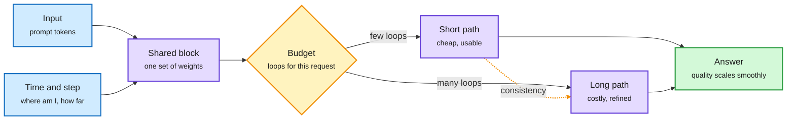

# LoopFormer: Elastic-Depth Looped Transformers for Latent Reasoning via Shortcut Modulation

**Source:** arXiv [2602.11451](https://arxiv.org/abs/2602.11451) (Ahmadreza Jeddi, Marco Ciccone, Babak Taati; University of Toronto, Vector Institute, UHN). ICLR 2026. Resurfaced via the X home feed ([@hooshaaii](https://x.com/hooshaaii/status/2104250462262186184)), 2026-09-27. Raw: `raw/twitter/feed/2026-09-27-evening-230005-ranked.json`. Background from the alphaxiv overview.

## TL;DR

A looped transformer reuses one block several times, so depth is a runtime choice. In practice most looped models are trained at one loop count and collapse when you change it at inference. LoopFormer makes the loop count a real dial. It conditions each loop on where it sits in the trajectory (a time value) and on how big a step it is taking (a step size), in the spirit of shortcut models from flow matching. Training mixes trajectories of different lengths and adds a shortcut-consistency objective: a short trajectory is pushed to land where the long one lands. The result is a single model where fewer loops give a usable answer and more loops refine it, instead of falling apart.

One set of weights, any number of loops

Each loop knows its position and step size, so a short run is trained to land where a long run lands.

Blue is input and conditioning, purple is the shared block and its two paths, amber is the per-request budget, green is the result.

## Key points

- **The failure it fixes:** looped models trained at a fixed depth have no reason to produce good intermediate states, so cutting loops at inference breaks them.
- **The mechanism:** time and step-size conditioning (it extends Time-Modulated Looped Transformers) plus a shortcut-consistency loss across trajectory lengths.
- **What you get:** a per-request compute dial on a single checkpoint. Latent reasoning depth becomes a knob a router or a budget controller can turn.

## Relation to prior wiki pages

- **Pairs with FlashLoop (09-27).** [FlashLoop](2026-09-27-flashloop-lazy-updates.md) made each loop cheaper by skipping what did not change between loops. LoopFormer makes the number of loops adjustable. Together they cover both halves of looped-model serving cost. See [looped-transformers](looped-transformers.md).
- **Complements the scaling result.** [Sparse Layers are Critical to Scaling Looped LMs (09-27)](2026-09-27-sparse-layers-looped-moe.md) found looped models scale only with MoE shared layers. LoopFormer is tested at smaller, dense scale, so whether elasticity survives MoE loops is open.
- **Routing hook.** [llm-routing](../ai-routing/llm-routing.md) has so far routed between models or reasoning-effort settings. Elastic depth adds a third target: route to a loop count inside one model. See also [test-time-compute-allocation](../inference-efficiency/test-time-compute-allocation.md).

## Gaps

- ICLR-scale experiments, not frontier scale; no serving-latency measurements.
- No learned policy for choosing the loop count per input; the budget is set externally.
