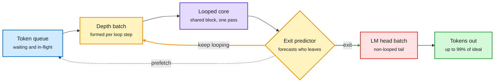

# Continuous Depth Batching: Depth-Adaptive Inference for Looped Language Models

**Source:** HuggingFace Daily Papers, listed 2026-09-28 · [arXiv 2608.09444](https://arxiv.org/abs/2608.09444)
**Raw:** [raw/huggingface/2026-09-28-depth-adaptive-inference-of-looped-language-models-via-conti.md](../../raw/huggingface/2026-09-28-depth-adaptive-inference-of-looped-language-models-via-conti.md)

## TL;DR

Looped language models run one shared block of layers several times. Their big promise is depth-adaptive inference: loop fewer times for easy tokens and more for hard ones. That promise has had a practical hole. Tokens that exit after different numbers of loops cannot share one forward pass, so standard batching engines like vLLM cannot serve them efficiently, and the saved compute never shows up as throughput. Continuous depth batching (CDB) fixes the batching. It forms new batches between loop steps, so a token that exits early leaves the batch and a waiting token takes its slot. It also schedules the looped and non-looped parts of the model separately, manages the KV cache for looped layers, and predicts which tokens will exit ahead of time so the next batch can be assembled asynchronously. On Ouro 1.4B and Huginn 3.5B, CDB reaches up to 99% of the estimated maximum speedup. The architectural finding matters more than the number: fully looped models suit depth-adaptive inference best, because large non-looped pieces outside the recurrent core (token embedding, LM head, unshared blocks) slow down and complicate scheduling.

Batches are rebuilt between loop steps, not between requests

An exit predictor lets the scheduler prepare the next batch before tokens actually leave.

Blue is input, amber is the scheduling loop, purple is the shared core, red is the non-looped part that complicates scheduling, green is the result.

## Key findings

- **Batching was the missing piece.** Without it, adaptive depth saves FLOPs on paper and nothing in a serving engine.
- **Re-batch at loop boundaries.** CDB treats each loop step as a scheduling point, the depth analogue of continuous batching across requests.
- **Predict exits ahead of time.** Forecasting which tokens will leave lets batch assembly overlap with compute instead of stalling on it.
- **Fully looped wins.** Non-looped components outside the recurrent core (embedding, LM head, unshared blocks) are large, run on a different schedule, and eat into the gain. The less of the model that sits outside the loop, the better adaptive depth serves.
- **Up to 99% of estimated maximum speedup** on Ouro 1.4B and Huginn 3.5B. Further gains depend on the architecture and on how often tokens exit early, not on the scheduler.

## How this relates to prior wiki pages

- **Completes the serving picture begun on 09-27 and 09-28.** [FlashLoop (09-27)](2026-09-27-flashloop-lazy-updates.md) showed most of the work in later loops is redundant (few tokens change, KV residuals quantize well) and skipped it training-free, for up to 1.64x end-to-end. [LoopFormer (09-28)](2026-09-28-loopformer-elastic-depth.md) made a looped model robust to running at a depth other than the one it was trained at, so loop count became a per-request dial. CDB makes the dial usable per *token* inside a batch. The three together are cheaper loops, a choice of how many, and a scheduler that turns that choice into throughput.
- **Partial answer to LoopFormer's open question.** The [looped-transformers concept page](looped-transformers.md) closed 09-28 with "no one has trained a router to pick the loop count per input." CDB's exit predictor forecasts when a token will exit, but it forecasts the model's own exit decision for scheduling. It does not choose depth. The router question stays open, and CDB now tells that future router what it costs to be wrong: a mispredicted exit is a wasted batch slot.
- **In tension with the sparse-loop scaling result.** [Sparse Layers are Critical (09-27)](2026-09-27-sparse-layers-looped-moe.md) and [SMELT (09-02)](2026-09-02-smelt-moe-looped-transformers.md) both found looped models scale well only with MoE layers inside the loop. CDB's finding is about what sits *outside* the loop, so the two are compatible in principle. But MoE loops add per-pass expert routing on top of per-token exit, and nobody has scheduled both at once.
- **Connects to routing.** [llm-routing.md](../ai-routing/llm-routing.md) noted on 09-28 that elastic depth gives routers a third target (how many loops). CDB is the serving substrate that target needs.

## Gaps

- Small models only (1.4B and 3.5B). Whether 99% of the estimated maximum holds at the scales where looped MoE models are proposed is untested.
- "Estimated maximum speedup" is bounded by the models' exit behaviour. If the models rarely exit early, 99% of a small ceiling is still small. The absolute speedup should be read from the paper.
- No integration with FlashLoop's lazy updates or LoopFormer's elastic depth, which would change both the exit distribution and the per-loop cost.

## Related

- [looped-transformers.md](looped-transformers.md) · [FlashLoop](2026-09-27-flashloop-lazy-updates.md) · [LoopFormer](2026-09-28-loopformer-elastic-depth.md) · [Sparse Layers are Critical](2026-09-27-sparse-layers-looped-moe.md) · [SMELT](2026-09-02-smelt-moe-looped-transformers.md) · [kv-cache.md](../inference-efficiency/kv-cache.md)

**Source:** [arXiv 2608.09444](https://arxiv.org/abs/2608.09444) · [raw file](../../raw/huggingface/2026-09-28-depth-adaptive-inference-of-looped-language-models-via-conti.md)
