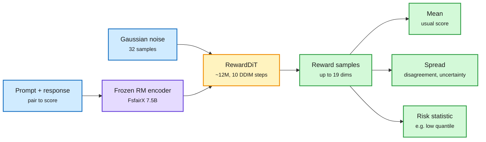

# Diffusion Reward Models: learning the distribution of human preference

**Source:** arXiv [2609.33803](https://arxiv.org/abs/2609.33803) (THUNLP, Tsinghua). [Code](https://github.com/thunlp/DRM) · [Models](https://huggingface.co/Teburile/DRM). Surfaced via the X home feed ([@HBX_hbx](https://x.com/HBX_hbx/status/2104779296640467452)). Raw: `raw/twitter/feed/2026-09-29-morning-ranked.json` (thread text; the PDF was captured as unreadable binary, so details below come from the thread and paper summary).
**Date:** 2026-09-29

## TL;DR

Almost every reward model squeezes human preference about a response into one number. But people disagree, sometimes sharply, about the same answer, so a single score throws away exactly the information a careful policy should use. A Diffusion Reward Model (DRM) instead models the conditional distribution p(r | x, y): the full spread of rewards a prompt-response pair could receive. It keeps a strong existing reward model frozen (the 7.5B FsfairX-LLaMA3-RM) as an encoder and adds a small diffusion head, **RewardDiT, about 12M parameters**, that starts from Gaussian noise and denoises it into reward vectors conditioned on the encoder's features. Running 10 DDIM (a fast deterministic diffusion sampler) steps for 32 samples gives a distribution per response, from which you can read a mean, an uncertainty, or a risk-sensitive statistic such as a lower quantile. Two checkpoints are released: **DRM-Multi-8B** (19 reward dimensions) and **DRM-Pref-8B** (preference).

A reward becomes a cloud, not a point

Only a 12M-parameter head is trained; the 7.5B encoder stays frozen.

Blue is input, purple is the frozen encoder, amber is the trained diffusion head, green is what the policy can consume.

## Key points

- **Target:** p(r | x, y), not a point estimate. Disagreement among annotators is modelled, not averaged away.
- **Architecture:** frozen 7.5B FsfairX-LLaMA3-RM encoder plus a ~12M-parameter RewardDiT head; cheap to train.
- **Inference:** 10 DDIM steps, 32 samples per pair. Cost is a small head run 32 times on one encoder pass.
- **Outputs:** mean for standard RLHF, spread as an uncertainty signal, risk-sensitive statistics for conservative optimization.
- **Releases:** DRM-Multi-8B (19 dimensions) and DRM-Pref-8B, with code.

## Why it matters

Two uses stand out. First, a policy trained against a lower quantile rather than the mean should be harder to reward-hack, because hacks tend to exploit regions where the reward model is confident but wrong or where raters disagree. Second, uncertainty is a routing signal: responses with high reward spread are the ones worth sending to a stronger judge or a human. Both are cheap because only the head is sampled.

## How this relates to prior wiki pages

- **On [rl-for-llms](rl-for-llms.md):** the page's recent thread is about sizing each update by how informative its signal is (Cliff, GAPO, FlowBalance). A reward distribution supplies that informativeness directly: a wide spread means a weak signal.
- **[What do reward models memorize? (08-02)](2026-08-02-what-reward-models-memorize.md)** found reward models spend their memorization budget on pairs that did not need it. A distributional head could expose those pairs as low-variance and the genuinely contested ones as high-variance.
- **[C2 rubric reward modeling (04-18)](2026-04-18-c2-rubric-reward-modeling.md)** decomposed rewards into rubric items; DRM-Multi's 19 dimensions do the decomposition, and the diffusion head adds a distribution over each.
- **[Adversarial delegation (09-29)](../responsible-ai/2026-09-29-adversarial-delegation-personal-agents.md)** is a reminder that "what users prefer" differs by user; modelling that spread is only safe if the policy does not start conditioning on who is asking.

## Gaps

- The PDF was not readable in capture; benchmark numbers (RewardBench-style accuracy, calibration, downstream RLHF gains) are not recorded here.
- Unclear whether the distribution reflects real annotator disagreement or the head's own sampling noise; calibration against multi-annotator data is the test.
- Tied to one frozen encoder; portability to other base reward models is untested in what we saw.
